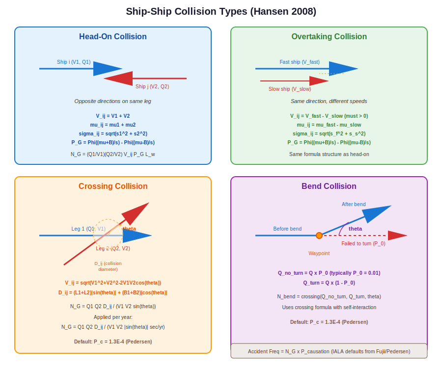

.. _collisions:

================================
Ship-Ship Collision Calculations
================================

This chapter describes OMRAT's calculations for ship-ship collision
risk. Four types of collision encounters are modelled: head-on,
overtaking, crossing, and bend collisions, all based on the equations
in Hansen (2008).

.. contents:: In this chapter
   :local:
   :depth: 2

Overview
========

Ship-ship collisions occur when two vessels occupy the same space at the
same time. The IWRAP methodology models this by calculating the
**geometric number of collision candidates** -- the expected number of
close encounters per year assuming no evasive action -- and then
multiplying by a **causation factor** to get the actual accident
frequency.

The general formula is:

.. math::

   F_{\text{collision}} = N_G \times P_C

Where:

- :math:`N_G` = geometric collision candidates per year
- :math:`P_C` = causation probability (IALA default values)

.. container:: source-code-ref pipeline

   **Pipeline orchestrator:** ``compute/ship_collision_model.py:526`` -- `run_ship_collision_model() <https://github.com/axelande/OMRAT/blob/main/compute/ship_collision_model.py#L526>`__

Head-On Collisions
==================

Head-on collisions occur between vessels travelling in **opposite
directions** on the same leg. This is the classical encounter type for
narrow shipping lanes.

Geometry
--------

Two streams of traffic travel in opposite directions. The collision
probability depends on the lateral overlap of their position
distributions.

Equations (Hansen Eq. 4.2--4.4)
--------------------------------

The geometric number of collision candidates is:

.. math::

   N_G = \frac{Q_1}{V_1} \times \frac{Q_2}{V_2} \times V_{ij}
         \times P_G \times L_w \times \frac{1}{\text{sec/year}}

Where:

- :math:`Q_1, Q_2` = traffic volume in each direction (ships/year)
- :math:`V_1, V_2` = vessel speeds (m/s)
- :math:`V_{ij} = V_1 + V_2` = relative closing speed (m/s)
- :math:`L_w` = leg segment length (m)
- :math:`P_G` = geometric collision probability

The term :math:`Q/V` converts from traffic frequency (ships/year) to
traffic density (ships/m), accounting for the time ships spend on the
leg.

The geometric collision probability is:

.. math::

   P_G = \Phi\!\left(\frac{\mu_{ij} + B_{ij}}{\sigma_{ij}}\right)
       - \Phi\!\left(\frac{\mu_{ij} - B_{ij}}{\sigma_{ij}}\right)

Where:

- :math:`\mu_{ij} = \mu_1 + \mu_2` -- combined mean lateral distance
  (head-on: positions add because ships face opposite directions)
- :math:`\sigma_{ij} = \sqrt{\sigma_1^2 + \sigma_2^2}` -- combined
  standard deviation
- :math:`B_{ij} = (B_1 + B_2) / 2` -- average vessel breadth (collision
  width)
- :math:`\Phi` = standard normal CDF

.. container:: source-code-ref

   ``compute/basic_equations.py:46`` -- `get_head_on_collision_candidates() <https://github.com/axelande/OMRAT/blob/main/compute/basic_equations.py#L46>`__

.. literalinclude:: ../../compute/basic_equations.py
   :language: python
   :lines: 102-144
   :caption: Head-on collision candidate calculation (compute/basic_equations.py)

Default causation factor
-------------------------

.. math::

   P_C = 4.9 \times 10^{-5} \quad \text{(Fujii et al. 1974)}

Overtaking Collisions
=====================

Overtaking collisions occur between vessels travelling in the **same
direction** at different speeds. The faster vessel catches up to the
slower one.

Geometry
--------

Both vessels travel in the same direction. The collision probability
depends on the speed difference (overtaking is only possible if
:math:`V_{\text{fast}} > V_{\text{slow}}`) and the lateral overlap of
their distributions.

Equations (Hansen Eq. 4.5)
---------------------------

The formula is structurally identical to head-on, but with different
relative speed and lateral offset:

.. math::

   V_{ij} = V_{\text{fast}} - V_{\text{slow}}

.. math::

   \mu_{ij} = \mu_{\text{fast}} - \mu_{\text{slow}}

.. note::

   If :math:`V_{\text{fast}} \leq V_{\text{slow}}`, overtaking is
   impossible and the result is zero.

The geometric probability :math:`P_G`, combined standard deviation
:math:`\sigma_{ij}`, and breadth :math:`B_{ij}` are calculated
identically to the head-on case.

.. container:: source-code-ref

   ``compute/basic_equations.py:147`` -- `get_overtaking_collision_candidates() <https://github.com/axelande/OMRAT/blob/main/compute/basic_equations.py#L147>`__

Default causation factor
-------------------------

.. math::

   P_C = 1.1 \times 10^{-4} \quad \text{(Fujii et al. 1974)}

Crossing Collisions
===================

Crossing collisions occur at intersections where two legs cross at an
angle :math:`\theta`. This is common at traffic separation scheme
junctions, port approaches, and areas where multiple routes converge.

Geometry
--------

Two traffic streams cross at angle :math:`\theta`. The collision zone
is an area around the intersection point whose size depends on vessel
dimensions and the crossing angle.

Equations (Hansen Eq. 4.6)
---------------------------

.. math::

   N_G = \frac{Q_1 \times Q_2 \times D_{ij}}
              {V_1 \times V_2 \times |\sin\theta|
               \times \text{sec/year}}

Where:

- :math:`\theta` = crossing angle (radians)
- :math:`D_{ij}` = collision diameter (metres)
- :math:`V_1, V_2` = vessel speeds on each leg

The **relative speed** uses the law of cosines:

.. math::

   V_{ij} = \sqrt{V_1^2 + V_2^2 - 2 V_1 V_2 \cos\theta}

The **collision diameter** accounts for the projected area of both
vessels at the crossing angle:

.. math::

   D_{ij} = (L_1 + L_2) \times |\sin\theta|
           + (B_1 + B_2) \times |\cos\theta|

Where :math:`L_1, L_2` are ship lengths and :math:`B_1, B_2` are ship
beams.

.. note::

   When :math:`\theta \to 0` or :math:`\theta \to \pi` (parallel or
   anti-parallel courses), :math:`\sin\theta \to 0` and the crossing
   formula is not applicable. Use head-on or overtaking formulas instead.

.. container:: source-code-ref

   ``compute/basic_equations.py:238`` -- `get_crossing_collision_candidates() <https://github.com/axelande/OMRAT/blob/main/compute/basic_equations.py#L238>`__

.. literalinclude:: ../../compute/basic_equations.py
   :language: python
   :lines: 288-328
   :caption: Crossing collision with law of cosines (compute/basic_equations.py)

Default causation factor
-------------------------

.. math::

   P_C = 1.3 \times 10^{-4} \quad \text{(Pedersen 1995)}

Bend Collisions
===============

Bend collisions occur at waypoints where a route changes direction. A
vessel that fails to make the turn continues on its original heading and
may collide with vessels that did turn correctly.

Geometry
--------

At a waypoint, the route changes direction by angle :math:`\theta`.
Most vessels turn correctly, but a small fraction :math:`P_0` (typically
1%) fail to turn and continue straight.

Equations
---------

.. math::

   Q_{\text{no turn}} = Q \times P_0

.. math::

   Q_{\text{turn}} = Q \times (1 - P_0)

The bend collision is then modelled as a crossing collision between the
non-turning traffic and the turning traffic:

.. math::

   N_{\text{bend}} = N_G^{\text{crossing}}(Q_{\text{no turn}},
                      Q_{\text{turn}}, \theta)

Where :math:`\theta` is the bend angle (change in heading at the
waypoint) and the crossing collision formula is applied with
self-interaction (same ship type on both "legs").

.. container:: source-code-ref

   ``compute/basic_equations.py:331`` -- `get_bend_collision_candidates() <https://github.com/axelande/OMRAT/blob/main/compute/basic_equations.py#L331>`__

Default causation factor
-------------------------

.. math::

   P_C = 1.3 \times 10^{-4} \quad \text{(Pedersen 1995)}

Default probability of not turning:

.. math::

   P_0 = 0.01

Calculation Workflow
====================

The collision calculation for each leg proceeds as follows:

1. **Extract traffic data**: For each segment, extract all ship types,
   frequencies, speeds, and dimensions in both directions.

2. **Pair ship types**: For head-on and overtaking, pair every ship type
   :math:`i` in direction 1 with every ship type :math:`j` in direction 2
   (or same direction for overtaking).

3. **Calculate per-pair N_G**: Apply the appropriate formula based on
   encounter type, using the specific vessel speeds, beams, and lateral
   distributions.

4. **Sum over all pairs**: The total geometric candidates is the sum
   over all ship type pairs.

5. **Apply causation factor**: Multiply by :math:`P_C` to get accident
   frequency.

6. **Display results**: Results are shown in the UI as annual accident
   frequencies per collision type.

Summary of Equations
=====================

.. list-table::
   :widths: 20 30 20 30
   :header-rows: 1

   * - Type
     - Relative Speed
     - Lateral Offset
     - Key Parameter
   * - Head-on
     - :math:`V_1 + V_2`
     - :math:`\mu_1 + \mu_2`
     - Opposite directions
   * - Overtaking
     - :math:`V_f - V_s`
     - :math:`\mu_f - \mu_s`
     - Same direction, :math:`V_f > V_s`
   * - Crossing
     - :math:`\sqrt{V_1^2+V_2^2-2V_1V_2\cos\theta}`
     - :math:`D_{ij}`
     - Crossing angle :math:`\theta`
   * - Bend
     - (crossing formula)
     - (crossing formula)
     - :math:`P_0 = 0.01`
