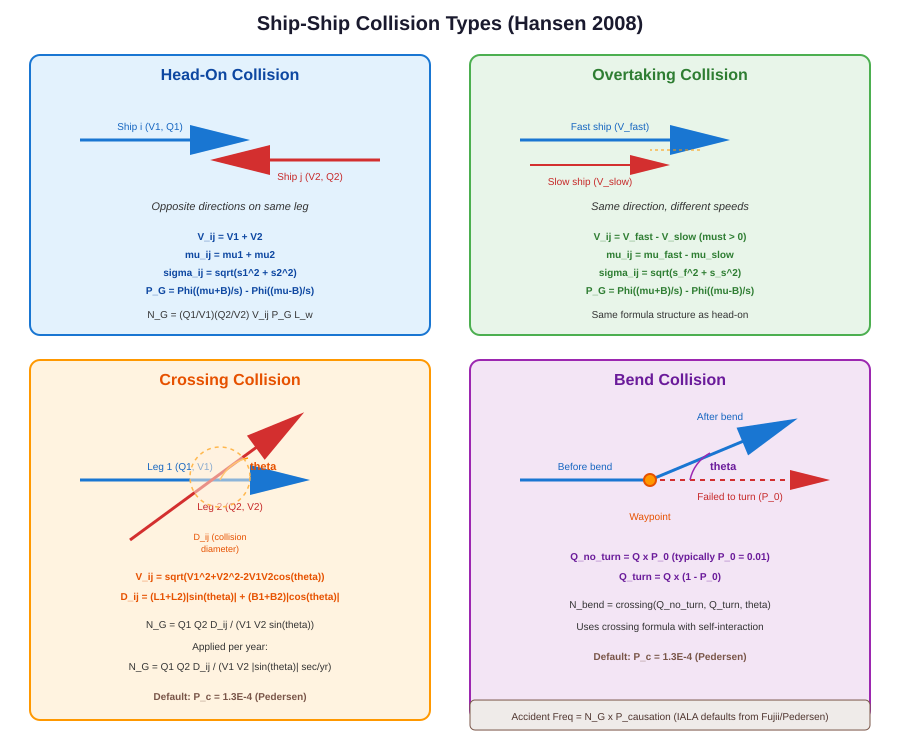

.. _collisions:

================================
Ship-Ship Collision Calculations
================================

This chapter describes OMRAT's calculations for ship-ship collision
risk.  Five encounter types are modelled -- head-on, overtaking,
crossing, merging and bend -- based on the equations in Pedersen
(1995) and Friis-Hansen (2008).

.. contents:: In this chapter
   :local:
   :depth: 2

Overview
========

Ship-ship collisions occur when two vessels occupy the same space at the
same time. The IWRAP methodology models this by calculating the
**geometric number of collision candidates** -- the expected number of
close encounters per year assuming no evasive action -- and then
multiplying by a **causation factor** to get the actual accident
frequency.

The general formula is:

.. math::

   F_{\text{collision}} = N_G \times P_C

Where:

- :math:`N_G` = geometric collision candidates per year
- :math:`P_C` = causation probability (IALA default values)

.. container:: source-code-ref pipeline

   **Pipeline orchestrator:** ``compute/ship_collision_model.py:1224`` -- `run_ship_collision_model() <https://github.com/axelande/OMRAT/blob/main/compute/ship_collision_model.py#L1224>`__

Head-On Collisions
==================

Head-on collisions occur between vessels travelling in **opposite
directions** on the same leg. This is the classical encounter type for
narrow shipping lanes.

Geometry
--------

Two streams of traffic travel in opposite directions. The collision
probability depends on the lateral overlap of their position
distributions.

Equations (Hansen Eq. 4.2--4.4)
--------------------------------

The geometric number of collision candidates is:

.. math::

   N_G = \frac{Q_1}{V_1} \times \frac{Q_2}{V_2} \times V_{ij}
         \times P_G \times L_w \times \frac{1}{\text{sec/year}}

Where:

- :math:`Q_1, Q_2` = traffic volume in each direction (ships/year)
- :math:`V_1, V_2` = vessel speeds (m/s)
- :math:`V_{ij} = V_1 + V_2` = relative closing speed (m/s)
- :math:`L_w` = leg segment length (m)
- :math:`P_G` = geometric collision probability

The term :math:`Q/V` converts from traffic frequency (ships/year) to
traffic density (ships/m), accounting for the time ships spend on the
leg.

The geometric collision probability is:

.. math::

   P_G = \Phi\!\left(\frac{\mu_{ij} + B_{ij}}{\sigma_{ij}}\right)
       - \Phi\!\left(\frac{\mu_{ij} - B_{ij}}{\sigma_{ij}}\right)

Where:

- :math:`\mu_{ij} = \mu_1 + \mu_2` -- combined mean lateral distance
  (head-on: positions add because ships face opposite directions)
- :math:`\sigma_{ij} = \sqrt{\sigma_1^2 + \sigma_2^2}` -- combined
  standard deviation
- :math:`B_{ij} = (B_1 + B_2) / 2` -- average vessel breadth (collision
  width)
- :math:`\Phi` = standard normal CDF

.. container:: source-code-ref

   ``compute/basic_equations.py:329`` -- `get_head_on_collision_candidates() <https://github.com/axelande/OMRAT/blob/main/compute/basic_equations.py#L329>`__

.. literalinclude:: ../../compute/basic_equations.py
   :language: python
   :pyobject: get_head_on_collision_candidates
   :caption: Head-on collision candidate calculation (compute/basic_equations.py)

Default causation factor
-------------------------

.. math::

   P_C = 4.9 \times 10^{-5} \quad \text{(Fujii et al. 1974)}

Overtaking Collisions
=====================

Overtaking collisions occur between vessels travelling in the **same
direction** at different speeds. The faster vessel catches up to the
slower one.

Geometry
--------

Both vessels travel in the same direction. The collision probability
depends on the speed difference (overtaking is only possible if
:math:`V_{\text{fast}} > V_{\text{slow}}`) and the lateral overlap of
their distributions.

Equations (Hansen Eq. 4.5)
---------------------------

The formula is structurally identical to head-on, but with different
relative speed and lateral offset:

.. math::

   V_{ij} = V_{\text{fast}} - V_{\text{slow}}

.. math::

   \mu_{ij} = \mu_{\text{fast}} - \mu_{\text{slow}}

.. note::

   If :math:`V_{\text{fast}} \leq V_{\text{slow}}`, overtaking is
   impossible and the result is zero.

The geometric probability :math:`P_G`, combined standard deviation
:math:`\sigma_{ij}`, and breadth :math:`B_{ij}` are calculated
identically to the head-on case.

.. container:: source-code-ref

   ``compute/basic_equations.py:433`` -- `get_overtaking_collision_candidates() <https://github.com/axelande/OMRAT/blob/main/compute/basic_equations.py#L433>`__

Default causation factor
-------------------------

.. math::

   P_C = 1.1 \times 10^{-4} \quad \text{(Fujii et al. 1974)}

Crossing Collisions
===================

Crossing collisions occur at intersections where two legs cross at an
angle :math:`\theta`. This is common at traffic separation scheme
junctions, port approaches, and areas where multiple routes converge.

Geometry
--------

Two traffic streams cross at angle :math:`\theta`. The collision zone
is an area around the intersection point whose size depends on vessel
dimensions and the crossing angle.

Equations (Pedersen 1995)
--------------------------

The two streams have linear densities :math:`Q_1/V_1` and
:math:`Q_2/V_2` (ships per metre of leg).  Candidates accumulate at the
rate at which one stream sweeps the other's collision cross-section:

.. math::

   N_G = \frac{Q_1}{V_1} \cdot \frac{Q_2}{V_2}
         \cdot V_{ij} \cdot \frac{D_{ij}}{|\sin\theta|}

Where:

- :math:`\theta` = crossing angle (radians)
- :math:`V_{ij}` = relative speed (metres/second)
- :math:`D_{ij}` = geometric collision diameter (metres)

The **relative speed** uses the law of cosines:

.. math::

   V_{ij} = \sqrt{V_1^2 + V_2^2 - 2 V_1 V_2 \cos\theta}

The **collision diameter** is the width of the Minkowski sum of the two
hulls projected onto the normal of the *relative* velocity -- the
cross-section ship 2 sweeps as seen from ship 1:

.. math::

   D_{ij} = \frac{(L_1 V_2 + L_2 V_1)\,|\sin\theta|}{V_{ij}}
          + B_1 \sqrt{1 - \left(\frac{V_2 \sin\theta}{V_{ij}}\right)^2}
          + B_2 \sqrt{1 - \left(\frac{V_1 \sin\theta}{V_{ij}}\right)^2}

Where :math:`L_1, L_2` are ship lengths and :math:`B_1, B_2` are ship
beams.  Note the pairing: :math:`B_1` carries :math:`V_2` inside the
root, and vice versa.  Modelling each hull as an :math:`L \times B`
rectangle, ship 1's projection onto that normal is
:math:`(L_1 V_2 |\sin\theta| + B_1 |V_1 - V_2\cos\theta|)/V_{ij}`, and
the identity
:math:`\sqrt{V_{ij}^2 - V_2^2 \sin^2\theta} = |V_1 - V_2\cos\theta|`
gives the square-root form above.

.. admonition:: Sanity check
   :class: tip

   Equal speeds, :math:`\theta = 90^\circ`: every term picks up
   :math:`1/\sqrt{2}` and
   :math:`D_{ij} = (L_1 + L_2 + B_1 + B_2)/\sqrt{2}` -- exactly the
   projected width of both rectangles onto the 45-degree normal.  This
   is checked directly in
   ``tests/test_ship_ship_collisions.py::test_crossing_diameter_equals_projected_hull_width``.

Because :math:`Q/V` appears twice and :math:`V_{ij}` once, crossing
candidates scale as :math:`1/V` -- faster traffic spends less time in
the conflict zone.  Head-on and overtaking obey the same law.

.. note::

   When :math:`\theta \to 0` or :math:`\theta \to \pi` (parallel or
   anti-parallel courses), :math:`\sin\theta \to 0` and the crossing
   formula is not applicable. Use head-on or overtaking formulas instead.

.. warning:: Changed in v0.14.0

   Earlier versions omitted :math:`V_{ij}` from the numerator and used
   the unweighted collision diameter
   :math:`D_{ij} = (L_1+L_2)|\sin\theta| + (B_1+B_2)|\cos\theta|`.  Two
   consequences: crossing candidates scaled as :math:`1/V^2` instead of
   :math:`1/V` (head-on and overtaking were always correct), and the
   beam contribution vanished entirely at right-angle crossings, where
   :math:`\cos\theta = 0`.

   On the bundled example project the corrected formula raises crossing
   by about **5.6x** and merging by about **4.8x**.  Crossing, merging
   and bend numbers from runs before v0.14.0 are therefore **not**
   comparable with current ones; re-run any project you want to compare.

.. container:: source-code-ref

   ``compute/basic_equations.py:524`` -- `get_crossing_collision_candidates() <https://github.com/axelande/OMRAT/blob/main/compute/basic_equations.py#L524>`__

.. literalinclude:: ../../compute/basic_equations.py
   :language: python
   :pyobject: get_crossing_collision_candidates
   :caption: Crossing collision with law of cosines (compute/basic_equations.py)

Default causation factor
-------------------------

.. math::

   P_C = 1.3 \times 10^{-4} \quad \text{(Pedersen 1995)}

.. _merging-collisions:

Merging Collisions
==================

A **merging** encounter is the same geometry as a crossing, but at a
shallow angle: two streams converging onto nearly the same course, for
example a feeder lane joining a main fairway.  The encounter lasts
longer and the closing speed is lower than a broadside crossing, so it
is worth reporting separately.

OMRAT classifies each leg pair once, from its meeting angle:

.. list-table::
   :header-rows: 1
   :widths: 30 70

   * - Meeting angle
     - Accident type
   * - :math:`\theta \le 30^\circ`
     - **Merging collision**
   * - :math:`\theta > 30^\circ`
     - **Crossing collision**

The threshold is ``ShipCollisionModelMixin.MERGING_ANGLE_DEG``.  The
*equations are identical* to the crossing case above -- only the
causation factor differs, so a project can calibrate merging
independently:

.. math::

   P_C^{\mathrm{merging}} = 1.3 \times 10^{-4}
   \quad \text{(defaults to the crossing value)}

IWRAP publishes no separate merging causation factor, which is why the
default matches crossing.  Set it under **Settings -> Causation
Factors -> Merging causation factor**.

.. note:: Changed in v0.14.0

   Merging used to be classified internally but summed into the
   **crossing** total, while the Run Analysis row labelled "Merging
   collision" was fed the *bend* number.  Merging and bend are now
   separate accident types with their own rows, causation factors and
   consequence-matrix entries.  There is no automatic migration: a
   ``.omrat`` file written before v0.14.0 needs a ``pc['merging']``
   entry and a 9th row in each spill matrix.  Opening the Causation
   Factors dialog and the Consequence dialogs and saving writes both.

.. _crossing_traffic_distribution:

How OMRAT distributes traffic between legs at a junction
---------------------------------------------------------

A common question from new users:

   *"At a crossing or merging point, how does OMRAT decide which
   fraction of leg A's traffic continues to leg B vs leg C?"*

**Short answer: it doesn't.**  OMRAT does not model a routing
distribution at junctions.  Each leg has its **own independent**
traffic table, and crossing collisions are computed pairwise from
:math:`Q_1 \times Q_2` for every pair of legs that share a waypoint.

That means **the user is responsible for keeping leg traffic counts
consistent**:

* If 1000 ships/year transit a fork and the user expects 60 % to take
  leg B and 40 % to take leg C, the *Frequency (ships/year)* value on
  leg A must be ``1000``, on leg B ``600``, on leg C ``400`` — entered
  manually on the Traffic Data tab (or split by AIS in the user's
  pre-processing).
* If you populate traffic from the AIS database (``pbUpdateAIS``),
  OMRAT samples passages from the AIS table that intersect each leg's
  passage line independently.  A ship that AIS shows transiting both
  leg A and leg B contributes ``+1`` to leg A's count *and* ``+1`` to
  leg B's count — i.e. AIS already supplies a self-consistent
  distribution as a side-effect of how passages are counted.

The crossing-collision contribution between leg :math:`i` and leg
:math:`j` is therefore:

.. math::

   N_{G, i\to j} = \frac{Q_i \cdot Q_j \cdot D_{ij}}
                       {V_i V_j |\sin\theta_{ij}| \cdot \text{sec/year}}

with no extra weighting term for "the share of :math:`Q_i` that
continues toward leg :math:`j`".  The same applies to merging collisions
(treated as crossings with a small angle) and to bend collisions on a
single leg (no neighbouring-leg contribution).

.. container:: source-code-ref

   ``compute/ship_collision_model.py:_calc_crossing_collisions``
   iterates every pair ``(leg_i, leg_j)`` and skips pairs that don't
   share a waypoint or are nearly parallel (``crossing_angle < 0.1
   rad``).

Bend Collisions
===============

Bend collisions occur at waypoints where a route changes direction. A
vessel that fails to make the turn continues on its original heading and
may collide with vessels that did turn correctly.

Geometry
--------

At a waypoint, the route changes direction by angle :math:`\theta`.
Most vessels turn correctly, but a small fraction :math:`P_0` (typically
1%) fail to turn and continue straight.

Equations
---------

.. math::

   Q_{\text{no turn}} = Q \times P_0

.. math::

   Q_{\text{turn}} = Q \times (1 - P_0)

The bend collision is then modelled as a crossing collision between the
non-turning traffic and the turning traffic:

.. math::

   N_{\text{bend}} = N_G^{\text{crossing}}(Q_{\text{no turn}},
                      Q_{\text{turn}}, \theta)

Where :math:`\theta` is the bend angle (change in heading at the
waypoint) and the crossing collision formula is applied with
self-interaction: :math:`L_1 = L_2`, :math:`B_1 = B_2` and
:math:`V_1 = V_2 = V`, the traffic-weighted mean speed on the leg.  With
equal speeds the relative speed reduces to

.. math::

   V_{ij} = 2 V \left|\sin\frac{\theta}{2}\right|

so the bend inherits the crossing formula's :math:`1/V` scaling: faster
traffic yields fewer candidates.

.. warning:: Changed in v0.14.0

   Earlier versions called the crossing formula with a placeholder
   ``V1 = V2 = 1.0`` m/s and a comment claiming the speed cancelled out.
   It does not: the placeholder inflated both linear densities
   (:math:`Q/V` with :math:`V = 1`) and removed the bend's speed
   dependence altogether.  Together with the crossing-formula fix, bend
   frequencies now come out roughly **5-10x lower** than before,
   depending on speed and bend angle.  Bend numbers from earlier runs
   are not comparable.

Bend is reported as its own row in the Accident probabilities table.  It
is *not* the same accident as a merging collision -- a bend is one leg
changing direction, a merge is two legs converging.  See
:ref:`merging-collisions`.

.. container:: source-code-ref

   ``compute/basic_equations.py:648`` -- `get_bend_collision_candidates() <https://github.com/axelande/OMRAT/blob/main/compute/basic_equations.py#L648>`__

Default causation factor
-------------------------

.. math::

   P_C = 1.3 \times 10^{-4} \quad \text{(Pedersen 1995)}

Default probability of not turning:

.. math::

   P_0 = 0.01

Calculation Workflow
====================

The collision calculation for each leg proceeds as follows:

1. **Extract traffic data**: For each segment, extract all ship types,
   frequencies, speeds, and dimensions in both directions.

2. **Pair ship types**: For head-on and overtaking, pair every ship type
   :math:`i` in direction 1 with every ship type :math:`j` in direction 2
   (or same direction for overtaking).

3. **Calculate per-pair N_G**: Apply the appropriate formula based on
   encounter type, using the specific vessel speeds, beams, and lateral
   distributions.

4. **Sum over all pairs**: The total geometric candidates is the sum
   over all ship type pairs.

5. **Apply causation factor**: Multiply by :math:`P_C` to get accident
   frequency.

6. **Display results**: Results are shown in the UI as annual accident
   frequencies per collision type.

Summary of Equations
=====================

.. list-table::
   :widths: 20 30 20 30
   :header-rows: 1

   * - Type
     - Relative Speed
     - Lateral Offset
     - Key Parameter
   * - Head-on
     - :math:`V_1 + V_2`
     - :math:`\mu_1 + \mu_2`
     - Opposite directions
   * - Overtaking
     - :math:`V_f - V_s`
     - :math:`\mu_f - \mu_s`
     - Same direction, :math:`V_f > V_s`
   * - Crossing
     - :math:`\sqrt{V_1^2+V_2^2-2V_1V_2\cos\theta}`
     - :math:`D_{ij}`
     - Crossing angle :math:`\theta`
   * - Bend
     - (crossing formula)
     - (crossing formula)
     - :math:`P_0 = 0.01`
