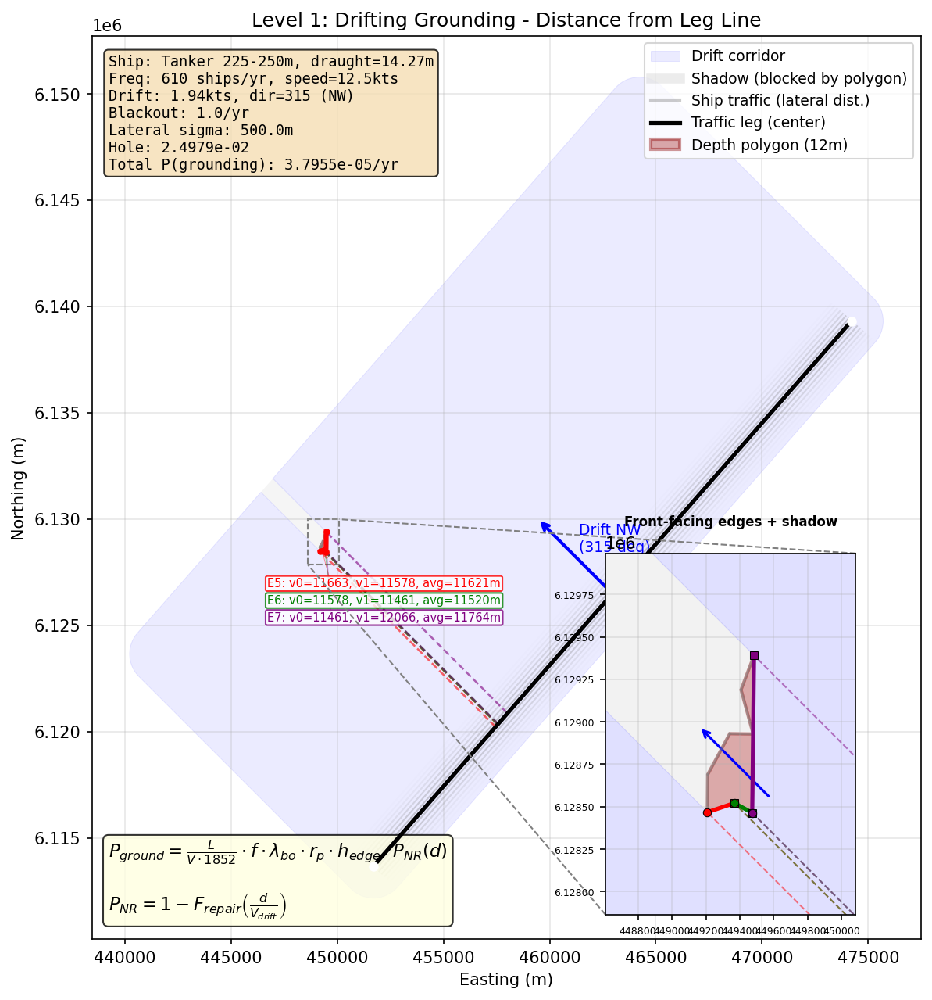
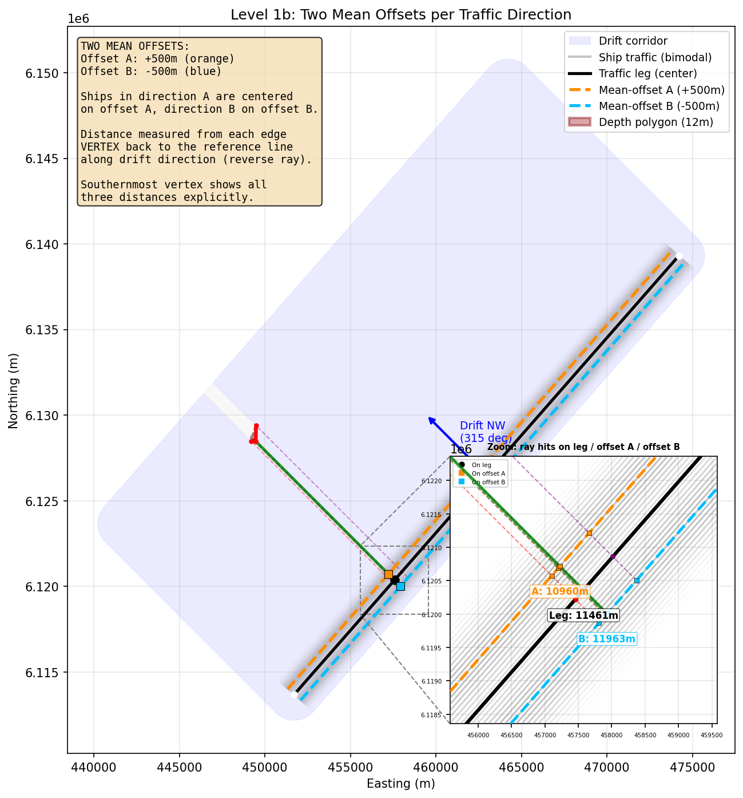
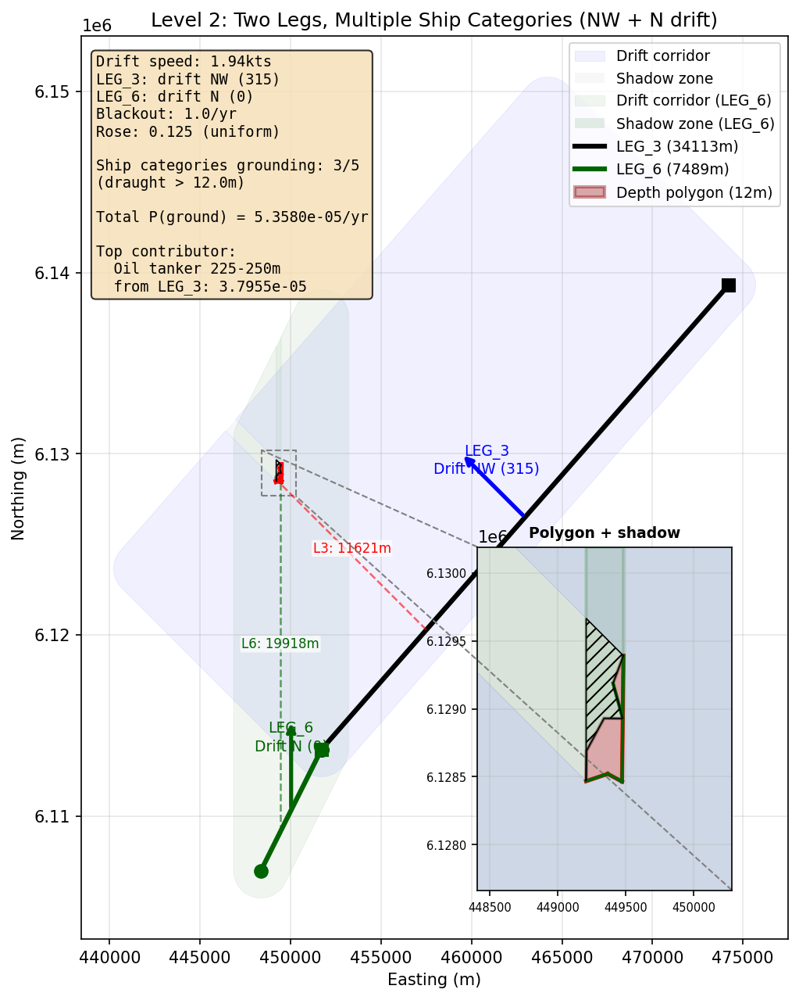
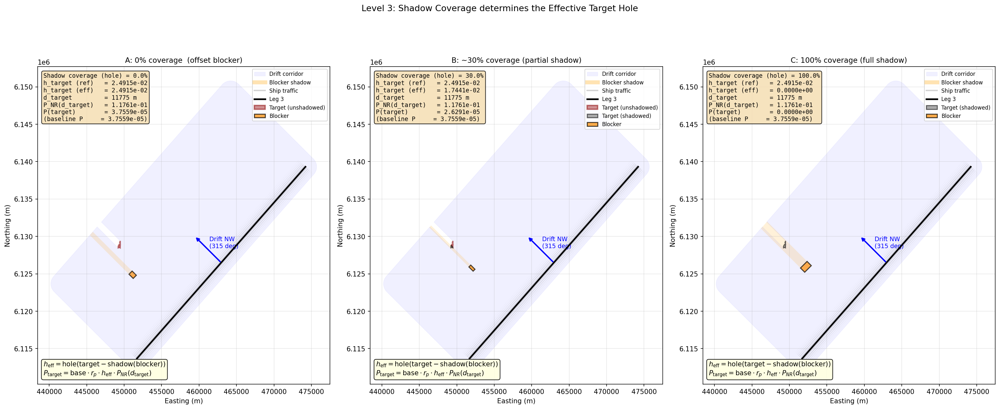
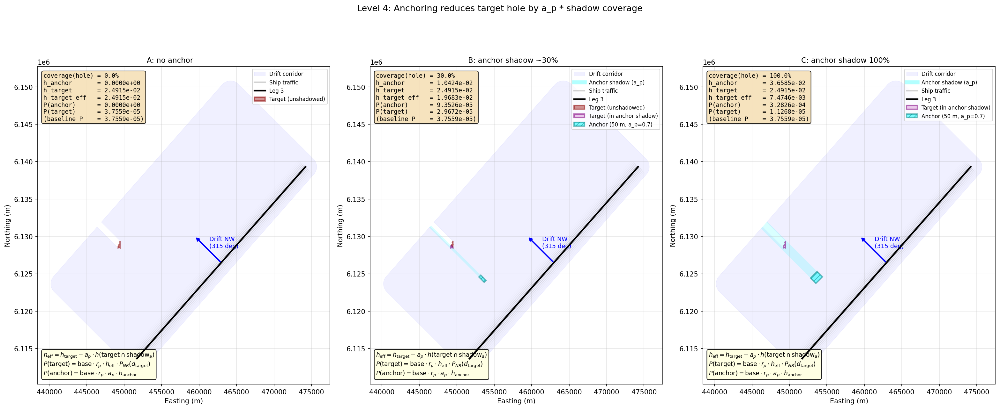
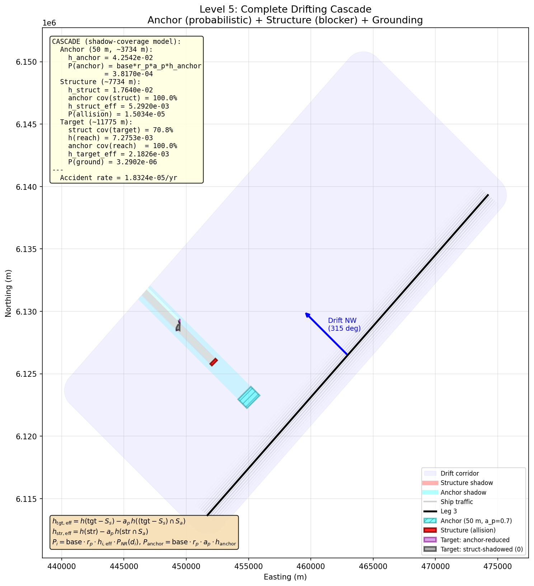
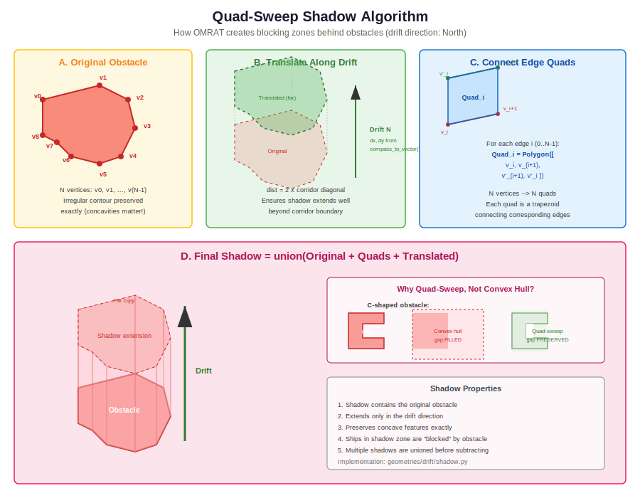

.. _drifting:

============================
Drifting Risk Calculations
============================

This chapter explains, step by step, how OMRAT calculates the risk that
a ship which loses propulsion (blackout) drifts into a shallow area
(grounding), a structure (allision) or succeeds in anchoring before it
does so.

The chapter is built around the five worked examples in
``drifting/debug/level_1 ... level_5``.  Each example runs OMRAT's
actual calculation functions, prints every intermediate value, and
produces a figure showing the leg, the obstacles and the drift corridor.
Re-running the scripts reproduces the numbers quoted below exactly.

.. contents:: In this chapter
   :local:
   :depth: 2

.. _drifting-overview:

Overview of the Drifting Model
===============================

When a ship suffers a blackout it becomes powerless and drifts under
wind and current until one of the following happens:

1. The crew repairs the engine,
2. The crew successfully drops the anchor (in water shallow enough for
   anchoring), or
3. The ship reaches an obstacle (grounds on a shallow, collides with a
   structure or reaches the reach-distance limit without incident).

The probability that a drifting ship causes an accident on an obstacle
:math:`X` from leg :math:`i` in compass direction :math:`d` is

.. math::
   :label: eq-drift-per-direction

   P_{i,d,X}
     \;=\; \mathrm{base}_{i,k}
           \cdot r_{p,d}
           \cdot h_{X,\mathrm{eff}}
           \cdot P_{NR}(d_X)

and for anchoring (which saves ships rather than causing an accident)

.. math::
   :label: eq-drift-anchor

   P_{\mathrm{anchor},i,d,X}
     \;=\; \mathrm{base}_{i,k}\cdot r_{p,d}\cdot a_p\cdot h_{\mathrm{anchor}}

The total drifting accident rate is the sum over all wind-rose
directions, all obstacles, all legs and all ship categories:

.. math::
   :label: eq-drift-total

   R_{\mathrm{drift}}
     \;=\; \sum_{i}\ \sum_{k}\ \sum_{X\in \{\mathrm{gr,al}\}}\ \sum_{d=1}^{8}
             r_{p,d}\cdot \mathrm{base}_{i,k}\cdot
             h_{X,\mathrm{eff},d}\cdot P_{NR,d}(d_X)

with :math:`\sum_{d=1}^{8} r_{p,d} = 1`.  For a uniform wind rose
(used in the worked examples) :math:`r_{p,d} = 0.125`.  Anchoring
events are summed separately since they represent saved — not lost —
ships.

The base exposure is

.. math::
   :label: eq-base

   \mathrm{base}_{i,k}
     \;=\; \frac{L_i}{V_k\cdot 1852}\cdot f_{i,k}\cdot \lambda_{bo,\mathrm{hour}}
   \qquad
   \lambda_{bo,\mathrm{hour}}
     \;=\; \frac{\lambda_{bo}}{365.25\cdot 24}

The symbols are listed in the table below.  Sections
:ref:`drifting-base`, :ref:`drifting-repair`, :ref:`drifting-hole`,
:ref:`drifting-distance` and :ref:`drifting-run-vs-analysis` define
each term in detail, and the five worked examples in Sections
:ref:`drifting-level1` through :ref:`drifting-level5` show how they
combine.

.. list-table:: Symbols used throughout this chapter
   :header-rows: 1
   :widths: 18 62 20

   * - Symbol
     - Meaning
     - Unit / type
   * - :math:`L_i`
     - Length of leg :math:`i`
     - metres
   * - :math:`V_k`
     - Service speed of ship category :math:`k`
     - knots
   * - :math:`1852`
     - Metres per nautical mile
     - constant
   * - :math:`f_{i,k}`
     - Transits per year of category :math:`k` on leg :math:`i`
     - 1/year
   * - :math:`\lambda_{bo}`
     - Blackout rate while at sea
     - 1/year
   * - :math:`\lambda_{bo,\mathrm{hour}}`
     - Blackouts per hour =
       :math:`\lambda_{bo}/(365.25\cdot 24)`
     - 1/hour
   * - :math:`r_{p,d}`
     - Wind-rose probability for compass direction :math:`d`
       (8 directions, sum = 1)
     - dimensionless
   * - :math:`h_X`
     - Probability hole of obstacle :math:`X` (the fraction of the
       lateral traffic distribution whose drift rays intersect
       :math:`X`)
     - dimensionless
   * - :math:`h_{X,\mathrm{eff},d}`
     - Effective hole of obstacle :math:`X` in direction :math:`d`
       after upstream shadowing / anchoring
     - dimensionless
   * - :math:`d_X`
     - Along-drift distance from the leg reference to obstacle
       :math:`X`
     - metres
   * - :math:`V_{\mathrm{drift}}`
     - Drift speed
     - m/s
   * - :math:`P_{NR}(d_X)`
     - Probability the blackout is *not* repaired by the time the
       ship has drifted :math:`d_X`
     - dimensionless
   * - :math:`a_p`
     - Anchoring success probability
     - dimensionless
   * - :math:`a_d`
     - Anchoring depth multiplier (anchoring applies if depth is
       less than :math:`a_d\cdot T_{\mathrm{ship}}`)
     - dimensionless
   * - :math:`T_{\mathrm{ship}}`
     - Ship draught
     - metres
   * - :math:`S_X`
     - Quad-sweep shadow polygon of obstacle :math:`X` along the
       drift direction
     - polygon

.. _drifting-run-vs-analysis:

``run analysis`` vs ``run model``
==================================

Two buttons in the OMRAT QGIS plugin trigger different code paths.

.. list-table::
   :header-rows: 1
   :widths: 22 20 58

   * - Button
     - Entry point
     - What it does
   * - **Run analysis**
     - :code:`run_drift_analysis()` in ``omrat.py:884`` →
       ``DriftCorridorTask``
     - Builds the **drift corridor polygons** (per leg, per direction)
       and draws them as QGIS vector layers.  Uses the quad-sweep
       shadow algorithm and the corridor-clipping code in
       ``geometries/drift/``.  **No probabilities are computed.**
   * - **Run model**
     - :code:`run_calculation()` in ``omrat.py:599`` →
       ``CalculationTask`` → :code:`run_drifting_model()` in
       ``compute/drifting_model.py:2096``
     - Computes the actual drifting risk — :math:`P(\mathrm{ground})`,
       :math:`P(\mathrm{allision})`, :math:`P(\mathrm{anchor})` — for
       every (leg, direction, obstacle, ship-category).  This is the
       path described in the rest of this chapter.

The quad-sweep algorithm described in :ref:`drifting-shadow-algorithm`
is **only used by "run analysis"** (for drawing the corridors); the
probability calculation uses the shadow-coverage formulation described
per level below, which operates directly on the obstacle polygons and
their quad-sweep shadows as a geometric subtraction rather than a
corridor-clipping step.

.. _drifting-parameters:

Common Parameters Used in the Examples
=======================================

All five worked examples use Leg 3 from the ``proj_3_3`` test scenario
and an 8-vertex 12 m depth polygon (``BD5A4C46``) as the target.  The
values below are the exact inputs the scripts pass to the OMRAT
functions — re-running the scripts reproduces every number shown in
this chapter.

.. list-table::
   :header-rows: 1
   :widths: 30 20 50

   * - Parameter
     - Value
     - Symbol / note
   * - Leg 3 length
     - 34 113.2 m
     - :math:`L`
   * - Leg 3 start (lon, lat)
     - (14.24187°, 55.16728°)
     - EPSG:4326
   * - Leg 3 end (lon, lat)
     - (14.59271°, 55.39937°)
     - EPSG:4326
   * - Ship speed (service)
     - 12.5 kts
     - :math:`V`
   * - Ship frequency (Leg 3)
     - 610 transits/year
     - :math:`f`
   * - Ship draught (oil tanker)
     - 14.27 m
     - :math:`T_{\mathrm{ship}}`
   * - Drift speed
     - 1.94 kts (0.998 m/s)
     - :math:`V_{\mathrm{drift}}`
   * - Blackout rate
     - 1.0 /year
     - :math:`\lambda_{bo}`
   * - Blackouts per hour
     - :math:`1.1408\times 10^{-4}`
     - :math:`\lambda_{bo,\mathrm{hour}}`
   * - Wind rose (uniform)
     - 1/8 = 0.125 per direction
     - :math:`r_p`
   * - Lateral sigma
     - 500 m
     - :math:`\sigma`
   * - Reach distance
     - 50 000 m
     - max drift distance
   * - Repair time distribution
     - lognormal(std=1, loc=0, scale=1)
     - :math:`F_{\mathrm{lognorm}}`
   * - Anchoring success
     - :math:`a_p = 0.70`
     -
   * - Anchoring depth multiplier
     - :math:`a_d = 7.0`
     - threshold = :math:`a_d\cdot T_{\mathrm{ship}}`
   * - Drift direction (examples)
     - 315° (NW)
     - :math:`\theta_{\mathrm{compass}}`

Compass-to-math conversion used throughout OMRAT:

.. math::

   \theta_{\mathrm{math}} = (90\degree - \theta_{\mathrm{compass}}) \bmod 360\degree

For :math:`\theta_{\mathrm{compass}}=315\degree` (NW) this gives
:math:`\theta_{\mathrm{math}}=135\degree` and a unit drift vector
:math:`\hat v = (-0.7071, 0.7071)`.

.. _drifting-base:

Exposure Base
==============

The base exposure counts how many blackouts per year are expected while
ships are on the leg (equation :eq:`eq-base`).

With the shared parameters:

.. math::

   \mathrm{hours\_present}
     = \frac{34113.2}{12.5\cdot 1852}\cdot 610
     = 898.878\ \mathrm{h/yr}
   \qquad
   \mathrm{base}
     = 898.878\cdot 1.1408\times10^{-4}
     = 1.02541\times 10^{-1}

The unit of :math:`\mathrm{base}` is *blackouts per year on this leg
from ships of this category*.  Every grounding, allision and anchoring
probability below is multiplied by this factor and the wind-rose
probability.

.. container:: source-code-ref

   ``compute/basic_equations.py:9`` -- `get_drifting_prob()
   <https://github.com/axelande/OMRAT/blob/main/compute/basic_equations.py#L9>`__

.. _drifting-repair:

Repair Time and :math:`P_{NR}`
==============================

The time required to repair a blackout is modelled by a lognormal
distribution with parameters :math:`(\sigma, \mu_{\mathrm{loc}}, s)`.
The probability that the ship is *not* repaired by the time it has
drifted a distance :math:`d` is

.. math::

   P_{NR}(d)
     \;=\; 1 - F_{\mathrm{lognorm}}\!
            \left(
              \frac{d}{V_{\mathrm{drift}}\cdot 3600};\
              \sigma,\ \mu_{\mathrm{loc}},\ s
            \right)

In the examples we use :math:`\sigma=1.0`, :math:`\mu_{\mathrm{loc}}=0`,
:math:`s=1.0`.  For the average target edge at :math:`d=11\,775\,\mathrm{m}`
this evaluates to

.. math::

   \frac{d}{V_{\mathrm{drift}}\cdot 3600}
     = \frac{11775}{0.998\cdot 3600}
     = 3.28\ \mathrm{h}
   \qquad
   P_{NR}(11775) \approx 0.1176

i.e. about 11.8% of blackouts are still unresolved three hours after
the event.

.. container:: source-code-ref

   ``compute/basic_equations.py:30`` -- `get_not_repaired()
   <https://github.com/axelande/OMRAT/blob/main/compute/basic_equations.py#L30>`__

.. _drifting-hole:

The Probability "Hole" :math:`h_X`
===================================

The **hole** of an obstacle :math:`X` is the fraction of the lateral
traffic distribution whose straight-line drift rays intersect :math:`X`.
OMRAT computes it analytically by slicing the leg into N cross-sections
and integrating the lateral PDF over the y-intervals where the drift ray
hits the polygon (``geometries/analytical_probability.py``).

For a lateral normal :math:`\mathcal N(0, \sigma^2)` the result is
deterministic (no Monte Carlo noise):

.. math::

   h_X \;=\; \int_0^1 \!\!\!\!\int_{R(s)\subset[-W/2,+W/2]}
                        \phi\!\left(\frac{y}{\sigma}\right) dy\, ds

where :math:`R(s)` is the union of y-intervals at slice position
:math:`s` where the drift ray hits :math:`X`, and :math:`W=5\sigma` is
the lateral integration range.

Numerical value in the examples: for the 8-vertex 12 m target polygon
with drift direction NW, :math:`h_{\mathrm{target}} = 2.4915\times 10^{-2}`.

.. container:: source-code-ref

   ``geometries/analytical_probability.py`` --
   `compute_probability_analytical()
   <https://github.com/axelande/OMRAT/blob/main/geometries/analytical_probability.py>`__.
   The analytical path is the default
   (``data['use_analytical']=True`` in ``run_drifting_model``); a Monte
   Carlo fallback exists in
   ``geometries/calculate_probability_holes.py`` but is only used when
   the user explicitly disables the analytical integrator.

.. _drifting-distance:

Directional Distance to an Obstacle
====================================

The distance :math:`d_X` that goes into :math:`P_{NR}(d_X)` is the
*along-drift* distance from a leg reference line to the obstacle.  OMRAT
measures it by casting a **reverse ray** from each vertex of the
obstacle back along the drift direction and intersecting with the
reference line.  The per-edge distance is the average of its two vertex
distances (``edge_average_distance_m`` in ``drifting/engine.py``).

Two reference lines are supported:

- **Leg centreline** (``use_leg_offset = False``, default):
  distance is measured from the charted leg line itself.
- **Mean-offset line** (``use_leg_offset = True``): distance is
  measured from a parallel line offset by :math:`\mathrm{mean\_offset\_m}`
  from the leg.  This is the correct choice when the traffic in a
  direction is systematically biased to one side of the charted leg.

For the target polygon (NW drift, leg centreline), the three
front-facing edges give

===========  =================  =================  ===============
Edge         vertex 0 (m)       vertex 1 (m)       average (m)
===========  =================  =================  ===============
5            11 662.9           11 578.4           11 620.6
6            11 578.4           11 461.5           11 519.9
7            11 461.5           12 066.2           11 763.8
===========  =================  =================  ===============

.. container:: source-code-ref

   ``drifting/engine.py:215`` -- `directional_distance_to_point_from_offset_leg()
   <https://github.com/axelande/OMRAT/blob/main/drifting/engine.py#L215>`__ |
   ``drifting/engine.py:288`` -- `edge_average_distance_m()
   <https://github.com/axelande/OMRAT/blob/main/drifting/engine.py#L288>`__

.. _drifting-level1:

Level 1 — Single Polygon, Single Ship, Single Leg
==================================================

**Script:** ``drifting/debug/level_1_single_polygon.py``

The simplest case.  Leg 3 drifts NW toward the 8-vertex 12 m polygon
``BD5A4C46``.  One ship category (oil tanker 225–250 m, draught 14.27 m,
610 transits/year) contributes because the target depth (12 m) is less
than the draught.

Step 1 — base exposure (section
:ref:`drifting-base`):

.. math::

   \mathrm{base} \;=\; 1.02541\times 10^{-1}

Step 2 — analytical target hole (section
:ref:`drifting-hole`):

.. math::

   h_{\mathrm{target}} \;=\; 2.4979\times 10^{-2}

Step 3 — distribute the hole over the three front-facing edges in
proportion to their length (total = 1215.0 m):

===========  ============  =================  =====================
Edge idx     length (m)    distance (m)       :math:`h_{\mathrm{edge}}`
===========  ============  =================  =====================
5            168.2         11 620.6           :math:`3.458\times 10^{-3}`
6            119.7         11 519.9           :math:`2.462\times 10^{-3}`
7            927.0         11 763.8           :math:`1.906\times 10^{-2}`
===========  ============  =================  =====================

Step 4 — :math:`P_{NR}` per edge (section :ref:`drifting-repair`):

.. math::

   \begin{aligned}
   P_{NR}(11620.6)\text{ (Edge 5)} &= 0.12023 \\
   P_{NR}(11519.9)\text{ (Edge 6)} &= 0.12198 \\
   P_{NR}(11763.8)\text{ (Edge 7)} &= 0.11780
   \end{aligned}

Step 5 — per-edge grounding contribution:

.. math::

   P_{\mathrm{edge}}
     \;=\; \mathrm{base}\cdot r_p\cdot h_{\mathrm{edge}}\cdot P_{NR}(d_{\mathrm{edge}})

==================  ================================================
Edge                Contribution (events/year)
==================  ================================================
5                   :math:`5.329\times 10^{-6}`
6                   :math:`3.849\times 10^{-6}`
7                   :math:`2.878\times 10^{-5}`
**Total**           :math:`3.7955\times 10^{-5}`
==================  ================================================

So **P(grounding) = 3.7955 × 10⁻⁵ events/year** for this single
(leg, ship, direction) combination.

.. _drifting-level1b:

Level 1b — Distance from the Leg Centreline vs the Distribution Centre
=======================================================================

**Script:** ``drifting/debug/level_1_single_polygon.py`` (second figure)

A *charted* leg is a single line, but the **traffic** on that leg is
typically split into two directions (ships going one way and ships
going the other way) and those two populations may be centred on
slightly different parallel lines.  OMRAT supports this via two
reference-line modes for the :math:`d_X` measurement
(:ref:`drifting-distance`):

- **Mode (a) — ``leg_center`` (default):** distance is measured from
  the charted leg line.  Used everywhere in Levels 1–5 unless stated.
- **Mode (b) — ``distribution_center``:** distance is measured from a
  mean-offset line, one per traffic direction.  This shifts the
  distance values by the mean lateral offset of the traffic for that
  direction.

The same front-facing target edges computed with both modes
(:math:`\mathrm{mean\_offset}_A = +500\,\mathrm{m}`,
:math:`\mathrm{mean\_offset}_B = -500\,\mathrm{m}`):

.. list-table:: Edge distances per reference line (metres)
   :header-rows: 1
   :widths: 10 22 22 22 22

   * - Edge
     - Leg centreline (v0 / v1 / avg)
     - Offset A = +500 (v0 / v1 / avg)
     - Offset B = -500 (v0 / v1 / avg)
     - Shift
   * - 5
     - 11 662.9 / 11 578.4 / 11 620.6
     - 11 161.8 / 11 077.4 / 11 119.6
     - 12 163.9 / 12 079.5 / 12 121.7
     - ±500 m
   * - 6
     - 11 578.4 / 11 461.5 / 11 519.9
     - 11 077.4 / 10 960.4 / 11 018.9
     - 12 079.5 / 12 562.5 / 12 320.9
     - ±500 m
   * - 7
     - 11 461.5 / 12 066.2 / 11 763.8
     - 10 960.4 / 11 565.1 / 11 262.8
     - 11 961.5 / 12 566.8 / 12 264.0
     - ±500 m

Using the mean-offset distance changes :math:`P_{NR}(d_X)` (shorter
distance → ship more likely to still be drifting).  Combined over the
two traffic directions this produces a more realistic risk than
treating both directions as centred on the charted leg.

To enable this mode set ``use_leg_offset_for_distance = True`` in the
:code:`DriftConfig` and provide a non-zero
:code:`LegState.mean_offset_m` per direction.

.. container:: source-code-ref

   ``drifting/engine.py:215`` -- `directional_distance_to_point_from_offset_leg(use_leg_offset=True)
   <https://github.com/axelande/OMRAT/blob/main/drifting/engine.py#L215>`__ |
   ``drifting/engine.py:46`` -- `DriftConfig.use_leg_offset_for_distance
   <https://github.com/axelande/OMRAT/blob/main/drifting/engine.py#L46>`__

.. _drifting-level2:

Level 2 — Two Legs, Multiple Ship Categories
=============================================

**Script:** ``drifting/debug/level_2_two_legs_multi_ships.py``

This example introduces:

1. A second traffic leg (Leg 6, 7 489 m, bearing ~41° NE) with its own
   drift direction (N = 0°).
2. Five ship categories with different draughts and frequencies.

Only ship categories with :math:`T_{\mathrm{ship}} > d_{\mathrm{polygon}} = 12\,\mathrm{m}`
can ground on this polygon.  Three of the five qualify:

==========================  =============  =========  ==========  ==========  =======
Ship category               Draught (m)    Grounds?   Freq L3     Freq L6     Speed
==========================  =============  =========  ==========  ==========  =======
Oil tanker 225-250 m        14.27          yes        610         50          12.5
General cargo 225-250 m     11.82          no         450         40          13.0
Bulk carrier 250-275 m      16.53          yes        180         15          13.5
Container 275-300 m         13.50          yes        95          8           18.0
Passenger 100-125 m         5.80           no         320         280         16.0
==========================  =============  =========  ==========  ==========  =======

Per-leg analytical holes (NW for Leg 3, N for Leg 6):

==========  =====================================================
Leg         :math:`h_X`  (NW for L3, N for L6)
==========  =====================================================
LEG_3       :math:`2.4979\times 10^{-2}`
LEG_6       :math:`8.1012\times 10^{-2}`
==========  =====================================================

The per-(leg, ship) exposure base scales with that ship's speed and
frequency:

.. math::

   \mathrm{base}_{i,k}
     = \frac{L_i}{V_k\cdot 1852}\cdot f_{i,k}\cdot \lambda_{bo,\mathrm{hour}}

Summing over all valid (leg, ship, edge) combinations and the single NW
direction yields

.. list-table::
   :header-rows: 1
   :widths: 40 20 20 20

   * - Leg / ship
     - Base
     - P(ground)
     - Share
   * - LEG_3 / Oil tanker 225-250 m
     - 0.10254
     - :math:`3.7955\times 10^{-5}`
     - 70.8%
   * - LEG_3 / Bulk carrier 250-275 m
     - 0.02802
     - :math:`1.0370\times 10^{-5}`
     - 19.4%
   * - LEG_3 / Container 275-300 m
     - 0.01109
     - :math:`4.1049\times 10^{-6}`
     - 7.7%
   * - LEG_6 / Oil tanker 225-250 m
     - 0.001845
     - :math:`8.281\times 10^{-7}`
     - 1.5%
   * - LEG_6 / Bulk carrier 250-275 m
     - 0.000513
     - :math:`2.300\times 10^{-7}`
     - 0.4%
   * - LEG_6 / Container 275-300 m
     - 0.000205
     - :math:`9.201\times 10^{-8}`
     - 0.2%
   * - **Total (NW)**
     -
     - :math:`\mathbf{5.358\times 10^{-5}}`
     -

Multiplying by the rose probability and summing over all 8 wind
directions gives the full per-leg risk used in equation
:eq:`eq-drift-total`.

.. _drifting-level3:

Level 3 — Blocking Polygon (Shadow Coverage)
=============================================

**Script:** ``drifting/debug/level_3_blocking_polygon.py``

When an obstacle sits upstream of another obstacle on the drift axis,
drifting ships that would otherwise reach the downstream obstacle may
be blocked by the upstream one.  In OMRAT the blocking effect is
**purely geometric**: a blocker removes exactly the drift rays it
physically intercepts, nothing more.

Shadow-Coverage Model
---------------------

Define the blocker's shadow polygon :math:`S_B` as the quad-sweep of
the blocker along the drift direction (see
:ref:`drifting-shadow-algorithm`).  The effective hole of the
downstream target becomes

.. math::
   :label: eq-shadow-cover

   h_{\mathrm{target,eff}} \;=\; h\!\big(\mathrm{target} - S_B\big)

which is computed by the same analytical integrator used for any other
hole, but evaluated on the *unshadowed part* of the target polygon.
Equivalently,

.. math::

   h_{\mathrm{target,eff}}
     \;=\; h_{\mathrm{target}}\cdot\big(1 - \mathrm{cov}_B\big)
   \qquad
   \mathrm{cov}_B
     \;=\; \frac{h_{\mathrm{target}} - h_{\mathrm{target,eff}}}
                {h_{\mathrm{target}}}

where :math:`\mathrm{cov}_B` is the *probability-hole coverage* (not
the geometric area fraction — the lateral PDF weights the target
unevenly).  The grounding probability is

.. math::

   P(\mathrm{target})
     \;=\; \mathrm{base}\cdot r_p\cdot h_{\mathrm{target,eff}}
           \cdot P_{NR}(d_{\mathrm{target}})

.. important::
   There is **no** multiplicative "remaining" factor in the blocker
   cascade.  The blocker only changes the target's effective hole via
   equation :eq:`eq-shadow-cover`.

Three Scenarios
---------------

Using the same target polygon as Level 1/2 and a rectangular blocker
placed 4 km upstream of the target, the script generates three
coverage scenarios by varying the blocker's cross-drift width.  For
each, it reports the effective hole, the blocker's own hole and the
target probability.

.. list-table:: Level 3 — three shadow coverages
   :header-rows: 1
   :widths: 30 15 25 30

   * - Scenario
     - cov(hole)
     - :math:`h_{\mathrm{target,eff}}`
     - P(target)
   * - A — blocker laterally offset
     - 0.0%
     - :math:`2.4915\times 10^{-2}`
     - :math:`3.7559\times 10^{-5}`
   * - B — 30 % coverage
     - 30.0%
     - :math:`1.7441\times 10^{-2}`
     - :math:`2.6291\times 10^{-5}`
   * - C — 100 % coverage
     - 100.0%
     - 0
     - 0
   * - Baseline (no blocker)
     -
     - :math:`2.4915\times 10^{-2}`
     - :math:`3.7559\times 10^{-5}`

Detailed Calculation (Scenario B, 30% coverage)
-----------------------------------------------

.. math::

   \begin{aligned}
   h_{\mathrm{target}}            &= 2.4915\times 10^{-2} \\
   \mathrm{cov}_B\text{ (hole)}   &= 30.00\% \\
   h_{\mathrm{target,eff}}        &= h_{\mathrm{target}}\cdot(1-0.30)
                                    = 1.7441\times 10^{-2} \\
   \mathrm{base}                  &= 1.02541\times 10^{-1} \\
   r_p                            &= 0.125 \\
   P_{NR}(d_{\mathrm{target}}=11\,775)  &= 0.11761 \\
   P(\mathrm{target})
     &= 1.02541\times 10^{-1}\cdot 0.125
        \cdot 1.7441\times 10^{-2}\cdot 0.11761 \\
     &= 2.6291\times 10^{-5}\ \text{events/year}
   \end{aligned}

The blocker itself may also be a grounding or allision hazard; the
script reports its contribution separately using its own hole, distance
and (for grounding/allision) :math:`P_{NR}`.

.. _drifting-level4:

Level 4 — Anchoring
====================

**Script:** ``drifting/debug/level_4_anchoring.py``

An *anchoring polygon* is an area where ships can successfully drop
anchor because the water depth is shallower than
:math:`a_d\cdot T_{\mathrm{ship}}` but deeper than the ship's draught
(so it is not a grounding hazard).  Anchoring is modelled
*probabilistically*: a ship drifting through the anchor zone anchors
with probability :math:`a_p` and keeps drifting with probability
:math:`(1-a_p)`.

The anchoring formulation uses the same shadow-coverage geometry as
Level 3, combined with the probabilistic success factor.  If
:math:`S_A` is the anchor polygon's quad-sweep shadow along the drift
direction, the effective target hole is

.. math::

   h_{\mathrm{target,eff}}
     \;=\; h_{\mathrm{target}}
           - a_p\cdot h\!\big(\mathrm{target}\cap S_A\big)

The grounding and anchoring contributions are

.. math::

   P(\mathrm{target})
     = \mathrm{base}\cdot r_p
       \cdot h_{\mathrm{target,eff}}
       \cdot P_{NR}(d_{\mathrm{target}})
   \qquad
   P(\mathrm{anchor})
     = \mathrm{base}\cdot r_p\cdot a_p\cdot h_{\mathrm{anchor}}

When :math:`a_p \to 1`, the anchor behaves like a pure blocker (the
Level 3 full-coverage case).  When :math:`a_p = 0` it has no effect.

Parameters specific to this example:

- :math:`a_p = 0.70`, :math:`a_d = 7.0`, :math:`T_{\mathrm{ship}} = 14.27\,\mathrm{m}`
- Anchoring threshold: :math:`a_d\cdot T_{\mathrm{ship}} = 99.9\,\mathrm{m}`
- Anchor polygon depth: 50 m (< 99.9 m, so anchoring applies)

Three Scenarios
---------------

The script varies the anchor polygon's cross-drift width to produce
three coverage cases.

.. list-table:: Level 4 — anchor shadow coverages
   :header-rows: 1
   :widths: 30 15 20 20 20

   * - Scenario
     - cov(hole)
     - :math:`h_{\mathrm{target,eff}}`
     - P(anchor)
     - P(target)
   * - A — no anchor polygon
     - 0.0%
     - :math:`2.4915\times 10^{-2}`
     - 0
     - :math:`3.7559\times 10^{-5}`
   * - B — 30% coverage
     - 30.0%
     - :math:`1.9479\times 10^{-2}`
     - :math:`9.353\times 10^{-5}`
     - :math:`2.9672\times 10^{-5}`
   * - C — 100% coverage
     - 100.0%
     - :math:`7.475\times 10^{-3}`
     - :math:`3.283\times 10^{-4}`
     - :math:`1.1268\times 10^{-5}`

In Scenario C the anchor reduces the target hole by exactly
:math:`a_p = 70\%`, giving :math:`P(\mathrm{target})` equal to 30% of
the baseline.  In Scenario B it reduces it by
:math:`0.3\cdot 0.7 = 21\%`, consistent with the reported -21%.

Detailed Calculation (Scenario C, 100% coverage)
------------------------------------------------

.. math::

   \begin{aligned}
   h_{\mathrm{anchor}}         &= 3.6585\times 10^{-2} \\
   h(\mathrm{target}\cap S_A)  &= h_{\mathrm{target}} = 2.4915\times 10^{-2} \\
   h_{\mathrm{target,eff}}     &= h_{\mathrm{target}}
                                  - a_p\cdot h(\mathrm{target}\cap S_A) \\
                               &= 2.4915\times 10^{-2}
                                  - 0.7\cdot 2.4915\times 10^{-2} \\
                               &= 7.475\times 10^{-3} \\
   P(\mathrm{anchor})          &= \mathrm{base}\cdot r_p\cdot a_p
                                  \cdot h_{\mathrm{anchor}} \\
                               &= 1.02541\times 10^{-1}\cdot 0.125
                                  \cdot 0.7\cdot 3.6585\times 10^{-2} \\
                               &= 3.283\times 10^{-4}\ \text{/yr} \\
   P(\mathrm{target})          &= \mathrm{base}\cdot r_p
                                  \cdot h_{\mathrm{target,eff}}
                                  \cdot P_{NR}(d_{\mathrm{target}}) \\
                               &= 1.02541\times 10^{-1}\cdot 0.125
                                  \cdot 7.475\times 10^{-3}
                                  \cdot 0.11761 \\
                               &= 1.1268\times 10^{-5}\ \text{/yr}
   \end{aligned}

.. _drifting-level5:

Level 5 — Complete Cascade
===========================

**Script:** ``drifting/debug/level_5_complete_cascade.py``

The full cascade combines all three obstacle types in the same drift
path:

1. **Anchoring polygon** (50 m depth, 8 km upstream, wider than target):
   probabilistic, reduces subsequent rays by :math:`a_p = 0.70` over
   the cross-drift intersection.
2. **Allision structure** (platform / turbine cluster, 600 m × 200 m,
   4 km upstream of target, directly in front on the cross-drift axis):
   pure geometric blocker.
3. **Grounding target** (same 8-vertex 12 m polygon).

Combined Shadow-Coverage Formulation
-------------------------------------

Let :math:`S_s` be the structure's quad-sweep shadow and :math:`S_a`
be the anchor's.  Only the part of the target *not* shadowed by the
structure is reachable:

.. math::

   \mathrm{target}_{\mathrm{reach}}
     \;=\; \mathrm{target} - S_s

Of that reachable part, some rays also pass through the anchor zone
and are reduced by :math:`a_p`:

.. math::

   h_{\mathrm{target,eff}}
     \;=\; h\!\big(\mathrm{target}_{\mathrm{reach}}\big)
           - a_p\cdot h\!\big(\mathrm{target}_{\mathrm{reach}} \cap S_a\big)

The structure itself is reduced by the anchor for its own rays that
pass through the anchor zone first:

.. math::

   h_{\mathrm{struct,eff}}
     \;=\; h_{\mathrm{struct}}
           - a_p\cdot h\!\big(\mathrm{struct}\cap S_a\big)

Anchoring is unconditional — every ray passing through the anchor zone
is counted, regardless of whether a downstream structure would later
have blocked it:

.. math::

   P(\mathrm{anchor})
     \;=\; \mathrm{base}\cdot r_p\cdot a_p\cdot h_{\mathrm{anchor}}

Probability contributions:

.. math::

   \begin{aligned}
   P(\mathrm{allision}) &= \mathrm{base}\cdot r_p
                            \cdot h_{\mathrm{struct,eff}}
                            \cdot P_{NR}(d_{\mathrm{struct}}) \\
   P(\mathrm{ground})   &= \mathrm{base}\cdot r_p
                            \cdot h_{\mathrm{target,eff}}
                            \cdot P_{NR}(d_{\mathrm{target}})
   \end{aligned}

The total accident rate is :math:`P(\mathrm{allision}) + P(\mathrm{ground})`.
:math:`P(\mathrm{anchor})` is shown separately since those ships are saved.

Numerical Walk-Through
-----------------------

Values computed by the script (see ``drifting/debug/level_5_complete_cascade.py``):

.. list-table:: Obstacle holes and distances
   :header-rows: 1
   :widths: 40 30 30

   * - Obstacle
     - :math:`h_X`
     - :math:`d_X` (m)
   * - Anchor (50 m, 8 km upstream)
     - :math:`4.2542\times 10^{-2}`
     - 3 734
   * - Structure (600 m × 200 m, 4 km upstream of target)
     - :math:`1.7640\times 10^{-2}`
     - 7 734
   * - Target (12 m)
     - :math:`2.4915\times 10^{-2}`
     - 11 775

Shadow coverages (computed by the script):

.. list-table:: Shadow coverages of downstream obstacles
   :header-rows: 1
   :widths: 50 50

   * - Coverage
     - Value
   * - Structure shadow on target hole
     - 70.8%
   * - Anchor shadow on REACHABLE target hole
     - 100.0%
   * - Anchor shadow on structure hole
     - 100.0%

Effective holes:

.. math::

   \begin{aligned}
   h_{\mathrm{target,eff}}
     &= h(\mathrm{target}-S_s)
        - a_p\cdot h((\mathrm{target}-S_s)\cap S_a) \\
     &= 7.277\times 10^{-3} - 0.7\cdot 7.277\times 10^{-3} \\
     &= 2.183\times 10^{-3} \\
   h_{\mathrm{struct,eff}}
     &= h_{\mathrm{struct}} - a_p\cdot h(\mathrm{struct}\cap S_a) \\
     &= 1.7640\times 10^{-2} - 0.7\cdot 1.7640\times 10^{-2} \\
     &= 5.292\times 10^{-3}
   \end{aligned}

Probability contributions (using :math:`P_{NR}(7734)=0.22164` and
:math:`P_{NR}(11775)=0.11761`):

.. math::

   \begin{aligned}
   P(\mathrm{anchor})
     &= 1.02541\times 10^{-1}\cdot 0.125\cdot 0.70\cdot 4.2542\times 10^{-2}
      = 3.817\times 10^{-4} \\
   P(\mathrm{allision})
     &= 1.02541\times 10^{-1}\cdot 0.125\cdot 5.292\times 10^{-3}\cdot 0.22164 \\
     &= 1.503\times 10^{-5} \\
   P(\mathrm{ground})
     &= 1.02541\times 10^{-1}\cdot 0.125\cdot 2.183\times 10^{-3}\cdot 0.11761 \\
     &= 3.290\times 10^{-6} \\
   \text{Accident rate}
     &= P(\mathrm{allision}) + P(\mathrm{ground}) = 1.832\times 10^{-5}\ \text{/yr}
   \end{aligned}

Scenario Comparison
-------------------

Dropping one obstacle at a time shows how each component affects the
total:

.. list-table::
   :header-rows: 1
   :widths: 35 20 20 20

   * - Scenario
     - P(anchor)
     - P(allision)
     - P(ground)
   * - target only
     - 0
     - 0
     - :math:`3.756\times 10^{-5}`
   * - target + anchor
     - :math:`3.817\times 10^{-4}`
     - 0
     - :math:`1.127\times 10^{-5}`
   * - target + structure
     - 0
     - :math:`5.011\times 10^{-5}`
     - :math:`1.097\times 10^{-5}`
   * - target + anchor + structure
     - :math:`3.817\times 10^{-4}`
     - :math:`1.503\times 10^{-5}`
     - :math:`3.290\times 10^{-6}`

The structure blocks 70.8% of the target's rays (the part directly
behind it); the anchor reduces the remaining target rays (and the
structure's rays) by :math:`a_p = 0.7`.

.. _drifting-shadow-algorithm:

Shadow Algorithm (Quad-Sweep)
==============================

.. note::

   The quad-sweep algorithm described in this section is the same
   geometric operation used everywhere else in the chapter (for
   example, :math:`S_B` in :eq:`eq-shadow-cover` and :math:`S_s`,
   :math:`S_a` in Level 5).  It is also the only place a shadow
   polygon is explicitly **drawn**: in the ``run analysis`` code path
   that produces the QGIS drift-corridor layers.  During the
   probability calculation (``run model``) the shadow polygons are
   built on the fly per obstacle and used directly as a
   :code:`shapely.Polygon.difference` / :code:`Polygon.intersection`
   argument — the result is the effective-hole equation already shown
   per level.  There is no corridor-clipping or MultiPolygon
   reachability filter on the probability path.

OMRAT computes shadow polygons by sweeping each obstacle along the
drift direction and joining the original polygon to its translated
copy via a quadrilateral per edge.

Given polygon :math:`P = (v_0, v_1, \ldots, v_{n-1})` and drift vector
:math:`\hat v \cdot L`:

1. Translate :math:`P` by :math:`\hat v \cdot L` to produce :math:`P'`.
2. For each edge :math:`(v_i, v_{i+1})` create a quadrilateral
   :math:`Q_i = (v_i, v_{i+1}, v'_{i+1}, v'_i)`.
3. The shadow is :math:`S = P \cup P' \cup \bigcup_i Q_i`.

This preserves the original contour of the obstacle even for
**concave** shapes (e.g. a reef with a navigable gap) — the quads
fill only the region physically swept by each edge.  A convex-hull
shortcut would incorrectly fill navigable channels.

Reproducing this operation manually in the worked examples:

.. code-block:: python

   def build_quad_shadow(poly, extrude_length):
       far = translate(poly, xoff=drift_ux * extrude_length,
                              yoff=drift_uy * extrude_length)
       orig  = list(poly.exterior.coords)[:-1]
       far_c = list(far.exterior.coords)[:-1]
       quads = []
       for i in range(len(orig)):
           j = (i + 1) % len(orig)
           q = Polygon([orig[i], orig[j], far_c[j], far_c[i]])
           if q.is_valid and q.area > 0:
               quads.append(q)
       return unary_union([poly, far] + quads)

.. container:: source-code-ref

   ``geometries/drift/shadow.py:18`` -- `create_obstacle_shadow()
   <https://github.com/axelande/OMRAT/blob/main/geometries/drift/shadow.py#L18>`__
   *(visualisation path only; used by ``run analysis`` to produce the
   corridor layers)*

.. _drifting-corridor-viz:

Drift Corridor Visualisation (``run analysis`` only)
======================================================

The **drift corridor** layers drawn on the map come from a separate
code path (``run analysis``) and are not part of the probability
calculation.  They are a convenience for the user to see, for each leg
and each of the 8 compass directions, the reachable area after all
obstacles have been clipped out.

Base surface width:

.. math::

   \text{width} = 2\cdot Z_{0.995}\cdot \sigma \approx 2\cdot 2.576\cdot \sigma

Maximum drift distance:

.. math::

   d_{\mathrm{max}} = F^{-1}_{\mathrm{lognorm}}(0.999)
                      \cdot 3600\cdot V_{\mathrm{drift}}

clamped to :math:`[10\,000, 50\,000]\,\mathrm{m}` for numerical
stability.

The visualisation corridor is the convex hull of the base surface and
its translation by :math:`d_{\mathrm{max}}\hat v`, clipped by every
obstacle's quad-sweep shadow (:ref:`drifting-shadow-algorithm`) and
filtered for reachability.  **This clipping happens only on the
visualisation path** — during ``run model`` the probability
calculation uses the shadow polygons directly (via
shadow-coverage subtraction, per-level equations above).

.. container:: source-code-ref

   ``omrat.py:884`` -- `run_drift_analysis()
   <https://github.com/axelande/OMRAT/blob/main/omrat.py#L884>`__ |
   ``geometries/drift/corridor.py:16`` -- `create_base_surface()
   <https://github.com/axelande/OMRAT/blob/main/geometries/drift/corridor.py#L16>`__ |
   ``geometries/drift/clipping.py:16`` -- `clip_corridor_at_obstacles()
   <https://github.com/axelande/OMRAT/blob/main/geometries/drift/clipping.py#L16>`__

.. _drifting-pipeline:

Pipeline and Source Code Pointers
==================================

.. container:: source-code-ref pipeline

   **Probability pipeline (``run model``):**
   ``omrat.py:599 run_calculation()`` →
   ``CalculationTask`` →
   ``compute/drifting_model.py:2096 run_drifting_model()`` →
   `analytical hole
   <https://github.com/axelande/OMRAT/blob/main/geometries/analytical_probability.py>`__ +
   `edge distance
   <https://github.com/axelande/OMRAT/blob/main/drifting/engine.py#L288>`__ +
   `P_NR
   <https://github.com/axelande/OMRAT/blob/main/compute/basic_equations.py#L30>`__ +
   shadow-coverage subtraction per Levels 3–5.

   **Visualisation pipeline (``run analysis``):**
   ``omrat.py:884 run_drift_analysis()`` →
   ``DriftCorridorTask`` →
   `DriftCorridorGenerator
   <https://github.com/axelande/OMRAT/blob/main/geometries/drift/generator.py#L25>`__ →
   `quad-sweep shadow
   <https://github.com/axelande/OMRAT/blob/main/geometries/drift/shadow.py#L18>`__ +
   `corridor clipping
   <https://github.com/axelande/OMRAT/blob/main/geometries/drift/clipping.py#L16>`__.

The worked-example scripts in ``drifting/debug/`` import the same
functions OMRAT uses during ``run model``, so the numbers printed
above match the results the QGIS plugin produces for the same inputs.

Summary
========

- For every (leg, direction, obstacle, ship) tuple the drifting
  probability is
  :math:`P = \mathrm{base}\cdot r_p\cdot h_{\mathrm{eff}}\cdot P_{NR}(d)`,
  and anchoring is
  :math:`P_{\mathrm{anchor}} = \mathrm{base}\cdot r_p\cdot a_p\cdot h_{\mathrm{anchor}}`.
- :math:`h_{\mathrm{eff}}` is the analytical hole of the obstacle
  *minus* everything that is geometrically or probabilistically blocked
  upstream.  Blocking polygons (Level 3) remove the rays they
  intercept; anchoring zones (Levels 4–5) reduce those rays by the
  factor :math:`a_p`.  No multiplicative "remaining" factor is applied
  across obstacles — the correct formulation is the shadow-coverage
  model, identical in form across blockers (:math:`h - h(\cap S)`)
  and anchoring (:math:`h - a_p\cdot h(\cap S_A)`).
- The final drifting rate is the sum over all 8 wind-rose directions,
  all obstacles, all legs and all ship categories (equation
  :eq:`eq-drift-total`).
- Levels 1–5 of the worked examples in ``drifting/debug/`` reproduce
  every intermediate value in this chapter.
- The quad-sweep shadow algorithm is used in both the probability
  calculation (via polygon subtraction) and the drift-corridor
  visualisation; the corridor-clipping step is **visualisation-only**.
