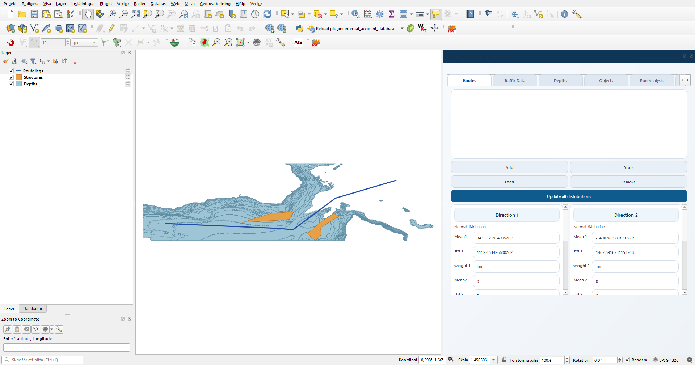

.. OMRAT documentation master file

=============================================
OMRAT -- Open Maritime Risk Analysis Tool
=============================================

**OMRAT** is a QGIS plugin that calculates how often ships in a waterway
are expected to run aground, collide with structures, or collide with
each other.  It implements the IWRAP methodology (Friis-Hansen 2008,
Pedersen 1995) as an open-source tool, so the result is comparable with
the IALA reference implementation but everything happens inside QGIS.

Given a shipping route, traffic volume per ship type, a bathymetry
layer, and a list of structures, OMRAT returns **expected accidents per
year** for each of the main accident types:

* **Drifting grounding / allision / anchoring** -- ships that lose
  propulsion and drift into shallow water, a structure, or anchor
  successfully.
* **Powered grounding / allision** -- ships under power that fail to
  turn at a bend and continue straight into an obstacle.
* **Ship-ship collisions** -- head-on, overtaking, crossing, and bend
  collisions.

Three ways to read this documentation
======================================

Pick the path that fits what you're trying to do.

.. list-table::
   :widths: 20 80
   :header-rows: 1

   * - I want to...
     - Read
   * - run OMRAT for the first time on the supplied example project
     - :ref:`quickstart`
   * - learn what each tab of the plugin does
     - :ref:`user_guide`
   * - understand **what** the risk numbers mean
     - :ref:`theory`, then :ref:`drifting` / :ref:`collisions` /
       :ref:`powered`
   * - understand **how** the calculation is implemented
       (function by function, call tree)
     - :ref:`code-flow`, then the per-accident chapters
       :ref:`code-flow-drifting` / :ref:`code-flow-collisions` /
       :ref:`code-flow-powered`
   * - look up a specific field in the ``.omrat`` JSON file or the
       ``data`` dict passed to the calculation
     - :ref:`reference-data-format`

The two-track philosophy
========================

Every accident type has **two chapters**:

* A **theory chapter** (Track 1) explaining *what* the calculation
  measures, deriving the formulas, and listing the assumptions.  Read
  this if you're an analyst interpreting a result or comparing against
  IWRAP.

* A **code-flow chapter** (Track 2) walking the actual function calls
  that happen when **Run Model** is pressed.  Read this if you're a
  developer tracing an output back to the code that produced it, or
  extending / reviewing the calculation.

The two tracks deliberately overlap so you can start reading in one
and cross over to the other without getting lost.

Contents
========

.. toctree::
   :maxdepth: 2
   :caption: Getting Started

   overview
   installation
   quickstart
   quickstart_from_scratch

.. toctree::
   :maxdepth: 2
   :caption: Using OMRAT

   concepts
   user_guide
   workflows

.. toctree::
   :maxdepth: 2
   :caption: Theory (what is calculated)

   theory
   drifting
   collisions
   powered
   junctions
   consequence

.. toctree::
   :maxdepth: 2
   :caption: Code Flow (how it is calculated)

   code_flow
   code_flow_drifting
   code_flow_collisions
   code_flow_powered

.. toctree::
   :maxdepth: 2
   :caption: Reference

   reference_data_format
   architecture
   api

Indices
=======

* :ref:`genindex`
* :ref:`modindex`
* :ref:`search`

Citing OMRAT
============

If you use OMRAT in a publication, please cite the project repository
(https://github.com/axelande/OMRAT) together with the IWRAP references
it implements (Friis-Hansen 2008, Pedersen 1995).  A full bibliography
is at the bottom of :ref:`theory`.
