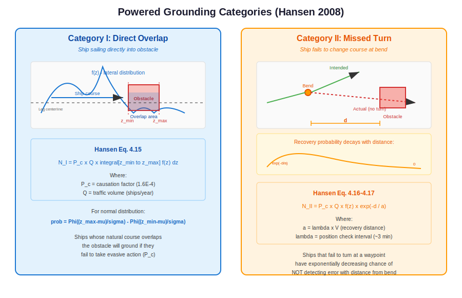
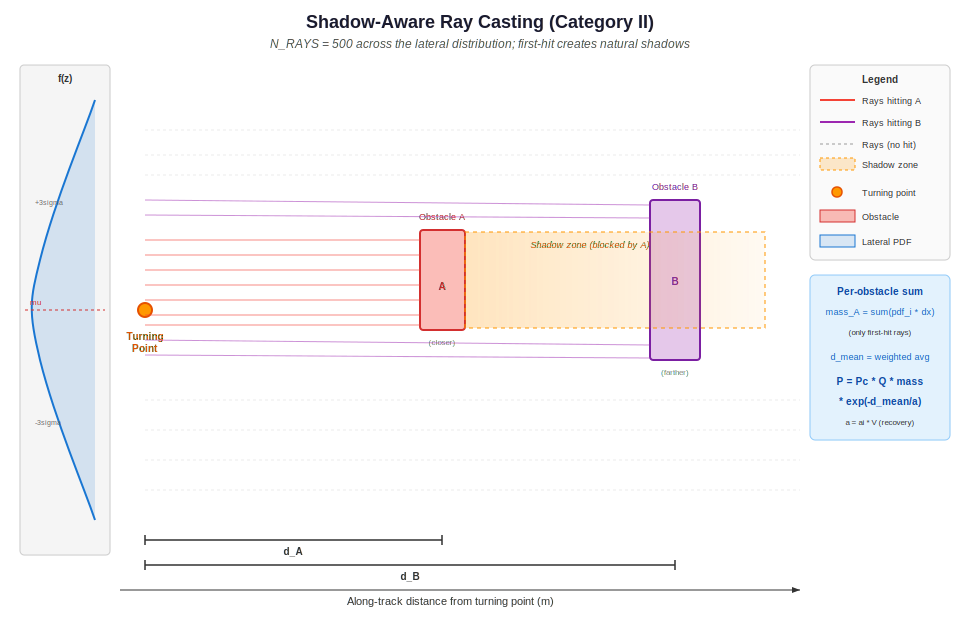
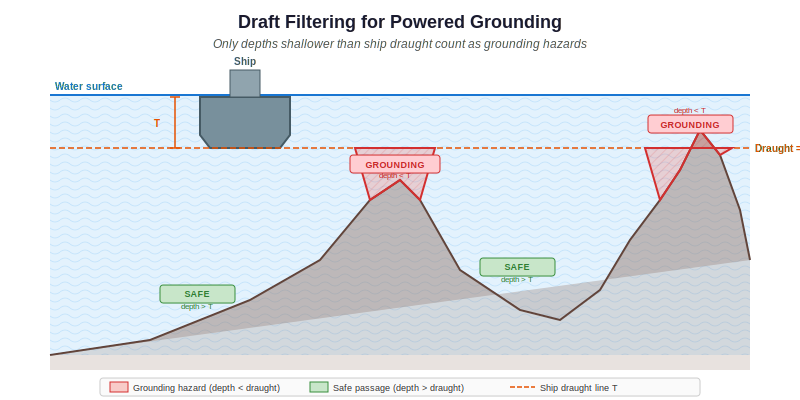

.. _powered:

===================================
Powered Grounding and Allision
===================================

This chapter describes OMRAT's calculations for powered grounding and
allision -- accidents involving ships that are under power but fail to
navigate correctly. Two categories are modelled based on Hansen (2008).

.. contents:: In this chapter
   :local:
   :depth: 2

Overview
========

Powered accidents occur when a vessel has operational engines but the
crew fails to take appropriate action. This can happen because of:

- Navigation errors
- Equipment malfunction
- Human factors (fatigue, distraction)
- Environmental conditions (poor visibility)

Unlike drifting accidents, powered accidents depend on the **lateral
traffic distribution** relative to obstacles and the **probability of
course correction** after an error.

.. container:: source-code-ref pipeline

   **Grounding pipeline:** ``compute/powered_model.py:28`` -- `run_powered_grounding_model() <https://github.com/axelande/OMRAT/blob/main/compute/powered_model.py#L28>`__ |
   **Allision pipeline:** ``compute/powered_model.py:178`` -- `run_powered_allision_model() <https://github.com/axelande/OMRAT/blob/main/compute/powered_model.py#L178>`__ |
   **Exponential decay:** ``compute/basic_equations.py:26`` -- `powered_na() <https://github.com/axelande/OMRAT/blob/main/compute/basic_equations.py#L26>`__

Category I: Direct Overlap
==========================

Category I covers ships whose natural course (based on their lateral
position in the traffic distribution) takes them directly into an
obstacle. These ships are sailing on a heading that overlaps with the
obstacle, and will ground/collide unless they take evasive action.

Equation (Hansen Eq. 4.15)
---------------------------

.. math::

   N_I = P_C \times Q \times \int_{z_{\min}}^{z_{\max}} f(z) \, dz

Where:

- :math:`P_C` = causation factor (:math:`1.6 \times 10^{-4}` for
  grounding)
- :math:`Q` = traffic volume (ships/year)
- :math:`f(z)` = lateral traffic distribution (PDF)
- :math:`z_{\min}, z_{\max}` = lateral extent of the obstacle
- The integral represents the fraction of traffic whose course overlaps
  the obstacle

For a **normal distribution**, the integral evaluates to:

.. math::

   \int_{z_{\min}}^{z_{\max}} f(z) \, dz =
   \Phi\!\left(\frac{z_{\max} - \mu}{\sigma}\right) -
   \Phi\!\left(\frac{z_{\min} - \mu}{\sigma}\right)

Where :math:`\Phi` is the standard normal CDF and :math:`\mu, \sigma`
are the mean and standard deviation of the lateral position distribution.

.. container:: source-code-ref

   ``compute/basic_equations.py:432`` -- `get_powered_grounding_cat1() <https://github.com/axelande/OMRAT/blob/main/compute/basic_equations.py#L432>`__

.. literalinclude:: ../../compute/basic_equations.py
   :language: python
   :lines: 466-467
   :caption: Category I -- direct overlap (compute/basic_equations.py)

Physical Interpretation
-----------------------

Category I accidents are "ships sailing into the obstacle". Even though
the ship has power, the crew may not be paying attention, may not see
the obstacle (e.g., submerged reef), or may misjudge the ship's
position. The causation factor :math:`P_C = 1.6 \times 10^{-4}` means
that roughly 1 in 6,000 geometric encounter candidates results in an
actual accident.

Category II: Missed Turn at Bend
================================

Category II covers ships that fail to change course at a
waypoint/bend. The ship continues on its original heading instead of
turning, and may collide with an obstacle that lies ahead on the
original course.

The probability decreases **exponentially** with distance from the bend,
because the crew has more opportunities to detect and correct the course
error the further they travel.

Equation (Hansen Eq. 4.16--4.17)
---------------------------------

.. math::

   N_{II} = P_C \times Q \times f(z) \times \exp\!\left(
     -\frac{d}{a}
   \right)

Where:

- :math:`d` = distance from the bend to the obstacle (metres)
- :math:`a = \lambda \times V` = recovery distance (metres)
- :math:`\lambda` = position check interval (minutes, converted to
  seconds)
- :math:`V` = ship speed (m/s)
- :math:`f(z)` = probability density at the lateral position where the
  original heading leads to the obstacle

.. container:: source-code-ref

   ``compute/basic_equations.py:470`` -- `get_powered_grounding_cat2() <https://github.com/axelande/OMRAT/blob/main/compute/basic_equations.py#L470>`__

.. literalinclude:: ../../compute/basic_equations.py
   :language: python
   :lines: 521-532
   :caption: Category II -- exponential decay (compute/basic_equations.py)

Recovery Distance
-----------------

The **recovery distance** :math:`a` represents the average distance a
ship travels between position checks:

.. math::

   a = \lambda \times V = (\lambda_{\text{min}} \times 60) \times V

Where :math:`\lambda_{\text{min}}` is the position check interval in
minutes. A typical value is :math:`\lambda = 3` minutes, meaning the
navigator checks the ship's position approximately every 3 minutes.

For a ship travelling at 10 knots (~5.1 m/s):

.. math::

   a = 3 \times 60 \times 5.1 \approx 920 \text{ m}

.. container:: source-code-ref

   ``compute/basic_equations.py:408`` -- `get_recovery_distance() <https://github.com/axelande/OMRAT/blob/main/compute/basic_equations.py#L408>`__

Exponential Decay
-----------------

The term :math:`\exp(-d/a)` represents the probability that the ship
has **not** detected its course error before reaching the obstacle.

- At :math:`d = 0` (obstacle at bend): :math:`\exp(0) = 1` (no time to
  detect)
- At :math:`d = a` (one check interval away): :math:`\exp(-1) \approx 0.37`
- At :math:`d = 3a` (three check intervals): :math:`\exp(-3) \approx 0.05`
- At :math:`d = 5a` (five check intervals): :math:`\exp(-5) \approx 0.007`

This means obstacles close to bends are much more dangerous than
obstacles far from bends, because the crew has less time to detect and
correct the error.

Physical Interpretation
-----------------------

Category II models the "missed turn" scenario. A ship approaching a
waypoint should change course, but some fraction of ships (weighted by
:math:`P_C`) continue straight. The exponential decay represents the
crew's progressive awareness: at each position check interval, they have
a chance to notice they are off course and correct.

Shadow-Aware Ray Casting
========================

The Category II equations above describe the probability for a
*single ray* from the turning point to a single obstacle. In practice,
the lateral traffic distribution means ships may be at any lateral
offset when they miss the turn. OMRAT evaluates this by casting
**500 rays** across the full lateral distribution.

The Algorithm
--------------

For each leg and direction (turning point + extension direction):

1. **Sample the lateral distribution**: Generate ``N_RAYS = 500``
   equally spaced offsets from :math:`\mu - 4\sigma` to
   :math:`\mu + 4\sigma`, where :math:`\mu` and :math:`\sigma` are
   the lateral distribution parameters.

2. **Compute PDF weights**: For each offset :math:`z_i`, evaluate the
   normal PDF and multiply by the spacing:

   .. math::

      m_i = f(z_i) \times \Delta z

   This gives the probability *mass* carried by each ray.

3. **Cast each ray**: From the turning point offset laterally by
   :math:`z_i`, cast a ray in the extension direction (the heading the
   ship would continue on after missing the turn). The ray extends up
   to 50 km.

4. **First-hit logic**: For each ray, find the *closest* obstacle it
   intersects. This is the key step -- a ray can only hit one obstacle.
   If obstacle A is closer than obstacle B on a given ray, only A
   receives that ray's mass.

5. **Accumulate per obstacle**: For each obstacle, collect:

   - **mass** = sum of :math:`m_i` for all rays that hit it (first)
   - **weighted distance** = :math:`\sum m_i \times d_i`
   - **mean distance** = weighted distance / mass
   - **probability integral** = :math:`\sum m_i \times \exp(-d_i / a)`

6. **Compute final probability**: For each obstacle:

   .. math::

      P_{\text{obs}} = P_C \times Q \times \text{mass}
        \times \exp\!\left(-\frac{d_{\text{mean}}}{a}\right)

   Where :math:`a = \lambda \times V` is the recovery distance.

.. container:: source-code-ref

   ``geometries/get_powered_overlap.py:205`` -- `_compute_cat2_with_shadows() <https://github.com/axelande/OMRAT/blob/main/geometries/get_powered_overlap.py#L205>`__

Shadow Effect
--------------

The first-hit logic naturally creates **shadows**. When a closer
obstacle intercepts a set of rays, those rays never reach any obstacle
behind it. The farther obstacle only receives rays that pass *around*
the closer one.

::

   Lateral offset (z)
   |
   |  miss  miss  miss                 miss  miss
   |   .     .     .                     .     .
   |    .    .    .          SHADOW        .    .
   |     .   .   .    +---------+------+   .   .
   |   hit-A hit-A    | Obs A   | (blocked)|   .
   |     .   .   .    +---------+------+   .   .
   |    .    .    .          SHADOW        .    .
   |   .     .     .                     .     .
   |  hit-B hit-B hit-B               hit-B hit-B
   +---------------------------------------------------> distance

This approach differs from drifting risk, where shadows are created by
*geometric subtraction* of corridor polygons. In the powered model,
shadows emerge from the ray-casting itself -- no explicit shadow
geometry is needed.

**Mass conservation**: The sum of masses across all obstacles plus the
"miss" mass (rays that hit nothing) equals 1.0 (within numerical
precision). Each ray's mass is assigned to exactly one obstacle or
none, so there is no double-counting.

The waterfall visualisation (see :ref:`powered-visualization` below)
shows how the lateral distribution loses mass at each obstacle in
distance order.

Draft Filtering for Grounding
==============================

For powered **grounding**, not all depth areas are hazardous. A depth
area is only a grounding risk if the water is shallower than the
ship's draught:

.. math::

   \text{Hazard if:} \quad \text{depth} \leq T_{\text{ship}}

Where :math:`T_{\text{ship}}` is the ship's draught in metres.

Since different ship types have different draughts, the set of
obstacles varies per ship type. A large tanker with :math:`T = 15` m
faces more grounding hazards than a small ferry with :math:`T = 4` m.

To avoid running the expensive ray-casting computation once per ship
type, OMRAT groups ships by **unique draught values**:

1. Collect all unique draughts from the traffic data
2. For each unique draught, filter depth areas to those
   :math:`\leq T` and build the obstacle list
3. Run the shadow-aware ray casting once per draught bracket
4. When summing per-ship-type contributions, look up the
   pre-computed results for the closest matching draught bracket

For powered **allision** (hitting structures above water), draft
filtering does not apply -- all objects are obstacles regardless of
ship draught.

.. container:: source-code-ref

   ``compute/powered_model.py:66`` -- `draught grouping <https://github.com/axelande/OMRAT/blob/main/compute/powered_model.py#L66>`__

Computation Pipeline
=====================

The full powered risk computation is orchestrated by
``powered_model.py``, which provides two methods:
``run_powered_grounding_model()`` and ``run_powered_allision_model()``.

Grounding Pipeline
-------------------

::

   1. Build equirectangular projector from first segment
   2. Collect all unique draughts from traffic data
   3. For each unique draught:
      a. Filter depth areas to those <= draught
      b. Build projected obstacle list
      c. Run _run_all_computations():
         For each (leg, direction):
           - Determine turning point and extension direction
           - Cast 500 rays across lateral distribution
           - First-hit logic assigns each ray to nearest obstacle
           - Accumulate mass and mean distance per obstacle
   4. For each (leg, direction, LOA class, ship type):
      a. Get ship frequency Q, speed V, draught T, check interval ai
      b. Look up shadow results for closest draught bracket
      c. For each obstacle hit:
         total += Pc * Q * mass * exp(-d_mean / (ai * V))

Allision Pipeline
------------------

The allision pipeline is simpler because no draft filtering is needed:

::

   1. Build equirectangular projector from first segment
   2. Build projected obstacle list (all objects, ignore depths)
   3. Run _run_all_computations() once for all obstacles
   4. For each (leg, direction, LOA class, ship type):
      a. Get ship frequency Q, speed V, check interval ai
      b. For each obstacle hit:
         total += Pc * Q * mass * exp(-d_mean / (ai * V))

Per-Ship-Type Parameters
-------------------------

The final summation loops over every ship type in the traffic data.
Key parameters that vary per ship type:

.. list-table::
   :widths: 25 35 40
   :header-rows: 1

   * - Parameter
     - Symbol
     - Effect
   * - Traffic frequency
     - :math:`Q` (ships/year)
     - Linear scaling of risk
   * - Ship speed
     - :math:`V` (m/s)
     - Affects recovery distance :math:`a = \lambda \times V`
   * - Ship draught
     - :math:`T` (m)
     - Determines which depths are hazards (grounding only)
   * - Position check interval
     - :math:`\lambda` (seconds)
     - Affects recovery distance; set per segment direction

Faster ships have a *longer* recovery distance, which means the
exponential decay is gentler -- obstacles far from the bend are
relatively more dangerous for fast ships. Conversely, slow ships have
a short recovery distance, so the exponential drops off quickly.

.. container:: source-code-ref pipeline

   ``compute/powered_model.py:28`` -- `run_powered_grounding_model() <https://github.com/axelande/OMRAT/blob/main/compute/powered_model.py#L28>`__ |
   ``compute/powered_model.py:178`` -- `run_powered_allision_model() <https://github.com/axelande/OMRAT/blob/main/compute/powered_model.py#L178>`__

.. _powered-visualization:

Visualization
==============

OMRAT provides a three-panel interactive visualization for powered
risk, implemented by ``PoweredOverlapVisualizer``. The visualizer is
embedded in the QGIS dialog and shows the shadow-aware ray-casting
results.

Overview Panel
---------------

The top panel shows the full geographic context:

- **Route legs** as coloured lines with start/end markers
- **Distribution bands** (semi-transparent) showing :math:`\pm 3\sigma`
  around each direction's lateral mean
- **Depth areas** in light blue (shallow, hazardous) and grey (deep,
  ignored)
- **Objects** (structures) in salmon
- **Ray fans** from each turning point, coloured by which obstacle
  the rays hit
- **Clickable turning points** -- click to select a computation for
  the detail panels

Detail Panel
-------------

The bottom-left panel shows a local-coordinate view for the selected
turning point:

- **X-axis**: along-track distance from turning point
- **Y-axis**: lateral offset from centreline
- **Lateral distribution** drawn as a curve at :math:`x = 0`,
  coloured by which obstacle each ray hits
- **Sample rays** drawn from the turning point to each obstacle
- **Shadow regions** shown as hatched areas behind each obstacle
- **Annotation boxes** for each obstacle showing mass, mean distance,
  and probability

Waterfall Panel
----------------

The bottom-right panel shows how the lateral distribution *evolves*
as obstacles consume mass:

- Obstacles are shown left-to-right in distance order
- At each obstacle, the remaining distribution is drawn
- The consumed portion (rays hitting that obstacle) is highlighted
- After the last obstacle, the remaining (unconsumed) mass is shown

This visualization makes the shadow effect directly visible: when
a nearby obstacle is wide, it consumes a large fraction of the
distribution, leaving little mass for obstacles further away.

.. container:: source-code-ref

   ``geometries/get_powered_overlap.py:447`` -- `PoweredOverlapVisualizer <https://github.com/axelande/OMRAT/blob/main/geometries/get_powered_overlap.py#L447>`__

Combined Powered Risk
=====================

The total powered accident frequency for an obstacle is the sum of
Category I and Category II contributions from all legs and ship types:

.. math::

   F_{\text{powered}} = \sum_{\text{legs}} \sum_{\text{dirs}}
     \sum_{\text{types}} (N_{I} + N_{II,k})

Where :math:`N_{II,k}` includes the shadow-aware mass and exponential
decay computed by the ray-casting algorithm. The summation runs over:

- All route legs (segments)
- Both travel directions per leg
- All ship types (LOA class x type category)

The ``powered_model.py`` module orchestrates this computation. The
shadow-aware geometry (mass and mean distance per obstacle) is computed
once per unique draught bracket, then reused across all ship types
with that draught.

Comparison with Drifting Risk
==============================

.. list-table::
   :widths: 25 35 40
   :header-rows: 1

   * - Aspect
     - Drifting Risk
     - Powered Risk
   * - Ship status
     - Engine failure (blackout)
     - Under power
   * - Causation factor
     - 1.0 (no avoidance possible)
     - :math:`1.6 \times 10^{-4}` (avoidance likely)
   * - Direction
     - Wind/current driven (8 dirs)
     - Along ship's heading
   * - Key parameter
     - Repair time, wind rose
     - Lateral distribution, bend distance
   * - Spatial model
     - Drift corridors
     - Distribution overlap / exp decay
   * - Typical magnitude
     - Higher per-event
     - Lower per-event, but more frequent

In practice, powered risks often dominate for obstacles near route
centrelines, while drifting risks dominate for obstacles that are off to
the side of routes.

Causation Factor Summary
=========================

.. list-table::
   :widths: 40 30 30
   :header-rows: 1

   * - Accident Type
     - Default :math:`P_C`
     - Source
   * - Powered grounding
     - :math:`1.6 \times 10^{-4}`
     - IALA / Fujii
   * - Powered allision
     - :math:`1.9 \times 10^{-4}`
     - Fujii et al. 1974
   * - Drifting (all types)
     - :math:`1.0`
     - N/A (powerless)
