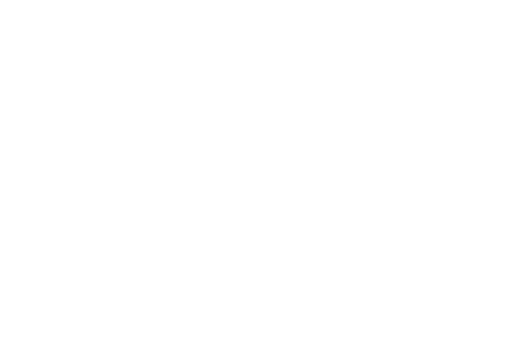
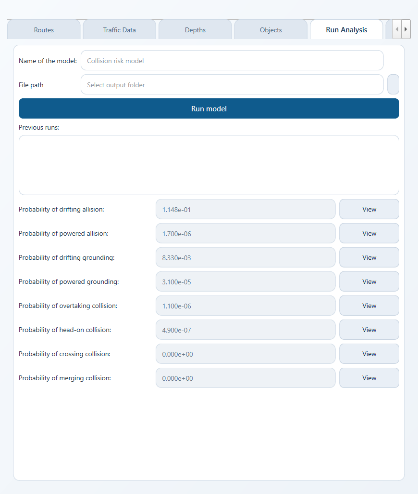

.. _quickstart:

===========
Quickstart
===========

This chapter walks you from **fresh install** to a **first calculated
risk number** on the supplied example project in under ten minutes.
It is deliberately thin: it only shows the clicks needed to produce a
result.  Every concept used here (leg, obstacle, traffic cell, drift
corridor, causation factor, ...) is defined in :ref:`concepts`, and
every tab is documented in detail in :ref:`user_guide`.

.. contents:: In this chapter
   :local:
   :depth: 1

Before you start
================

You need:

* QGIS 3.30 or newer (see :ref:`installation`).
* OMRAT installed via the Plugin Manager.  On first run the
  ``qpip`` plugin will offer to install the Python dependencies --
  accept it.
* The example project ``tests/example_data/proj.omrat`` shipped with
  the source repository.  If you installed from source, the file is
  already in your clone.  If you installed via the Plugin Manager,
  download ``proj.omrat`` from
  https://github.com/axelande/OMRAT/tree/main/tests/example_data.

1. Open the plugin
===================

Click the OMRAT icon in the QGIS toolbar.  The dock widget docks on
the right side of the window.

   The OMRAT icon in the QGIS plugins toolbar.

.. figure:: _static/screenshots/ui_dock_overview.png
   :width: 80%
   :alt: The OMRAT dock widget docked on the right of QGIS

   OMRAT's dock widget.  All the plugin's tabs live here.

2. Load the example project
=============================

In the dock widget:

#. **File -> Load**.
#. Select ``proj.omrat`` from wherever you placed the example file.
#. When asked **Clear & Load** or **Merge**, choose **Clear & Load**.

The map canvas shows the example shipping route with two legs, the
depth polygons, and the two structure polygons.

   Loaded project: blue route legs on the map, depth polygons in
   greens/blues, structure polygons in orange.

3. Sanity-check each tab (30 seconds)
=======================================

Open each tab in the dock widget and scan the fields.  You do not need
to change anything.  What to look for:

.. list-table::
   :header-rows: 1
   :widths: 20 80

   * - Tab
     - What should be there
   * - **Route**
     - Four segments (``1``, ``2``, ``3``, ``4``) with ``Start_Point``
       / ``End_Point`` filled in.
   * - **Traffic**
     - For each segment and direction, non-zero numbers in the
       Frequency, Speed, Draught, Height rows (21 ship types x 15 LOA
       bins).
   * - **Depths**
     - 17 rows, each with a depth value and a polygon WKT.
   * - **Objects**
     - 2 rows, each with a height value and a polygon WKT.
   * - **Distributions**
     - A PDF plot showing the combined lateral distribution.  The
       curve should be centred near zero with reasonable spread.
   * - **Drift Analysis**
     - Empty until you run the model.
   * - **Results**
     - Empty until you run the model.

4. Run the model
==================

Go to the **Results** tab and click **Run Model**.

.. figure:: _static/screenshots/ui_run_model.png
   :width: 70%
   :alt: Run Model button on the Results tab

   The "Run Model" button on the Results tab.

A notification appears in the QGIS message bar saying the calculation
has started in the background.  Progress is shown in the QGIS task
manager tray (bottom of the QGIS window).  Four phases run in order:

#. Drifting model (largest, typically 60--80 % of total time)
#. Ship-ship collisions
#. Powered grounding
#. Powered allision

   The QGIS task tray shows percent complete and the current phase.

When the run finishes, the **Results** tab fills in with probability
numbers (expected accidents per year).

   Results tab after the run.  Each line-edit shows the expected annual
   frequency for that accident type, in scientific notation
   (e.g. ``1.148e-01``).

5. Inspect the map result layers
===================================

Two new layers appear in the QGIS Layers panel:

* **Drifting allision results** -- structure polygons coloured by
  their contribution to the total drifting-allision probability.
* **Drifting grounding results** -- depth polygons coloured the same
  way.

.. figure:: _static/screenshots/ui_result_layers.png
   :width: 90%
   :alt: Map canvas showing coloured result layers

   Red = highest contributor, green = lowest.  Click any feature to
   see its per-leg-direction contribution in the attribute table.

6. Where to read next
========================

You now have a working run.  From here:

* Want to understand the numbers? -> :ref:`theory` for the big
  picture, :ref:`drifting` for a worked example.
* Want to run OMRAT on your own data? -> :ref:`user_guide` walks
  every tab.
* Want a glossary of terms? -> :ref:`concepts`.
* Want to know what the code did under the hood? ->
  :ref:`code-flow`.

Troubleshooting
===============

**The Run Model button does nothing.**
   Check that the Route, Traffic, Depths, and Objects tabs all have
   data -- an empty traffic matrix short-circuits the calculation to
   zero.

**All result values are zero.**
   Same cause as above, plus check **Settings -> Drift Settings**:
   if ``drift_p`` (blackout rate) is zero, drifting risk is zero.

**The calculation runs for more than 10 minutes on the example.**
   That is much longer than expected (a few minutes on a modern
   laptop).  Open **View -> Panels -> Log Messages Panel -> OMRAT**
   and look for warnings.  If shapely is missing, qpip's first-run
   install may not have completed -- see
   :ref:`installation-manual-deps`.

**I want to interrupt the run.**
   Click the cancel button next to the OMRAT task in the QGIS task
   tray.  The next progress-callback check will abort the calculation.
