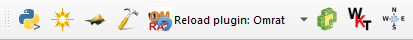
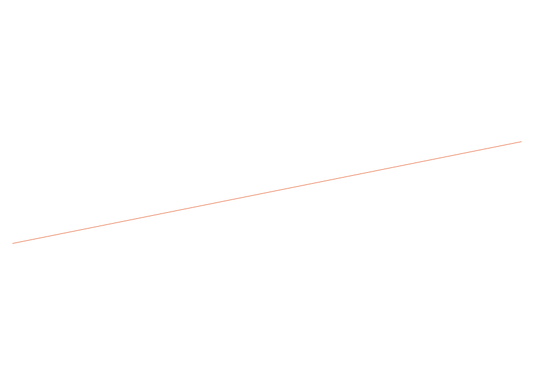
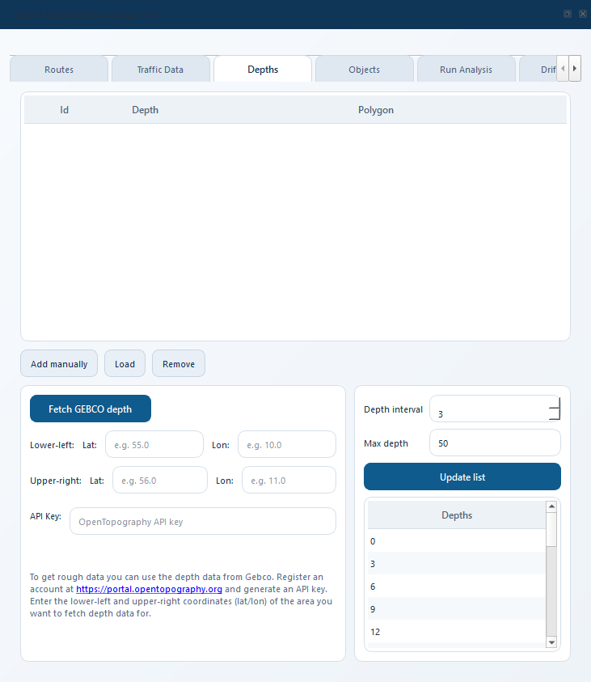
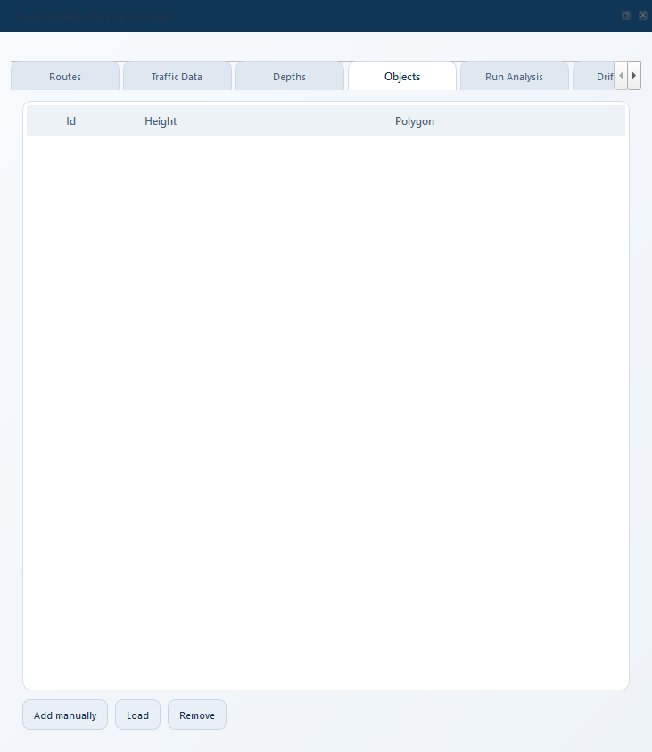
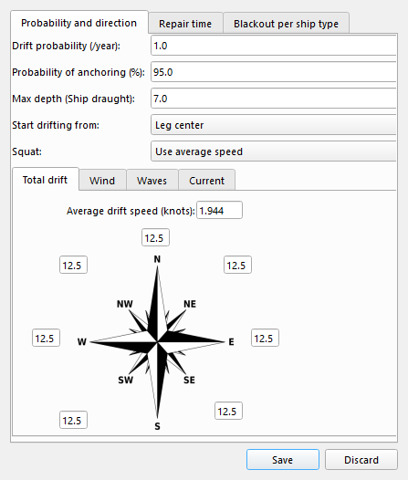
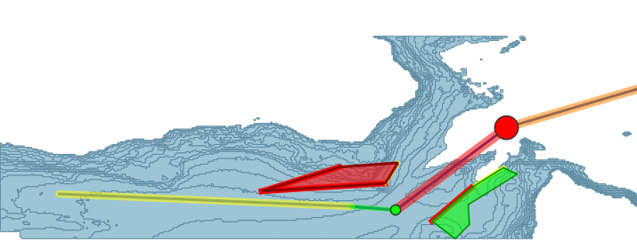
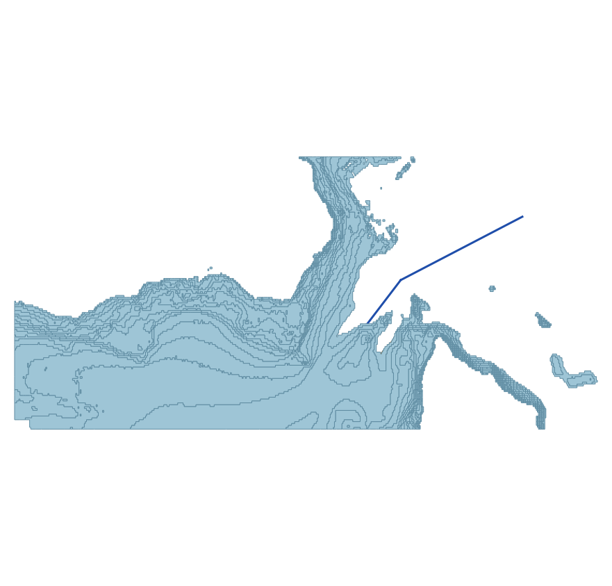

.. _quickstart:

===========
Quickstart
===========

This chapter walks you from a **blank QGIS project** to a **first
calculated risk number**: how to draw your first leg, bring in depth
and object data, fill in the traffic matrix, and read the results.

It is deliberately thin -- it only shows the clicks needed to produce a
result.  Every concept used here (leg, obstacle, traffic cell, drift
corridor, causation factor, ...) is defined in :ref:`concepts`, and
every tab is documented in detail in :ref:`user_guide`.

.. note::

   A real-world project usually pulls its traffic counts from a
   PostGIS AIS database via the **Update all distributions** button --
   not from manual entry.  Setting that database up (schema, raw-NMEA /
   CSV ingestion, vessel-lookup table, AIS connection settings) is its
   own multi-step task and is covered end-to-end in
   :ref:`database-setup`.  If you'll need real AIS traffic, **read that
   chapter first** so the database is ready before you reach step 6;
   otherwise you'll fill the matrix in by hand or come back later.

.. tip::

   In a hurry?  :ref:`quickstart-example-project` below loads the
   bundled example project, which already has traffic, depths and
   objects filled in -- you can jump straight to step 7 and produce a
   number without an AIS database at all.

.. contents:: In this chapter
   :local:
   :depth: 1

Before you start
================

You need:

* QGIS 3.30 or newer (see :ref:`installation`).
* OMRAT installed via the Plugin Manager.  On first run the
  ``qpip`` plugin will offer to install the Python dependencies --
  accept it.

1. Open the plugin
===================

Click the OMRAT icon in the QGIS toolbar.  The dock widget docks on
the right side of the window.

   The OMRAT icon in the QGIS plugins toolbar.

The dock has a **menu bar** (File, Settings, Consequence, Help) and a
stack of seven tabs: **Routes**, **Traffic Data**, **Depths**,
**Objects**, **Run Analysis**, **Drift Analysis** and **Compare**.  The
rough workflow is left-to-right.

.. figure:: _static/screenshots/quickstart/qs_01_empty_routes_tab.png
   :width: 80%
   :alt: Empty Routes tab, before the first leg is drawn.

   Routes tab on a fresh project.  ``twRouteList`` is empty and the
   distribution panel below it shows zeroed defaults.

   The QGIS canvas before any layer is added.  Most users begin by
   adding a basemap (XYZ Tiles -> OpenStreetMap is fine).

2. Place legs on the map
==========================

A *leg* is a single straight segment of a route.  OMRAT calculates risk
**per leg**, so a curved or branching route is approximated with
several short legs joined end to end.

To draw a leg, on the **Routes** tab:

#. Set **Route** (the route ID new legs are assigned to) and
   **Next leg ID** if you want something other than the defaults.
#. Click **Add**.  The cursor turns into a crosshair.
#. Click the start point on the canvas, then the end point.  The leg is
   added to ``twRouteList`` and a blue line appears on the canvas.
#. Repeat for each leg.  Click **Stop** to leave drawing mode.

**Remove** deletes the selected leg.  **Load** imports legs from an
existing QGIS line layer instead of digitising them by hand.

.. figure:: _static/screenshots/quickstart/qs_03_route_after_first_leg.png
   :width: 80%
   :alt: Routes tab after a single leg has been placed.

   The first leg appears in ``twRouteList`` (Segment 1, Route 1).
   Adjust **Width** to the width of the corridor in metres
   (5000 = a 5 km wide corridor).

   The leg as drawn on the canvas.  Two grey "offset" lines mark the
   width of the corridor.

.. tip::
   Endpoints that exactly coincide between legs (within metres, not
   visually) are treated as **shared vertices**: dragging one with the
   QGIS Vertex Tool moves every connected leg's endpoint together,
   so a curved route stays connected when you re-route.  Shared
   endpoints also become **junctions** -- see :ref:`junctions`.

Below the route table, the same tab hosts the **lateral distribution**
panel (Direction 1 / Direction 2, up to three Gaussians plus a uniform
component per direction).  The defaults are usable; :ref:`user_guide`
explains when to change them.

3. Bring in depth data
========================

Powered grounding and drifting grounding both rely on a depth contour
layer.  OMRAT consumes depth polygons (one per discrete depth value).

Where to get depth data:

* **EMODnet Bathymetry** (https://emodnet.ec.europa.eu/en/bathymetry) -
  free 1/16 arc-min DTM for European seas.  Download a tile, contour
  it in QGIS (*Raster -> Extraction -> Contour Polygons*), then load
  the resulting polygons into the Depths tab.
* **GEBCO via OpenTopography** - the Depths tab has a built-in downloader
  that fetches GEBCO depth data directly inside OMRAT.  See
  :ref:`gebco-api-key` below for how to get the free API key required.
* **Local hydrographic offices** - national bathymetry products are
  usually higher resolution but require a license.
* **ENCs** (Electronic Navigational Charts) - if you have access to
  S-57/S-101 chart data, the *Depth Areas* (DEPARE) layer is exactly
  what OMRAT wants.

Once you have polygons in QGIS, switch to the **Depths** tab and click
**Load** to import them from a layer.  **Add manually** creates a single
empty row you can paste a WKT polygon into, and **Remove** deletes the
selected row.

   Depths tab on a fresh project.  Each row links one polygon
   (``Polygon``) to its depth value in metres, positive downwards
   (``Depth``).

.. _gebco-api-key:

3a. Fetching GEBCO depths directly (OpenTopography)
~~~~~~~~~~~~~~~~~~~~~~~~~~~~~~~~~~~~~~~~~~~~~~~~~~~~

OMRAT can download GEBCO bathymetry for your project area and convert
it to depth polygons in one click, without leaving QGIS.  You need a
**free** OpenTopography API key first.

**Step 1 - Create an OpenTopography account**

   Go to https://portal.opentopography.org and click **Create new
   account** (top right).  Fill in a username, e-mail address, and
   password, then confirm your e-mail.

**Step 2 - Generate an API key**

   Log in, then click your username in the top-right corner and choose
   **MyOpenTopo -> My Account**.  Scroll to the **API Access** section
   and click **Request API Key**.  The key is a short alphanumeric
   string (e.g. ``abc123def456``).  Copy it.

**Step 3 - Paste the key into OMRAT**

   In the Depths tab, paste the key into the **API Key** field.  OMRAT
   saves it automatically between sessions so you only need to do this
   once.

**Step 4 - Enter your bounding box**

   Fill in the four coordinate boxes:

   * **Lower-left** *Lat* / *Lon* -- the south-west corner of the area
     you want to download.
   * **Upper-right** *Lat* / *Lon* -- the north-east corner.

   A good starting point is to add a small buffer around your routes.
   You can read off coordinates from the QGIS status bar (shown when
   you hover over the canvas).

**Step 5 - Set depth intervals and fetch**

   Enter the deepest contour of interest in **Max depth** and a contour
   step in **Depth interval**, both in metres.  Click **Update list** to
   preview the contour levels in the table on the right, then click
   **Fetch GEBCO depth**.  OMRAT downloads the GeoTIFF, vectorises it,
   and adds one row per depth interval to the table automatically.

.. note::

   GEBCO resolution is 15 arc-seconds (~450 m at mid-latitudes).  It
   is appropriate for open-water or offshore risk assessments; for
   nearshore or port approaches you should use higher-resolution
   hydrographic charts or ENCs.

4. Define obstacles (objects)
==============================

Bridges, wind-park footprints, and other surface structures go on the
**Objects** tab.  The buttons are the same as on Depths -- **Load**
imports a polygon layer, **Add manually** adds an empty row,
**Remove** deletes the selected one -- except that each row carries the
structure's **Height** in metres above sea level instead of a depth.

   Objects tab on a fresh project.  Powered allision and drifting
   allision use the polygons listed here.

Common sources for object polygons:

* **OpenStreetMap** - bridges, piers and offshore wind farms tagged
  ``man_made=*`` are usually present.
* **EMODnet Human Activities** - offshore platforms, wind-farm
  layouts.
* **National marine spatial planning portals**.

5. Settings: drift, ship categories, causation, AIS
=====================================================

Open the relevant dialog from the **Settings** menu at the top of the
dock.

   **Drift settings**.  The wind-rose drives drifting risk -- start from
   a uniform 1/8 distribution if you don't yet have site-specific data,
   then refine using a local meteorological reanalysis (ERA5, MERRA-2).

The other entries on the Settings menu are documented in
:ref:`user_guide`:

* **Ship Categories** - the type/size matrix that maps AIS rows to
  the cells of the traffic table.
* **Causation Factors** - the per-accident-type :math:`P_c` values,
  including a separate **Merging causation factor** that defaults to
  the crossing value.
* **AIS connection settings** - host/database/user for the optional AIS
  Postgres database.
* **Database setup wizard...** - guided creation and ingestion for that
  database (see :ref:`database-setup`).
* **Junction transition matrix...** - how traffic splits between legs
  at each shared waypoint (see :ref:`junctions`).

If you will report oil-spill consequences, the **Consequence** menu
holds the four project-level inputs described in :ref:`consequence`.

6. Fill in the traffic matrix
===============================

Nothing is calculated without traffic.  On the **Traffic Data** tab,
pick a **segment** and a **direction** with the two left-hand combo
boxes, then use the third to switch between the variables:

* **Frequency (ships/year)** -- the number that drives every model.
* **Speed (knots)**, **Draught (meters)**, **Ship heights (meters)**.
* **Scaling (%)** -- a what-if multiplier applied to Frequency at
  calculation time; 100 % is a no-op.  The **Traffic scaling** panel
  underneath drives it globally or per ship type.

Each view is a matrix of ship type (rows) x LOA interval (columns).

If you have an AIS database configured, click **Update all
distributions** on the **Routes** tab instead: it queries the database,
fills Frequency / Speed / Draught / Height for every leg and direction,
re-derives the junction transition matrices, and runs the route
validation pass (close waypoints and X-intersections).  Manually
entered **Scaling (%)** values survive the refresh.

7. Run the model
==================

Switch to the **Run Analysis** tab and fill in:

* **Name of the model** - a short slug for this scenario.
* **File path** - a folder (use the ``...`` button).  Each run writes
  three files into it:

  - ``<name>_<timestamp>.gpkg`` - the result layers.
  - ``<name>_<timestamp>.omrat`` - a snapshot of the inputs (read-only).
  - ``<name>_results_<timestamp>.md`` - a Markdown report covering
    every accident type.

Click **Run model**.  The button is greyed out until both fields are
set, and a popup spells out which is missing if you click anyway.

The calculation runs as a background QGIS task, so the UI stays
responsive.  Progress is shown in the QGIS task manager tray at the
bottom of the window.  The phases run in order:

#. Drifting model (largest, typically 60--80 % of total time)
#. Ship-ship collisions
#. Powered grounding
#. Powered allision
#. Oil-spill consequence (if configured)

   The QGIS task tray shows percent complete and the current phase.

8. Read the results
=====================

When the run finishes, the **Accident probabilities** table fills in
with one row per accident type, all in **expected events per year** and
scientific notation (``1.148e-01`` means about one event every 9 years):

.. list-table::
   :header-rows: 1
   :widths: 30 70

   * - Row
     - Meaning
   * - **Drifting allision**
     - Loss of propulsion, then drifting into a structure.
   * - **Drifting grounding**
     - Loss of propulsion, then drifting aground.
   * - **Powered allision**
     - Under power, failing to turn at a bend, into a structure.
   * - **Powered grounding**
     - Under power, failing to turn at a bend, aground.
   * - **Overtaking collision**
     - Same leg, same direction, different speeds.
   * - **Head-on collision**
     - Same leg, opposite directions.
   * - **Crossing collision**
     - Two legs meeting at a waypoint at more than 30 degrees.
   * - **Merging collision**
     - Two legs meeting at 30 degrees or less -- streams converging
       onto nearly the same course.
   * - **Bend collision**
     - One leg changing direction at a waypoint: a ship fails to
       turn and hits traffic that did.

The **View** button on each row opens a drill-down dialog for the run
selected in **Previous runs**, showing per-leg and per-obstacle
contributions -- the fastest way to find the single obstacle that
dominates a total.

If you filled in the **Consequence** inputs, the
**Catastrophe-level exceedance (events/year)** table below shows the
annual rate at which each catastrophe level is exceeded.

9. Inspect the map result layers
===================================

Select a row in **Previous runs** and click **Add selected run results
to map** to load that run's GeoPackage as styled QGIS layers.  (The
same action is on the row's right-click menu, along with the delete
options.)  Layers that would be empty are skipped, so a missing layer
means zero risk of that type:

.. list-table::
   :header-rows: 1
   :widths: 32 15 53

   * - Layer
     - Geometry
     - What it shows
   * - **Allision Results**
     - Line
     - The boundary edges of each structure, coloured by its share of
       the total drifting-allision probability.
   * - **Grounding Results**
     - Line
     - The boundary edges of each depth contour, coloured by its share
       of the total drifting-grounding probability.
   * - **Powered Allision Results**
     - Line
     - The same structure edges, coloured by the powered Cat II
       allision probability (failure-to-turn-at-bend hits).
   * - **Powered Grounding Results**
     - Line
     - Depth-contour edges, coloured by the powered Cat II grounding
       probability.
   * - **Ship-Ship Collision (per leg)**
     - Line
     - One line per route leg, coloured by ``combined`` =
       ``head_on`` + ``overtaking`` for that leg.
   * - **Ship-Ship Collision (waypoints)**
     - Point
     - One point at every shared waypoint, coloured by ``combined`` =
       ``crossing`` + ``merging`` + ``bend`` there.

All layers share the same green -> yellow -> red graduated ramp:
**green = lowest contributor, red = the hotspots that dominate the
total**.

   A finished run with several layer types visible at once: red
   structure edges (high drifting-allision contribution), red / yellow
   line segments along the legs (head-on + overtaking collisions), a red
   waypoint (crossing / merging / bend collision hotspot), and green
   features where the contribution is small.

Click any feature to open the attribute table.  The four obstacle
layers carry a per-leg breakdown in ``leg_<id>`` columns, so you can
trace which leg drove the colour; the collision layers carry the
per-mode columns listed above.

Two runs can be compared side by side from the **Compare** tab -- pick
two ``.omrat`` snapshots and click **Compare**.

.. _quickstart-example-project:

Shortcut: start from the example project
==========================================

If you just want to see a result without building a project, the source
repository ships a complete one at ``tests/example_data/proj.omrat``
(4 legs, 17 depth contours, 2 structures, traffic already filled in).
If you installed via the Plugin Manager, download it from
https://github.com/axelande/OMRAT/tree/main/tests/example_data.

#. **File -> Load** in the dock's menu bar.
#. Select ``proj.omrat``.
#. When asked **Clear & Load** or **Merge**, choose **Clear & Load**.

   Loaded project: blue route legs on the map, depth polygons in
   greens/blues, structure polygons in orange.

Then skip straight to step 7.  Before running, spot-check that the
**Routes** tab lists segments ``1``--``4``, that **Traffic Data** shows
non-zero frequencies, that **Depths** has 17 rows and **Objects** 2, and
set a model name and output folder on **Run Analysis**.

.. note::

   ``proj.omrat`` predates the settings, junction and traffic-scaling
   blocks, so it loads with defaults for those (scaling 100 %, junctions
   rebuilt from the geometry).  That is expected.

Where to read next
====================

You now have a working run.  From here:

* Want to understand the numbers? -> :ref:`theory` for the big
  picture, :ref:`drifting` for a worked example.
* Want a reference for every tab and field? -> :ref:`user_guide`.
* Want a glossary of terms? -> :ref:`concepts`.
* Want real AIS traffic? -> :ref:`database-setup`.
* Want to know what the code did under the hood? ->
  :ref:`code-flow`.

Troubleshooting
===============

**The Run model button is greyed out.**
   Both **Name of the model** and **File path** must be filled in on
   the Run Analysis tab.

**All result values are zero.**
   Check that the Routes, Traffic Data, Depths and Objects tabs all
   have data -- an empty traffic matrix short-circuits the calculation
   to zero.  Then check **Settings -> Drift settings**: if the blackout
   rate ``drift_p`` is zero, drifting risk is zero.

**The calculation runs for more than 10 minutes on a small project.**
   That is much longer than expected.  Open **View -> Panels ->
   Log Messages Panel -> OMRAT** and look for warnings.  If shapely is
   missing, qpip's first-run install may not have completed -- see
   :ref:`installation-manual-deps`.

**I want to interrupt the run.**
   Click the cancel button next to the OMRAT task in the QGIS task
   tray.  The next progress-callback check will abort the calculation.
