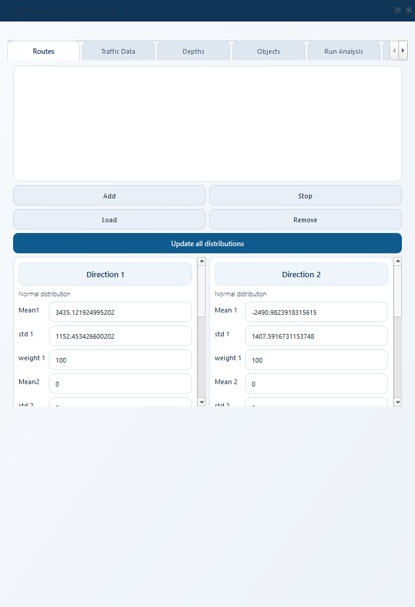
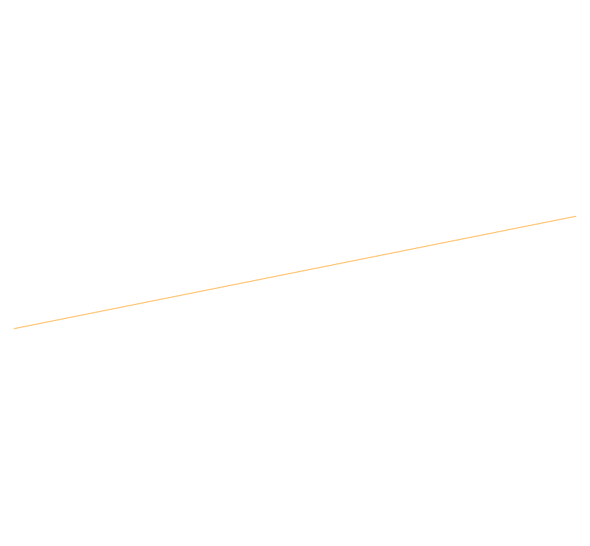
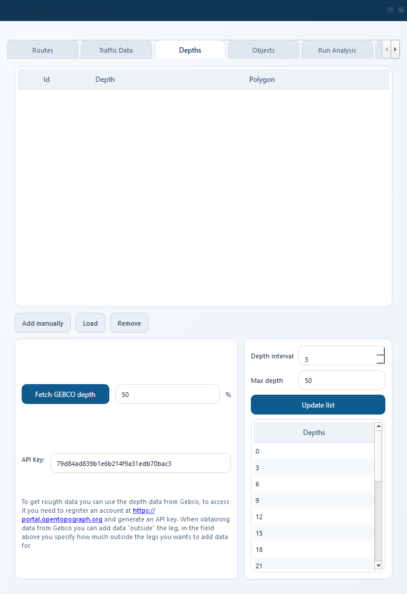
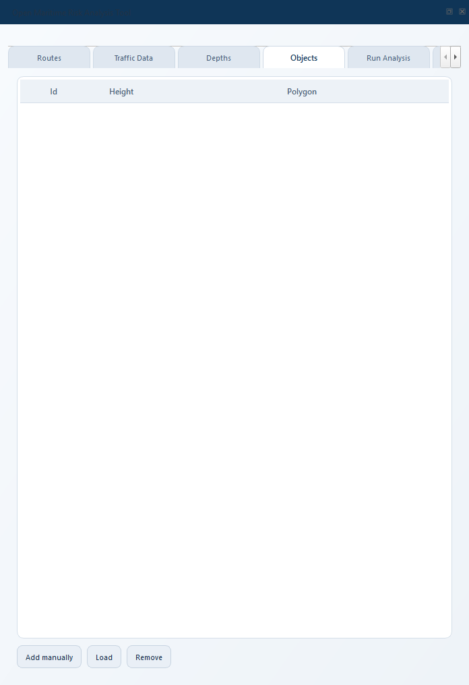
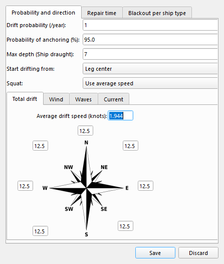

.. _quickstart_from_scratch:

==============================
Quickstart - from scratch
==============================

The :ref:`quickstart` chapter walks you through the **example project**.
This chapter shows the same workflow but **starting with a blank
QGIS project**: how to draw your first leg, set its width, bring in
depth and object data, and produce a first risk number.

.. contents:: In this chapter
   :local:
   :depth: 1

1. Open the plugin (no project loaded)
=========================================

Open QGIS, click the OMRAT icon, and dock the panel on the right.
With nothing loaded the Routes tab looks like this:

   Routes tab on a fresh project.  ``twRouteList`` is empty and the
   distribution panel below shows zeroed defaults.

   The QGIS canvas before any layer is added.  Most users begin by
   adding a basemap (XYZ Tiles → OpenStreetMap is fine).

2. Place legs on the map
==========================

A *leg* is a single straight segment of a route.  OMRAT calculates risk
**per leg**, so a curved or branching route is approximated with
several short legs joined end to end.

To draw a leg:

#. Click **Place leg** on the Routes tab toolbar.  The cursor turns
   into a crosshair.
#. Click the start point on the canvas.
#. Click the end point.  The leg is added to ``twRouteList`` and a
   blue line appears on the canvas.
#. Repeat for each leg.  Click **Stop route** to leave place-leg mode.

After one leg the Routes tab shows the new row:

.. figure:: _static/screenshots/quickstart/qs_03_route_after_first_leg.png
   :width: 80%
   :alt: Routes tab after a single leg has been placed.

   The first leg appears in ``twRouteList`` (Segment 1, Route 1).
   Adjust **Width** to the half-width of the corridor in metres
   (5000 = a 5 km wide corridor).

   The leg as drawn on the canvas.  Two grey "offset" lines mark the
   width of the corridor.

.. tip::
   Endpoints that exactly coincide between legs (within metres, not
   visually) are treated as **shared vertices**: dragging one with the
   QGIS Vertex Tool moves every connected leg's endpoint together,
   so a curved route stays connected when you re-route.

3. Bring in depth data
========================

Powered grounding and drifting grounding both rely on a depth contour
layer.  OMRAT consumes depth polygons (one per discrete depth value).

Where to get depth data:

* **EMODnet Bathymetry** (https://emodnet.ec.europa.eu/en/bathymetry) -
  free 1/16 arc-min DTM for European seas.  Download a tile, contour
  it in QGIS (*Raster → Extraction → Contour Polygons*), then load
  the resulting polygons into the Depths tab.
* **GEBCO** (https://www.gebco.net/) - global 15-arc-second bathymetry.
  Same workflow.
* **Local hydrographic offices** - national bathymetry products are
  usually higher resolution but require a license.
* **ENCs** (Electronic Navigational Charts) - if you have access to
  S-57/S-101 chart data, the *Depth Areas* (DEPARE) layer is exactly
  what OMRAT wants.

Once you have polygons in QGIS, switch to the **Depths** tab and use
**Add depth from layer** to import them.  The tab is empty before any
depths are added:

   Depths tab on a fresh project.  Each row links one polygon to its
   depth value (in metres, positive downwards).

4. Define obstacles (objects)
==============================

Bridges, wind-park footprints, and other surface structures go on the
**Objects** tab.  The workflow is identical to Depths: import a polygon
layer (or digitise polygons by hand) and set the structure's height
in metres above sea level.

   Objects tab on a fresh project.  Powered allision and drifting
   allision use the polygons listed here.

Common sources for object polygons:

* **OpenStreetMap** - bridges, piers and offshore wind farms tagged
  ``man_made=*`` are usually present.
* **EMODnet Human Activities** - offshore platforms, wind-farm
  layouts.
* **National marine spatial planning portals**.

5. Settings: drift, ship categories, causation, AIS
=====================================================

Open the relevant **Settings** dialog from the dock's gear menu.

   Drift Settings.  The wind-rose drives drifting risk -- start from a
   uniform 1/8 distribution if you don't yet have site-specific data,
   then refine using a local meteorological reanalysis (ERA5, MERRA-2).

The other Settings dialogs are documented in :ref:`user_guide`:

* **Ship Categories** - the type/size matrix that maps AIS rows to
  the cells of the traffic table.
* **Causation Factors** - the per-accident-type Pc values.
* **AIS Connection** - host/database/user for the optional AIS
  Postgres database.  If you don't have an AIS database, fill the
  traffic table in by hand on the Traffic tab.

6. Run the model
==================

Switch to the **Run Analysis** tab, fill in:

* **Name of the model** - a short slug for this scenario.
* **File path** - a folder.  Each Run writes three files into this
  folder:

  - ``<name>_<timestamp>.gpkg`` - the result layers.
  - ``<name>_<timestamp>.omrat`` - a snapshot of the inputs (read-only).
  - ``<name>_results_<timestamp>.md`` - a Markdown report covering
    every accident type.

Click **Run Model**.  The Run button is greyed out until both fields
are set, and a popup spells out which is missing if you click anyway.

When the run finishes the **Accident probabilities** table populates
with one row per accident type and a **View** button per row that
opens the matching driver visualisation.

7. Inspect the results
========================

The **Previous runs** table at the top of the Run Analysis tab keeps
every run.  Select a row and click **Add selected run results to map**
to load that run's GeoPackage as styled QGIS layers.  Two runs can be
compared side-by-side from the **Compare** tab.

.. seealso::
   * :ref:`quickstart` -- same flow, but with the example project.
   * :ref:`user_guide` -- detailed reference for every tab.
   * :ref:`concepts` -- glossary of the OMRAT-specific vocabulary.
