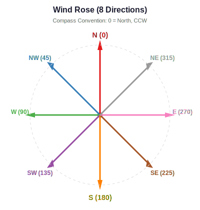

.. _theory:

========================
Mathematical Foundations
========================

This chapter describes the mathematical theory behind OMRAT's risk
calculations. The methodology is based on the IWRAP framework
(Friis-Hansen 2008), which separates maritime risk into three main
components: drifting risks, powered risks, and ship-ship collisions.

.. contents:: In this chapter
   :local:
   :depth: 2

Risk Assessment Framework
=========================

The fundamental equation for maritime accident frequency is:

.. math::

   F_{\text{accident}} = N_A \times P_C

Where:

- :math:`N_A` = number of accident candidates (geometric encounters)
- :math:`P_C` = causation probability (probability that an encounter
  leads to an actual accident)

The **accident candidates** :math:`N_A` are computed purely from
geometry and traffic patterns -- how many ships pass close enough to
an obstacle or another ship that a collision *could* occur if no
evasive action is taken.

The **causation probability** :math:`P_C` accounts for human and
technical factors -- the probability that the crew fails to detect and
avoid the danger.

Three Risk Categories
=====================

OMRAT models three categories of maritime risk:

1. **Drifting risk** -- Ships that lose propulsion (blackout) and drift
   under the influence of wind and current into obstacles.

2. **Powered risk** -- Ships under power that fail to navigate correctly,
   either by sailing directly into an obstacle (Category I) or failing
   to turn at a waypoint (Category II).

3. **Ship-ship collision risk** -- Encounters between vessels that could
   result in contact, including head-on, overtaking, crossing, and bend
   collisions.

Each category is described in detail in its own chapter:

- :ref:`drifting` -- Drifting risk calculations
- :ref:`collisions` -- Ship-ship collision calculations
- :ref:`powered` -- Powered grounding and allision calculations

Causation Factors
=================

Causation factors represent the probability that a geometric encounter
leads to an actual accident. These are empirically derived from
historical accident data.

.. list-table:: Default IALA Causation Factors
   :widths: 35 20 20 25
   :header-rows: 1

   * - Collision Type
     - IALA Default
     - Fujii (1974)
     - Notes
   * - Head-on collision
     - :math:`4.9 \times 10^{-5}`
     - :math:`4.9 \times 10^{-5}`
     - Traffic separation helps
   * - Overtaking collision
     - :math:`1.1 \times 10^{-4}`
     - :math:`1.1 \times 10^{-4}`
     -
   * - Crossing collision
     - :math:`1.3 \times 10^{-4}`
     - :math:`1.2 \times 10^{-4}`
     - Pedersen value
   * - Bend collision
     - :math:`1.3 \times 10^{-4}`
     - --
     - Pedersen value
   * - Powered grounding
     - :math:`1.6 \times 10^{-4}`
     - :math:`1.6 \times 10^{-4}`
     -
   * - Allision (structure)
     - :math:`1.9 \times 10^{-4}`
     - :math:`1.9 \times 10^{-4}`
     -
   * - Drifting
     - :math:`1.0`
     - --
     - No avoidance (powerless)

**Adjustment factors** can modify the base causation probabilities:

- **Ferry/passenger vessels**: :math:`\div 20` (two navigators, familiar
  route)
- **Pilot on board**: :math:`\div 3` (COWIconsult)
- **Poor visibility (3--10%)**: :math:`\times 2`
- **Poor visibility (10--30%)**: :math:`\times 8`

Lateral Traffic Distribution
============================

Vessel positions across a shipping lane are modelled as a mixture of
up to three normal distributions plus one uniform distribution:

.. math::

   f(z) = \sum_{i=1}^{3} w_i \cdot \phi\!\left(\frac{z - \mu_i}{\sigma_i}\right)
        + w_u \cdot U(z; a, b)

Where:

- :math:`z` = lateral distance from the leg centreline (metres)
- :math:`w_i` = weight of normal component :math:`i` (all weights sum to 1)
- :math:`\mu_i, \sigma_i` = mean and standard deviation of component :math:`i`
- :math:`w_u` = weight of the uniform component
- :math:`U(z; a, b)` = uniform distribution between :math:`a` and :math:`b`

These distributions can be fitted automatically from AIS data or
entered manually. The distribution parameters are stored per segment
and per direction.

Coordinate Systems
==================

OMRAT uses two coordinate reference systems:

- **WGS84 (EPSG:4326)** -- Geographic coordinates (longitude, latitude)
  for storage and display
- **UTM** -- Projected coordinates (metres) for distance calculations

The appropriate UTM zone is determined automatically from the centroid
of the study area:

.. math::

   \text{zone} = \left\lfloor \frac{\text{longitude} + 180}{6} \right\rfloor + 1

Northern hemisphere uses EPSG codes 326XX; southern hemisphere uses
327XX, where XX is the zone number.

All distance-dependent calculations (drift distances, corridor widths,
collision geometry) are performed in UTM coordinates to ensure metric
accuracy.

Compass Angle Convention
========================

OMRAT uses a **nautical compass convention** for wind and drift
directions:

.. list-table:: Direction Angles
   :widths: 20 20 60
   :header-rows: 1

   * - Direction
     - Angle
     - Description
   * - N
     - 0 deg
     - North (+Y in UTM)
   * - NW
     - 45 deg
     - NorthWest
   * - W
     - 90 deg
     - West (-X in UTM)
   * - SW
     - 135 deg
     - SouthWest
   * - S
     - 180 deg
     - South (-Y in UTM)
   * - SE
     - 225 deg
     - SouthEast
   * - E
     - 270 deg
     - East (+X in UTM)
   * - NE
     - 315 deg
     - NorthEast

To convert from compass to mathematical convention (0 deg = East, CCW):

.. math::

   \theta_{\text{math}} = 90^\circ + \theta_{\text{compass}}

The vector components in UTM are then:

.. math::

   dx = \cos(\theta_{\text{math}}) \times d, \qquad
   dy = \sin(\theta_{\text{math}}) \times d

References
==========

- Friis-Hansen, P. (2008). *IWRAP MK II - Basic Modelling Principles
  for Prediction of Collision and Grounding Frequencies.* Technical
  University of Denmark.

- Pedersen, P.T. (1995). *Collision and Grounding Mechanics.* WEMT'95.

- Fujii, Y. et al. (1974). *Some factors affecting the frequency of
  accidents in marine traffic.* Journal of Navigation, 27.

- Talavera, A. et al. (2013). *Application of Dempster-Shafer theory
  for the quantification and propagation of the uncertainty caused by
  the use of AIS data.* Reliability Engineering and System Safety, 111,
  95--105.

- Engberg, P.C. (2017). *IWRAP Mk2 v5.3.0 Manual.* GateHouse A/S.
