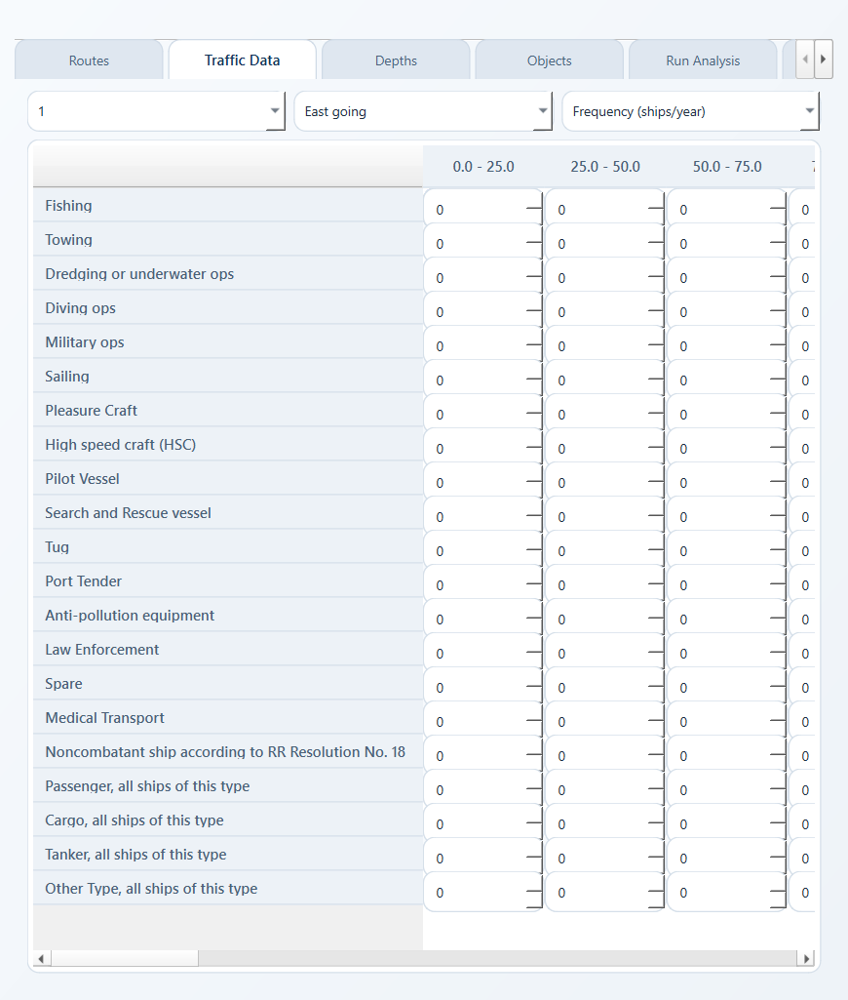
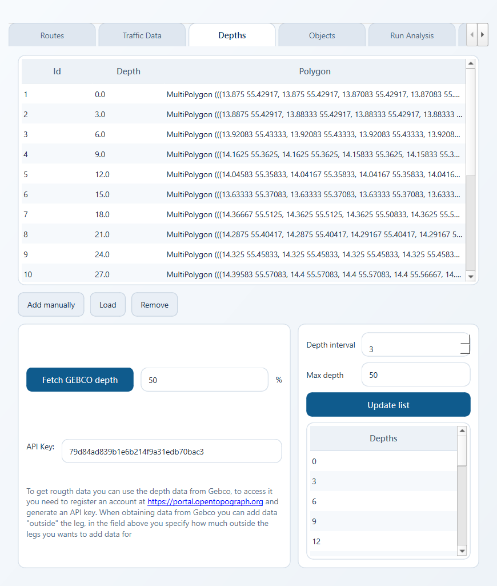
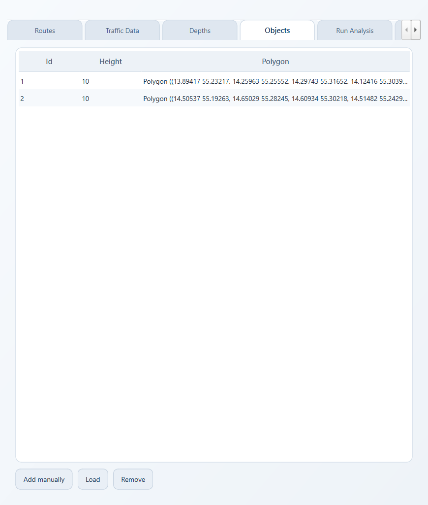
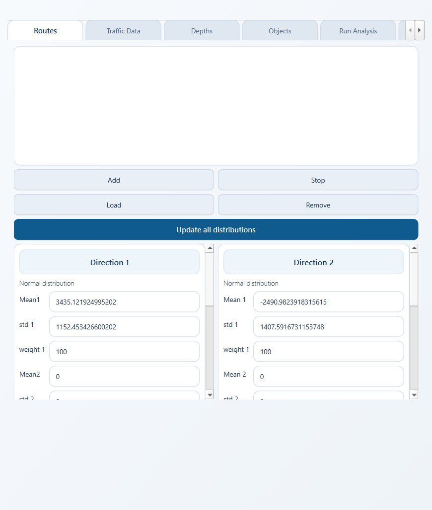
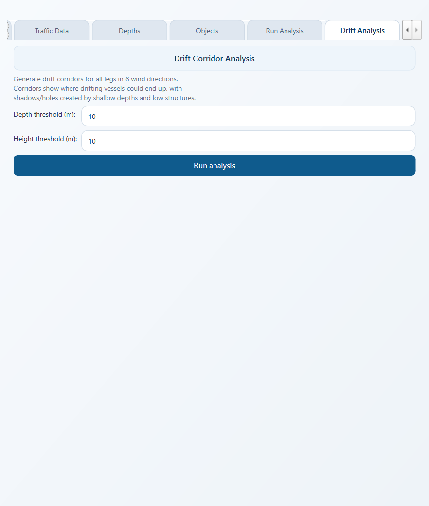
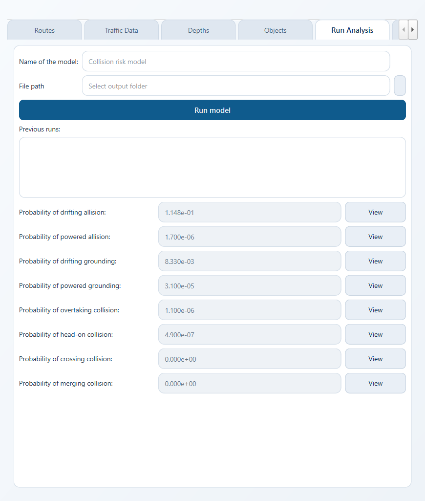
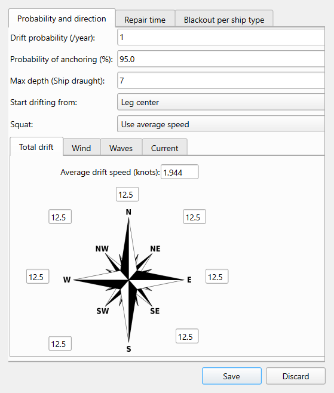
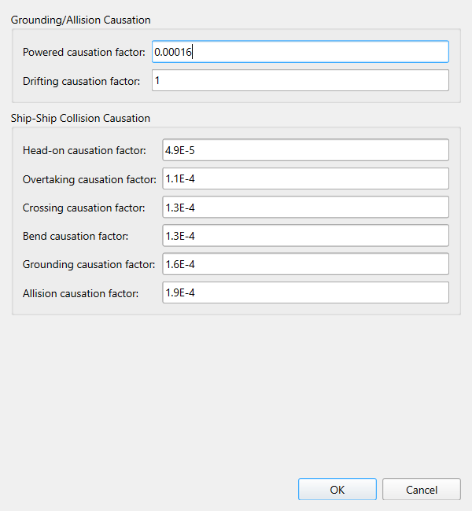
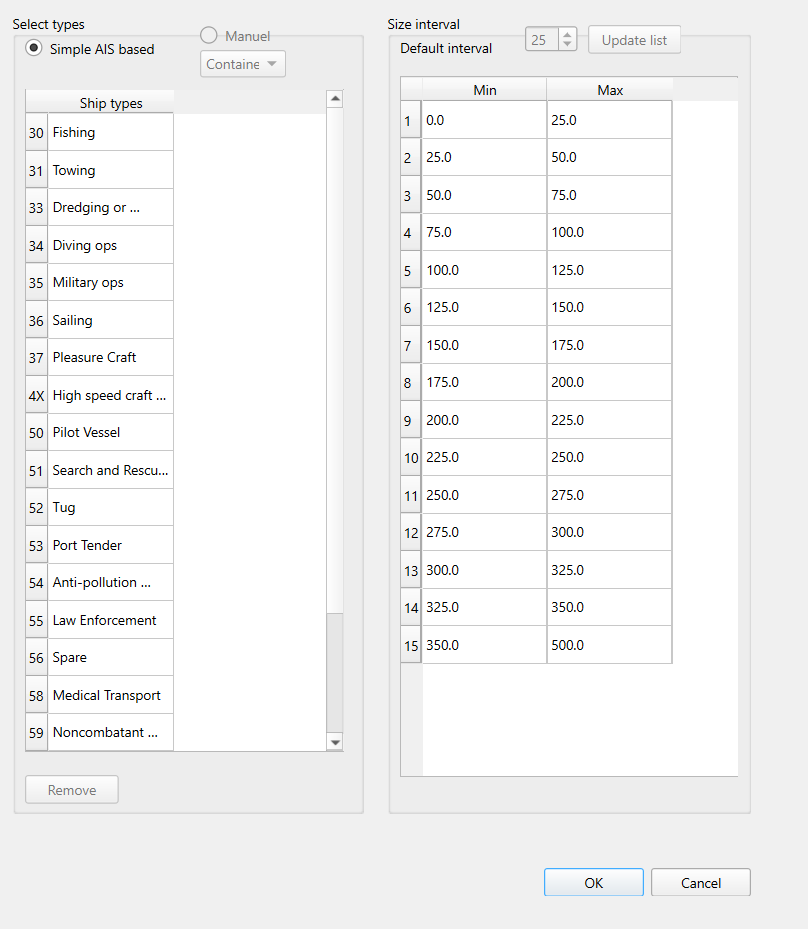
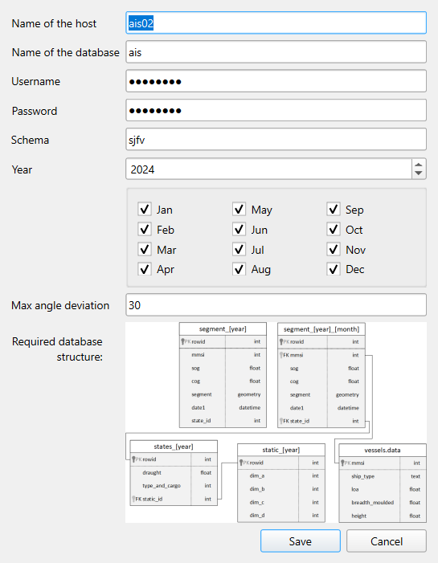

.. _user_guide:

============
User Guide
============

This chapter walks through the plugin **tab by tab**, explaining what
every button and field does.  It assumes you've already installed
OMRAT (:ref:`installation`) and opened the dock widget (:ref:`quickstart`).

Need a term defined?  See :ref:`concepts`.  Need a specific workflow
("I have AIS data, how do I ...")?  See :ref:`workflows`.

.. contents:: In this chapter
   :local:
   :depth: 2

The dock widget
=================

OMRAT's entire UI lives in one dockable widget.  The top of the widget
has a **menu bar** (File, Settings, View) and the main area has a
stack of **tabs**:

.. figure:: _static/screenshots/ui_dock_tabs_annotated.png
   :width: 100%
   :alt: Annotated OMRAT dock widget showing menu and tabs

   The dock widget.  Menu at top, tabs in the middle, progress and
   messages at the bottom.

The workflow is to fill tabs left-to-right, then press **Run Model**
on the Results tab.  You can come back and tweak any tab and rerun.

Route tab
=========

.. figure:: _static/screenshots/ui_tab_route.png
   :width: 90%
   :alt: The Route tab showing the segment table

   The Route tab lists every leg of the shipping route.

A **route** is a polyline split into one or more **segments** (legs).
Each segment has:

* **Start_Point** / **End_Point** -- lon/lat of the two endpoints.
* **Width** -- the lateral extent (metres) used to draw the corridor
  marker on the map.  This is *visualisation only*; the actual lateral
  spread used in the calculation comes from the Distributions tab.
* **Dirs** -- the two direction labels auto-derived from the segment's
  compass bearing (``"North going"`` / ``"South going"``, etc.).
* **bearing** -- stored compass bearing in degrees.
* **ai1**, **ai2** -- IWRAP "position check interval" in seconds for
  directions 1 and 2.  Used by the powered-grounding / allision
  calculations (:math:`N_{II} = P_c Q \cdot m \cdot \exp(-d/(a_i V))`).

Digitising a route
------------------

#. Click **Add Route** to start digitising.
#. Click on the map to set the first waypoint.
#. Click again to create a leg; each subsequent click adds a segment.
#. Click **Stop Route** when done.

Segments are automatically assigned an ID (``1``, ``2``, ...) and a
default width of 5000 m.

Editing a segment
-----------------

Select a segment in the route table and edit its geometry directly on
the map using QGIS's standard vertex-editing tools.  OMRAT listens to
the geometry-change signal and:

* Updates the Start_Point / End_Point values in the table,
* Recomputes direction labels and stored ``bearing``,
* Recomputes ``line_length`` (metres) via UTM projection.

The recomputed values are included in project save and in IWRAP XML
export, so map geometry and exported model stay in sync.

What flows downstream
----------------------

.. list-table::
   :header-rows: 1
   :widths: 30 70

   * - Field
     - Used by
   * - ``Start_Point`` / ``End_Point``
     - Every accident type (leg geometry).
   * - ``line_length``
     - Drifting base exposure, ship-ship collision candidate count.
   * - ``ai1``, ``ai2``
     - Powered grounding + allision (:math:`\exp(-d/(a_i V))`).
   * - ``bearing``
     - Crossing-collision geometry to detect leg pairs that share a
       waypoint.

Traffic tab
============

   The Traffic tab.  Matrix rows are ship types, columns are LOA
   (length) bins.

Every segment, in every direction, has its own traffic matrix.  Select
a segment and direction using the dropdowns at the top, then pick a
variable (Frequency, Speed, Draught, Height, Beam) to edit.

Matrix shape
------------

* **Rows** -- ship types (configurable under **Settings -> Ship
  Categories**; defaults to the 21 IMO types used by IWRAP).
* **Columns** -- LOA bins (also configurable; defaults to 15 bins
  from <50 m to >350 m).

Variables
---------

.. list-table::
   :header-rows: 1
   :widths: 25 35 40

   * - Variable
     - Units
     - Used by
   * - Frequency (ships/year)
     - ships/year
     - Every accident type (exposure).
   * - Speed (knots)
     - knots
     - Powered grounding/allision, head-on + overtaking + crossing
       collisions, drifting exposure.
   * - Draught (meters)
     - m
     - Powered grounding depth binning, drifting grounding filter.
   * - Ship heights (meters)
     - m
     - Powered allision (clearance check: short ships pass under
       high structures).
   * - Ship Beam (meters)
     - m
     - Ship-ship collision geometry.

Importing from AIS
------------------

If you have access to an AIS database:

#. **Settings -> AIS connection settings** -- enter host, port,
   database, schema, user, password.
#. Select a segment in the route table.
#. Click **Update AIS**.  The plugin queries the database for every
   vessel passage that crossed the segment's buffer and populates the
   traffic table automatically.

The query time is shown in the QGIS log panel.

Depths tab
===========

   The Depths tab.  One row per depth polygon.

Each row has:

* **id** -- a short label (auto-generated ``d1`` ... or user-set).
* **depth** -- the water depth at this polygon (metres below chart
  datum).
* **Polygon** -- the WKT geometry, in lon/lat (EPSG:4326).

Adding depths
-------------

Three ways:

* **Add Simple Depth** -- enter a depth value, draw a polygon on the
  map.
* **Load Depth** -- pick a shapefile; OMRAT imports every polygon and
  uses the ``depth`` attribute (or the first numeric attribute) as the
  depth value.
* **Get GEBCO Depths** -- requires an OpenTopography API key in
  Settings.  The plugin downloads GEBCO bathymetry for the project
  bbox + padding and vectorises it into depth polygons at the depths
  you specify.

How depths drive the calculation
--------------------------------

* **Drifting grounding:** a polygon's depth is compared against each
  ship's draught.  Only polygons shallower than the ship's draught
  are grounding hazards for that ship.
* **Drifting anchoring:** a polygon is an anchoring zone if its depth
  is less than ``anchor_d * draught`` (configurable under Drift
  settings).
* **Powered grounding:** the shallowest depth encountered along a
  ray cast from the leg's bend gives the grounding contribution
  (:math:`N_{II} = P_c Q m \exp(-d/(a_i V))`).

Objects tab
===========

   The Objects tab.  One row per structure.

Structures are bridges, wind-turbine foundations, platforms, piers.
Each row has:

* **id** -- label.
* **height** -- height of the structure above waterline (metres).
  Ships shorter than this pass under without colliding.
* **Polygon** -- the WKT footprint.

Adding structures
-----------------

* **Add Simple Object** -- enter a height, draw a polygon on the map.
* **Load Object** -- pick a shapefile with a ``height`` attribute.

How objects drive the calculation
---------------------------------

* **Drifting allision:** any ship that drifts into the polygon
  contributes, regardless of height.  No clearance check -- a drifting
  ship has no way to recover.
* **Powered allision:** ``ship_height < object_height`` passes under
  (no collision).  Otherwise the standard Cat II probability formula
  applies.

Distributions tab
=================

   The Distributions tab.  Two directions per segment; each direction
   can have up to three Gaussians plus a uniform component.

Per segment, per direction, you can define the **lateral traffic
distribution** -- the PDF of where ships are positioned relative to
the leg centerline.

Fields
------

.. list-table::
   :header-rows: 1
   :widths: 30 70

   * - Control
     - Meaning
   * - ``mean{d}_{i}``
     - Mean of normal component ``i`` (direction ``d``), metres.
   * - ``std{d}_{i}``
     - Standard deviation of normal component ``i``.
   * - ``weight{d}_{i}``
     - Weight of normal component ``i`` (weights normalised to 1).
   * - ``u_min{d}`` / ``u_max{d}``
     - Uniform component bounds, metres.
   * - ``u_p{d}``
     - Weight of the uniform component.

The plot at the bottom of the tab shows the combined PDF with the
sum of (up to 3) normals + 1 uniform.

Why this matters
----------------

The lateral distribution enters the calculations in three places:

#. **Powered grounding / allision** -- defines the "lateral spread" of
   rays cast across the leg (:math:`N_\mathrm{rays} = 500` rays at
   ``mean +/- 4 std``).
#. **Ship-ship collisions** -- defines :math:`(\mu, \sigma)` of each
   direction for the Gaussian-overlap probability.
#. **Drifting** -- defines the corridor width (``5 * sigma``) and
   feeds the analytical probability-hole integral.

A segment with zero weights produces zero ship-ship collisions on that
direction pair, and a zero-width corridor for drifting -- both silent
failures.  Always check the plot.

Drift Analysis tab
==================

   The Drift Analysis tab produces a visual drift-corridor layer.

This tab does **not** compute the risk -- it draws drift corridors
for visual inspection.  Use it to sanity-check whether the corridors
actually reach the obstacles you expect them to hit.

Fields
------

* **Depth threshold** -- hide depth polygons shallower than this (so
  the corridor isn't cluttered by the near-shore bathymetry).
* **Height threshold** -- same for structures.
* **Run Drift Analysis** -- kicks off
  :class:`~geometries.drift_corridor_task_v2.DriftCorridorTask` in a
  background thread.

Output
------

Per leg, per wind-rose direction, a polygon layer is added to the
map showing where a drifting ship from that leg in that direction
could reach, minus the footprints of any obstacles it would ground
or collide on.

.. figure:: _static/screenshots/ui_drift_corridor.png
   :width: 90%
   :alt: Map canvas showing 8-directional drift corridors per leg

   Drift corridors around a leg, coloured by direction.  The darker
   regions are where the ship has already grounded on a shallower
   polygon closer to the leg.

Results tab
===========

   The Results tab.

Clicking **Run Model** kicks off a
:class:`~compute.calculation_task.CalculationTask` that runs all four
risk models in sequence.  The task runs in the background so QGIS
stays responsive.

Result fields
-------------

All values are **annual accident frequencies** (expected events per
year).  They appear in scientific notation (``1.148e-01`` means 0.1148
events/year or roughly one event every 9 years).

.. list-table::
   :header-rows: 1
   :widths: 30 70

   * - Field
     - Meaning
   * - **LEPDriftAllision**
     - Drifting + hitting a structure.
   * - **LEPDriftingGrounding**
     - Drifting + running aground on a depth polygon.
   * - **LEPPoweredGrounding**
     - Under power, failing to turn, hitting a depth polygon.
   * - **LEPPoweredAllision**
     - Under power, failing to turn, hitting a structure.
   * - **LEPHeadOnCollision**
     - Two ships on the same leg in opposite directions.
   * - **LEPOvertakingCollision**
     - Same leg, same direction, different speeds.
   * - **LEPCrossingCollision**
     - Two legs that share a waypoint at a non-trivial angle.
   * - **LEPMergingCollision**
     - Ship fails to turn at a bend on the same leg.

The **View** button next to each field opens a drill-down dialog with
per-segment and per-obstacle contributions.  These are useful for
locating the single obstacle that dominates the total risk.

Settings menu
=============

Settings are split across four sub-dialogs accessed from the
**Settings** menu.

Drift settings
--------------

   Drift settings dialog.

.. list-table::
   :header-rows: 1
   :widths: 28 72

   * - Field
     - Meaning
   * - ``drift_p``
     - Blackout rate per ship-year (default 1.0).  Multiplied by a
       per-type override from ``blackout_by_ship_type`` -- e.g. RoRo =
       0.1.
   * - ``anchor_p``
     - Probability of a successful anchor given the ship is in an
       anchoring-depth region (default 0.7).
   * - ``anchor_d``
     - Anchor-depth factor.  A ship with draught :math:`T` can anchor
       in water shallower than :math:`\mathrm{anchor\_d} \cdot T`.
   * - ``speed``
     - Drift speed in knots.
   * - Wind **rose**
     - Probability per compass direction.  Eight values that must sum
       to 1.
   * - **Repair time**
     - Lognormal / Weibull / Normal CDF parameters for the
       time-to-repair distribution used to compute :math:`P_{NR}`.

Causation factors
-----------------

   Default values come from Fujii (1974), Pedersen (1995), and the
   IALA IWRAP manual.  See :ref:`theory` for the reference table.

Ship Categories
---------------

   Edit the type names (rows of the traffic matrix) and the LOA bins
   (columns).  Changing these rebuilds the Traffic tab matrix.

AIS connection
--------------

   Connection parameters for an AIS PostgreSQL/PostGIS database.
   Values are stored in the project file; the password is stored in
   plain text, so treat ``.omrat`` files as sensitive if you fill
   this in.

File menu
=========

* **Save** / **Load** -- writes / reads the project as a single JSON
  file with extension ``.omrat``.  Every tab's contents is included.
  See :ref:`reference-data-format` for the full schema.
* **Export to IWRAP XML** / **Import from IWRAP XML** -- exchange with
  the IALA IWRAP reference tool.  Useful for cross-validating OMRAT
  results against IWRAP on the same project.

Run history (Previous runs)
============================

OMRAT keeps a history of every Run Model invocation in two places:

* one **per-run GeoPackage** in the output folder you select, named
  ``<model_name>_<YYYYMMDD_HHMMSS>.gpkg``, holding the actual
  spatial result layers for that run.
* one **lightweight metadata row** in the master history database
  (``omrat_history.sqlite`` under the user app-data folder) holding the
  run name, timestamp, elapsed duration, every total probability,
  and a pointer (``output_dir`` + ``output_filename``) to the per-run
  file.

This split keeps the master DB small even after many runs, and gives
you one easy-to-archive ``.gpkg`` per run.

The master database location:

* **Windows**: ``%APPDATA%\\OMRAT\\omrat_history.sqlite``.
* **Linux**: ``~/.local/share/OMRAT/omrat_history.sqlite``.
* **macOS**: ``~/Library/Application Support/OMRAT/omrat_history.sqlite``.

Output folder + Run Model gating
--------------------------------

Run Model is **disabled** until you select an output folder.  Use the
**File path** ``...`` button on the Run Analysis tab to pick one --
the chosen path is remembered between sessions.  Once a valid folder
is selected, Run Model becomes available.

Naming a run
------------

The **Name of the model** field on the Run Analysis tab becomes the
run's name AND the per-run GeoPackage's filename prefix.  Leave it
blank and OMRAT auto-names the run ``run_<YYYYMMDD>_<HHMMSS>`` based
on the start time.

Note: result layers are no longer auto-added to the QGIS canvas at
the end of a run.  Use **Add selected run results to map** (see
below) when you want to look at them.

The Previous runs table
------------------------

The **Previous runs** table on the Run Analysis tab shows three
columns: **Name**, **Date**, **Duration** -- enough to pick a run
without scrolling.  Click a row (or several rows) and the result
fields below the table fill in:

* **Single selection** -- each result LineEdit shows that run's
  total probability, e.g. ``1.140e-01``.
* **Multi-selection** -- the LineEdits become side-by-side
  comparisons of the form
  ``1.140e-01 | 1.252e-01 (Δ+9.8%) | 0.992e-01 (Δ-13.0%)``.
  The first selected run is the baseline; each subsequent run
  carries its relative difference (``Δ`` percentage) to that
  baseline.

Below the table is an **Add selected run results to map** button.
Click it with a single row selected to load that run's per-run
GeoPackage as new layers in the QGIS Layers panel, styled
graduated red->green like the live-run output.  Multiple selection
disables this button -- pick one run at a time when loading on the
canvas.

The right-click context menu on the table provides:

* **Add results to map** -- same as the button (single selection
  only).
* **Delete from history** -- removes only the row from the master
  DB; the per-run ``.gpkg`` file stays on disk so you can keep
  archived results around if you want.
* **Delete from history + remove .gpkg file** -- removes both.
  Asks for confirmation.

You can also reach the table via **File -> Manage previous runs...**,
which switches to the Run Analysis tab and refreshes the table.

Result-layer attributes
-----------------------

After a run finishes, six new layers (when applicable) appear on the
canvas:

.. list-table::
   :header-rows: 1
   :widths: 35 15 50

   * - Layer
     - Geometry
     - Key attributes
   * - Drifting Allision Results
     - Polygon
     - ``obstacle_id``, ``total_prob``, plus per-segment columns and
       a ``leg_<id>`` column per leg that contributed.
   * - Drifting Grounding Results
     - Polygon
     - same shape as Allision.
   * - Powered Allision Results
     - Polygon
     - ``obstacle_id``, ``value`` (height), ``total_prob`` and one
       ``leg_<id>`` column per leg that contributed.
   * - Powered Grounding Results
     - Polygon
     - ``obstacle_id``, ``value`` (depth), ``total_prob`` and one
       ``leg_<id>`` column per leg.
   * - Ship-Ship Collision (per leg)
     - Line
     - ``leg_id``, ``head_on``, ``overtaking``, ``combined``.
   * - Ship-Ship Collision (waypoints)
     - Point
     - ``waypoint``, ``crossing``, ``bend``, ``combined``.

All layers are graduated red->green by ``total_prob`` /
``combined``.  The line layer is rendered semi-transparent and ~3 mm
wide so the underlying route stays visible.

Tips and best practices
==========================

* **Start with default causation factors.**  Only adjust if you have
  local accident data to support different values.
* **Check the distribution plot** on every segment before you trust
  a result.  A zero-weight distribution silently zeroes that
  segment's contribution for some accident types.
* **Use Drift Analysis** before Run Model on a new project -- if
  corridors don't reach the obstacles you care about, your result
  will be near zero and you'll waste time investigating why.
* **Result layers colour-code by contribution.**  Red polygons are
  your "risk hotspots" and usually the right place to look if the
  total seems implausibly high.
* **Keep your repair-time distribution realistic.**  If it says
  90 % of blackouts are repaired in 10 minutes, grounding risk will
  be near zero regardless of traffic.
* **Save often.**  The full result (including the debug-trace
  breakdown per obstacle, if enabled) is serialised with **File ->
  Save**, so a finished run is reproducible.
