.. _user_guide:

============
User Guide
============

This chapter walks through the plugin **tab by tab**, explaining what
every button and field does.  It assumes you've already installed
OMRAT (:ref:`installation`) and opened the dock widget (:ref:`quickstart`).

Need a term defined?  See :ref:`concepts`.  Need a specific workflow
("I have AIS data, how do I ...")?  See :ref:`workflows`.

.. contents:: In this chapter
   :local:
   :depth: 2

The dock widget
=================

OMRAT's entire UI lives in one dockable widget.  The top of the widget
has a **menu bar** (File, Settings, Consequence, Help) and the main
area has a stack of seven **tabs** -- Routes, Traffic Data, Depths,
Objects, Run Analysis, Drift Analysis and Compare:

.. figure:: _static/screenshots/ui_dock_tabs_annotated.png
   :width: 100%
   :alt: Annotated OMRAT dock widget showing menu and tabs

   The dock widget.  Menu at top, tabs in the middle, progress and
   messages at the bottom.

The workflow is to fill tabs left-to-right, then press **Run model**
on the Run Analysis tab.  You can come back and tweak any tab and
rerun.

Routes tab
==========

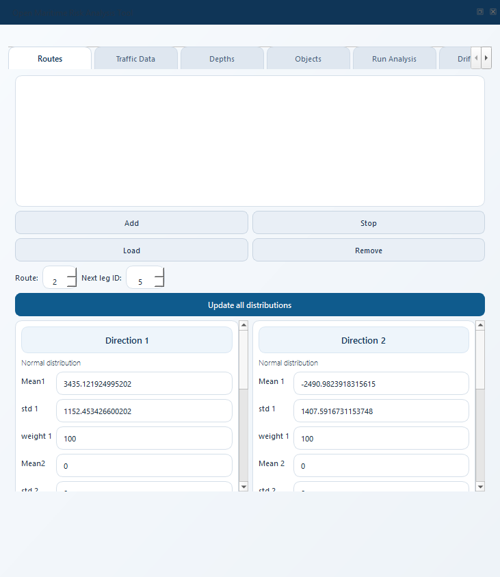

   The Routes tab lists every leg of the shipping route.  The
   lateral distribution panel (see :ref:`lateral-distributions`)
   lives on the same tab, underneath the table.

A **route** is a polyline split into one or more **segments** (legs).
Each segment has:

* **Start_Point** / **End_Point** -- lon/lat of the two endpoints.
* **Width** -- the length (metres) of the dashed **tangent line** drawn
  across the leg.  The tangent line is also the *passage line* the AIS
  query samples when you click **Update AIS**, so the width bounds
  which ships are counted.  The lateral spread used in the risk
  calculation itself comes from the distribution panel lower down the
  same tab.
* **Tangent (%)** -- where along the leg the tangent line sits, in
  percent from the start point.  Defaults to 50 (the midpoint).  See
  :ref:`moving-the-tangent-line`.
* **Dirs** -- the two direction labels auto-derived from the segment's
  compass bearing (``"North going"`` / ``"South going"``, etc.).
* **bearing** -- stored compass bearing in degrees.
* **ai1**, **ai2** -- IWRAP "position check interval" in seconds for
  directions 1 and 2.  Used by the powered-grounding / allision
  calculations (:math:`N_{II} = P_c Q \cdot m \cdot \exp(-d/(a_i V))`).

Click the **Segment_Id**, **Route_Id** or **Leg_name** column header to
sort the table by that column; click again to reverse.  Names sort
naturally, so ``LEG_1_2`` comes before ``LEG_1_10`` and ``LEG_5_12_a``
before ``LEG_5_12_b``.  The leg selector on the Traffic tab follows the
same order, and so does the saved project.

Digitising a route
------------------

#. Click **Add Route** to start digitising.
#. Click on the map to set the first waypoint.
#. Click again to create a leg; each subsequent click adds a segment.
#. Click **Stop Route** when done.

Segments are automatically assigned an ID (``1``, ``2``, ...) and a
default width of 5000 m.

Editing a segment
-----------------

Select a segment in the route table and edit its geometry directly on
the map using QGIS's standard vertex-editing tools.  OMRAT listens to
the geometry-change signal and:

* Updates the Start_Point / End_Point values in the table,
* Recomputes direction labels and stored ``bearing``,
* Recomputes ``line_length`` (metres) via UTM projection.

The recomputed values are included in project save and in IWRAP XML
export, so map geometry and exported model stay in sync.

.. _moving-the-tangent-line:

Moving the tangent line
-----------------------

By default the tangent line crosses each leg at its midpoint.  Where
the midpoint is a poor cross-section -- close to a junction, a port
approach or an anchorage that pollutes the AIS sample -- you can slide
it along the leg.  Its centre always stays on the leg, so the lateral
distribution fitted from the AIS passages still refers to the leg
centreline.

Three ways to move it, from easiest to most manual:

**Type a value in the table.**  Edit the **Tangent (%)** cell of the
leg in the route table (``0`` = start point, ``100`` = end point) and
press Enter.  The dashed line on the map jumps to the new position.
Non-numeric input is reverted to the stored value.

**Drag it with the Move tangent button.**

#. Click **Move tangent** under the route table.  OMRAT selects the
   *Tangent Line* layer, puts it in edit mode and activates QGIS's
   **Move Feature** tool for you.  A message in the QGIS message bar
   confirms this.
#. On the map, press the left mouse button on the dashed line you want
   to move and release it where you want the line to be.  (In QGIS 3
   *Move Feature* works with one click to pick up and a second click
   to drop, not press-and-hold.)
#. The line snaps back onto its leg at the new position, perpendicular
   and with the width from the table.  Only the movement *along* the
   leg counts; dragging sideways or rotating the line has no lasting
   effect.  The **Tangent (%)** cell updates to match.
#. Repeat for other legs, then pick the **Pan Map** tool (hand icon on
   the QGIS toolbar) to leave the move tool.

**Drag it with the QGIS tools yourself.**  This is what the button does
behind the scenes, useful if the toolbar is customised:

#. In the QGIS **Layers** panel click *Tangent Line* so it is the
   active layer.
#. If the pencil icon on the layer is grey, click **Toggle Editing**
   (the pencil on the Digitizing toolbar) so the layer is editable.
#. Open the **Advanced Digitizing** toolbar if it is hidden
   (*View -> Toolbars -> Advanced Digitizing Toolbar*) and choose
   **Move Feature**.  The **Vertex Tool** on the Digitizing toolbar
   also works; moving one end of the line moves its centre half as
   far along the leg.
#. Click the tangent line, then click where it should go.  OMRAT
   snaps it back onto the leg as above.

Whichever way you use, the position is stored with the leg and saved
in the project, and the table and the map always agree.  After a move
the leg's traffic is stale until you click **Update AIS** for that
leg; a message-bar hint reminds you.  When a leg is split at a
crossing, the sub-legs start at 50 % again.

.. note::

   You never need to save the *Tangent Line* layer's edits.  OMRAT
   discards the raw drag and redraws the line itself; the layer is a
   temporary memory layer that is rebuilt from the project file.

.. _copy-traffic:

Copying traffic between legs and locking it
-------------------------------------------

When several routes cross each other the validation pass splits them
into many short sub-legs (``LEG_5_12_a`` ... ``LEG_5_12_d``).  Some of
those sit right in the crossing, where the AIS sample mixes in ships
from the other routes.  Rather than accept that sample you can declare
that a sub-leg carries the same traffic as a clean sibling, and protect
that choice from the next AIS refresh.

#. Click **Copy traffic...** under the route table.
#. Pick the **source** leg (only legs that already hold traffic are
   listed) and one or more **target** legs (Ctrl-click for several).
#. Leave **Also copy the lateral distributions** ticked to copy the
   mean / std / weight / uniform / AI parameters and the raw AIS
   offsets used by the distribution plot.  Untick it to copy only the
   traffic matrices.
#. Tick **Swap directions** if the target leg was drawn the opposite
   way to the source.  Direction 1 and 2 are exchanged and the lateral
   axis is mirrored (means, samples and uniform bounds change sign),
   because "left of the leg" flips with the drawing direction.  For
   sub-legs of the same original leg leave it unticked.
#. Leave **Lock target legs** ticked (default) and press OK.

Every variable (Frequency, Speed, Draught, heights, beam and the
Scaling matrix) is copied per direction, direction 1 to direction 1
and 2 to 2, using the target leg's own direction labels.  If a target
is already locked you are asked before it is overwritten.

**AIS lock.**  The last column of the route table, **AIS lock**, is a
checkbox.  A locked leg is skipped by both the per-leg **Update AIS**
button (you get a message instead) and the global **Update all
distributions** pass (skipped legs are listed in the message bar).
The Traffic tab marks locked legs with ``[locked]`` in the leg
selector.  You can tick or untick the box by hand at any time, for
example to protect a leg whose matrices you edited manually.  The
flag and the source leg are saved in the project file.

Locking does not stop the leg's passages from being counted for the
junction transition matrices; those still come from AIS (or your
manual edits) as described below.

Junctions, crossings and merging
--------------------------------

Crossing and merging collisions arise wherever two or more legs meet
or cross.  OMRAT models the meeting point as a **junction** carrying a
transition matrix that says how traffic from each inbound leg splits
across the outbound legs.  There is no separate "add crossing" action
in the UI:

* Snap two leg endpoints together (or share a common waypoint when
  digitising) and OMRAT registers a junction automatically on save.
* Legs that cross *in the middle* (true X intersections, no shared
  endpoint) are detected when you click **Update all distributions**;
  you'll be prompted to split each crossing into four sub-legs that
  meet at a new junction.  Splitting also offers to copy the parent
  legs' traffic onto the sub-legs.
* Open **Settings -> Junction transition matrix...** to inspect or
  edit how traffic distributes at each junction.  Rows default from
  geometry (deflection-angle heuristic) and are overwritten by AIS
  counts when a database is connected; user edits stick.

See :ref:`junctions` for the math and the AIS-vs-geometry-vs-user
hierarchy.

Saving the route
----------------

**File -> Save** writes the whole model back to the ``.omrat`` file it
was loaded from or last saved to; the file name is shown in the dock
title.  For a model that has no file yet it behaves like **Save
as...**, which always asks for a file name (pre-filled with the current
one, so "save a copy next to it" is a two-click job).  **Clear model**
forgets the file, so the next Save asks again.

The ``.omrat`` snapshot that **Run Model** writes next to each run is
read-only on purpose, so it remains a faithful record of that run.  If
you load such a snapshot and press **Save**, the read-only flag is
cleared and the snapshot is overwritten; use **Save as...** to keep it
and continue in a new file.  The suggested name is then the snapshot's
stem without the run timestamp (``test14_20260827_232733.omrat``
becomes ``test14.omrat``).

Closing the OMRAT dock with unsaved changes brings up a prompt with
**Save**, **Save as...**, **Don't save** and **Cancel**.  Cancel, or
cancelling the file dialog behind Save as, keeps the dock open.  Once
the dock closes, all OMRAT layers (legs, tangent lines, depths,
structures, drift corridors and result layers) are removed from the
QGIS project together with the model; reopen OMRAT and use **Load** to
continue from the saved file.

Layer styling
~~~~~~~~~~~~~

OMRAT's layers are memory layers rebuilt from the project file, so a
QGIS project (``.qgz``) does not keep them.  Instead the QGIS style of
each layer type is saved *inside* the ``.omrat`` file when you press
Save and re-applied on Load: legs, the tangent lines, the depth layer
and the structures.  Change colours, widths or labels in the QGIS
Layers panel as usual; the style of the first leg (or structure)
layer is used for all legs (structures).  A leg drawn after Load picks
up the stored style too.  A style change counts as an unsaved change.

Two limits: the depth layer's automatic colour ramp is re-applied when
depth intervals are edited, and result layers from Run Model are not
covered.

The on-canvas leg layers in the QGIS Layers panel are *memory layers*
and disappear when you close QGIS.  The persistent source of truth is
the project file: **File -> Save .omrat** writes the route (start /
end / width / dirs / bearing) plus traffic / depths / objects /
distributions to a single JSON file.  **File -> Open .omrat** rebuilds
the leg layers from that JSON, so there is no separate "save layer"
step.

What flows downstream
----------------------

.. list-table::
   :header-rows: 1
   :widths: 30 70

   * - Field
     - Used by
   * - ``Start_Point`` / ``End_Point``
     - Every accident type (leg geometry).
   * - ``line_length``
     - Drifting base exposure, ship-ship collision candidate count.
   * - ``ai1``, ``ai2``
     - Powered grounding + allision (:math:`\exp(-d/(a_i V))`).
   * - ``bearing``
     - Crossing-collision geometry to detect leg pairs that share a
       waypoint.

Traffic Data tab
================

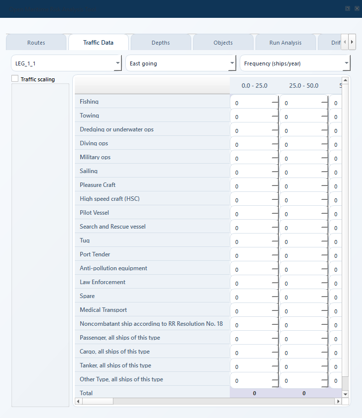

   The Traffic Data tab.  Matrix rows are ship types, columns are
   LOA (length) bins.

Every segment, in every direction, has its own traffic matrix.  Select
a segment and direction using the first two dropdowns at the top,
then use the third to pick which variable to edit:
**Frequency (ships/year)**, **Speed (knots)**, **Draught (meters)**,
**Ship heights (meters)** or **Scaling (%)**.

.. note::

   ``Ship Beam (meters)`` is a sixth variable that is stored per cell
   and populated by the AIS refresh, but it is deliberately **not**
   offered in the dropdown -- there is no way to edit it by hand.  It
   *is* consumed by the ship-ship collision model, which uses it for
   the collision width :math:`B_{ij}` in the head-on / overtaking
   geometric probability and for the collision diameter
   :math:`D_{ij}` in the
   crossing and bend formulas.  When a cell has no AIS observation,
   the model falls back to an L/B ratio estimate from the LOA bin
   midpoint (``ShipCollisionModel.estimate_beam``), so a hand-entered
   project still gets sensible beams.

Matrix shape
------------

* **Rows** -- ship types (configurable under **Settings -> Ship
  Categories**; defaults to the 21 IMO types used by IWRAP).
* **Columns** -- LOA bins (also configurable; defaults to 15 bins
  from <50 m to >350 m).

Variables
---------

.. list-table::
   :header-rows: 1
   :widths: 25 35 40

   * - Variable
     - Units
     - Used by
   * - Frequency (ships/year)
     - ships/year
     - Every accident type (exposure).
   * - Speed (knots)
     - knots
     - Powered grounding/allision, head-on + overtaking + crossing
       collisions, drifting exposure.
   * - Draught (meters)
     - m
     - Powered grounding depth binning, drifting grounding filter.
   * - Ship heights (meters)
     - m
     - Powered allision (clearance check: short ships pass under
       high structures).
   * - Ship Beam (meters)
     - m
     - Ship-ship collision geometry.
   * - Scaling (%)
     - percent
     - Per-cell **frequency multiplier** applied just before risk
       integration.  ``100`` = no scaling (default).  See
       *Scaling traffic up or down* below.

Scaling traffic up or down
--------------------------

The Traffic Data tab has an **easy option** for bumping all (or some) of
the traffic up or down by a percentage -- useful for "what if the
forecast goes up 30 %?" sensitivities without editing every cell.

All scaling controls live in a **Traffic scaling** group box to the
left of the matrix.  The box is **collapsible and starts collapsed**
so the matrix gets the full width on first open -- tick its title
checkbox to expand the controls, untick again to fold them away.

* **Global scaling [%]** spinbox inside the group is the master
  multiplier.  ``130`` means *every ticked ship-type row gets its
  Scaling (%) cells set to 130*, so :math:`Q_{effective} = Q \cdot
  1.30` for those rows.
* **Follow global per ship type** is the list of checkboxes below
  the spinbox -- one per ship type.  Tick (default) = "follow the
  global"; untick = "leave this row's values alone".  Use it to
  exclude e.g. passenger traffic from a cargo-forecast bump.
* Switch the **variable** dropdown to ``Scaling (%)`` to see and edit
  the per-cell values directly.  Typing a value into a cell
  **auto-unticks** that ship-type row -- the typed number is treated
  as your explicit override and survives future global changes.
* **Reset all to 100 %** clears every override: all checkboxes
  re-tick, the global snaps to ``100``, every cell goes back to
  ``100``.

The scaling matrix is per-leg / per-direction, but the global
broadcast covers every leg + direction at once.  AIS refresh and
IWRAP import only overwrite Frequency -- never Scaling -- so a saved
``+30 %`` survives every traffic update.

Importing from AIS
------------------

If you have access to an AIS database:

#. **Settings -> AIS connection settings** -- enter host, port,
   database, schema, user, password.
#. Select a segment in the route table.
#. Click **Update AIS**.  The plugin queries the database for every
   vessel passage that crossed the segment's buffer and populates the
   traffic table automatically.

The query time is shown in the QGIS log panel.

.. note::

   No AIS database yet?  See :ref:`database-setup` for the end-to-end
   guide: standing up the PostGIS schema, ingesting raw NMEA / CSV
   files through the **Database setup wizard**, and verifying the
   tables before clicking **Update AIS** in OMRAT.

Depths tab
===========

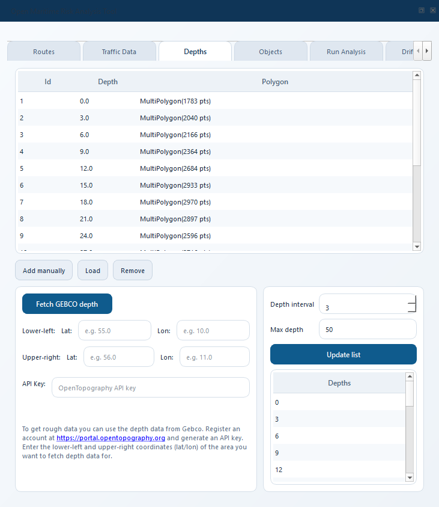

   The Depths tab.  One row per depth polygon.

Each row has:

* **id** -- a short label (auto-generated ``d1`` ... or user-set).
* **depth** -- the water depth at this polygon (metres below chart
  datum).
* **Polygon** -- the WKT geometry, in lon/lat (EPSG:4326).

Adding depths
-------------

Three ways:

* **Add manually** -- enter a depth value, draw a polygon on the map.
* **Load** -- pick a polygon layer; OMRAT imports every polygon and
  uses the ``depth`` attribute (or the first numeric attribute) as the
  depth value.
* **Remove** -- delete the selected row.
* **Fetch GEBCO depth** -- requires an OpenTopography API key, pasted
  into the **API Key** field on this same tab (not in Settings).
  Enter the bounding box (**Lower-left** / **Upper-right** lat/lon),
  a **Max depth** and a **Depth interval**, click **Update list** to
  preview the contour levels, then fetch.  The plugin downloads GEBCO
  bathymetry and vectorises it into depth polygons at those depths.

How depths drive the calculation
--------------------------------

* **Drifting grounding:** a polygon's depth is compared against each
  ship's draught.  Only polygons shallower than the ship's draught
  are grounding hazards for that ship.
* **Drifting anchoring:** a polygon is an anchoring zone if its depth
  is less than ``anchor_d * draught`` (configurable under Drift
  settings).
* **Powered grounding:** the shallowest depth encountered along a
  ray cast from the leg's bend gives the grounding contribution
  (:math:`N_{II} = P_c Q m \exp(-d/(a_i V))`).

Objects tab
===========

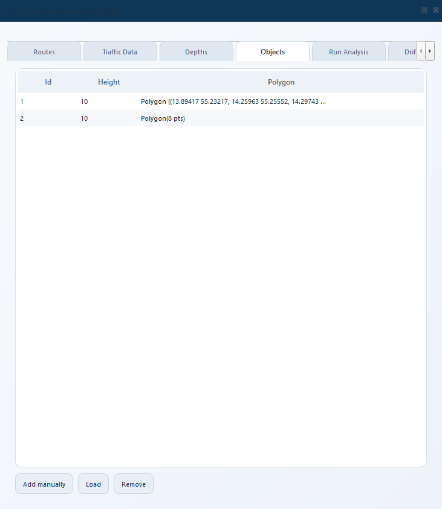

   The Objects tab.  One row per structure.

Structures are bridges, wind-turbine foundations, platforms, piers.
Each row has:

* **id** -- label.
* **height** -- height of the structure above waterline (metres).
  Ships shorter than this pass under without colliding.
* **Polygon** -- the WKT footprint.

Adding structures
-----------------

* **Add manually** -- enter a height, draw a polygon on the map.
* **Load** -- pick a polygon layer with a ``height`` attribute.
* **Remove** -- delete the selected row.

How objects drive the calculation
---------------------------------

* **Drifting allision:** any ship that drifts into the polygon
  contributes, regardless of height.  There is deliberately no
  clearance check -- a drifting ship has no propulsion and cannot
  steer away from a structure, so it will impact *something* on its
  drift trajectory whether or not its superstructure clears the deck
  of a bridge.  If you want every passing ship counted against an
  object (e.g. wind-turbine foundations, bridge piers), simply set
  the object's ``height`` to ``0``.
* **Powered allision:** ``ship_height < object_height`` passes under
  (no collision) -- the powered ship is assumed to clear the
  structure's deck.  Otherwise the standard Cat II probability
  formula applies.  Set ``object_height = 0`` to disable the
  clearance check and count every powered ship as well (typical for
  wind farms and full-height piers).

.. _lateral-distributions:

Lateral distributions
=====================

.. note::

   These controls are **not** a separate tab -- they sit in the
   scrollable panel underneath the route table on the **Routes** tab.

.. figure:: _static/screenshots/ui_tab_distributions.png
   :width: 90%
   :alt: The distribution panel showing the combined PDF plot

   The lateral distribution panel.  Two directions per segment; each
   direction can have up to three Gaussians plus a uniform component.

Per segment, per direction, you can define the **lateral traffic
distribution** -- the PDF of where ships are positioned relative to
the leg centerline.

Fields
------

.. list-table::
   :header-rows: 1
   :widths: 30 70

   * - Control
     - Meaning
   * - ``mean{d}_{i}``
     - Mean of normal component ``i`` (direction ``d``), metres.
   * - ``std{d}_{i}``
     - Standard deviation of normal component ``i``.
   * - ``weight{d}_{i}``
     - Weight of normal component ``i`` (weights normalised to 1).
   * - ``u_min{d}`` / ``u_max{d}``
     - Uniform component bounds, metres.
   * - ``u_p{d}``
     - Weight of the uniform component.

The plot at the bottom of the tab shows the combined PDF with the
sum of (up to 3) normals + 1 uniform.

Why this matters
----------------

The lateral distribution enters the calculations in three places:

#. **Powered grounding / allision** -- defines the "lateral spread" of
   rays cast across the leg (:math:`N_\mathrm{rays} = 500` rays at
   ``mean +/- 4 std``).
#. **Ship-ship collisions** -- defines :math:`(\mu, \sigma)` of each
   direction for the Gaussian-overlap probability.
#. **Drifting** -- defines the corridor width (``5 * sigma``) and
   feeds the analytical probability-hole integral.

A segment with zero weights produces zero ship-ship collisions on that
direction pair, and a zero-width corridor for drifting -- both silent
failures.  Always check the plot.

Drift Analysis tab
==================

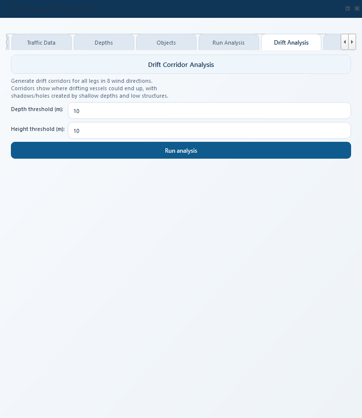

   The Drift Analysis tab produces a visual drift-corridor layer.

This tab does **not** compute the risk -- it draws drift corridors
for visual inspection.  Use it to sanity-check whether the corridors
actually reach the obstacles you expect them to hit.

Fields
------

* **Depth threshold** -- hide depth polygons shallower than this (so
  the corridor isn't cluttered by the near-shore bathymetry).
* **Height threshold** -- same for structures.
* **Run analysis** -- kicks off
  :class:`~geometries.drift_corridor_task_v2.DriftCorridorTask` in a
  background thread.

Output
------

Per leg, per wind-rose direction, a polygon layer is added to the
map showing where a drifting ship from that leg in that direction
could reach, minus the footprints of any obstacles it would ground
or collide on.

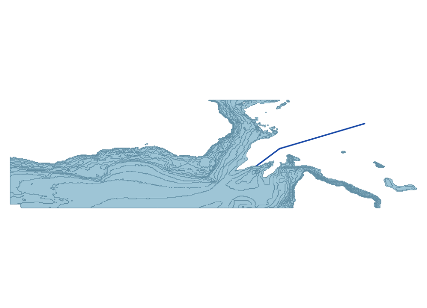

   Drift corridors around a leg, coloured by direction.  The darker
   regions are where the ship has already grounded on a shallower
   polygon closer to the leg.

Run Analysis tab
================

.. note::

   Older reference material calls this the "Results" tab.  It is the
   same tab; the widget label is **Run Analysis**.

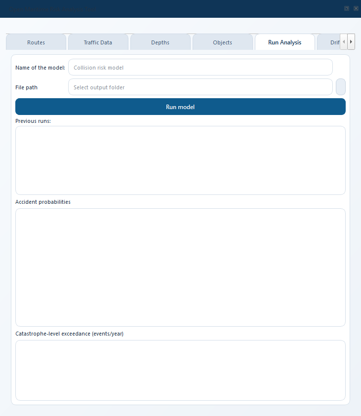

   The Run Analysis tab.

Fill in **Name of the model** and **File path** (the ``...`` button
opens a folder picker), then click **Run model**.  The button stays
disabled until both are set.  It kicks off a
:class:`~compute.calculation_task.CalculationTask` that runs the
drifting, ship-ship collision, powered grounding and powered allision
models in sequence, followed by the oil-spill consequence step.  The
task runs in the background so QGIS stays responsive.

Results land in two tables: **Accident probabilities** (one row per
accident type, with a **View** drill-down button) and
**Catastrophe-level exceedance (events/year)**.  **Previous runs**
above them lists every run in the history; select one and click
**Add selected run results to map** to load its GeoPackage.

Below the nine accident rows the table carries three bold summary
rows: **All grounding** (drifting + powered grounding), **All
allision** (drifting + powered allision) and **All collisions** (the
five ship-ship types).  They recompute whenever the rows above change
and get their own probability / delta cells when previous runs are
compared.

The **View** button on a ship-ship collision row opens a per-leg (or
per-leg-pair) table with the absolute probability and a **% of total**
column, i.e. each leg's share of that accident type.

Result fields
-------------

All values are **annual accident frequencies** (expected events per
year).  They appear in scientific notation (``1.148e-01`` means 0.1148
events/year or roughly one event every 9 years).

.. list-table::
   :header-rows: 1
   :widths: 30 70

   * - Field
     - Meaning
   * - **LEPDriftAllision**
     - Drifting + hitting a structure.
   * - **LEPDriftingGrounding**
     - Drifting + running aground on a depth polygon.
   * - **LEPPoweredGrounding**
     - Under power, failing to turn, hitting a depth polygon.
   * - **LEPPoweredAllision**
     - Under power, failing to turn, hitting a structure.
   * - **LEPHeadOnCollision**
     - Two ships on the same leg in opposite directions.
   * - **LEPOvertakingCollision**
     - Same leg, same direction, different speeds.
   * - **LEPCrossingCollision**
     - Two legs sharing a waypoint and meeting at more than 30
       degrees.
   * - **LEPMergingCollision**
     - Two legs sharing a waypoint and meeting at 30 degrees or
       less -- streams converging onto nearly the same course.  Same
       equations as crossing, its own causation factor.
   * - **LEPBendCollision**
     - One leg changing direction at a waypoint: a ship fails to
       turn and hits traffic that did.

.. note:: Changed in v0.14.0

   ``LEPMergingCollision`` used to be fed the *bend* total, and
   merging itself was summed into crossing.  They are now three
   distinct rows.  See :ref:`merging-collisions` and the
   crossing-formula warning in :ref:`collisions`.

The **View** button next to each row opens a drill-down dialog with
per-segment and per-obstacle contributions for the run selected in
**Previous runs**.  These are useful for locating the single obstacle
that dominates the total risk.

Settings menu
=============

Settings are split across six sub-dialogs accessed from the
**Settings** menu: **Drift settings**, **Ship Categories**,
**Causation Factors**, **AIS connection settings**,
**Database setup wizard...** and **Junction transition matrix...**
(the last one is documented in :ref:`junctions`).

Drift settings
--------------

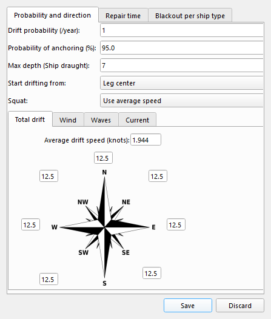

   Drift settings dialog.

.. list-table::
   :header-rows: 1
   :widths: 28 72

   * - Field
     - Meaning
   * - ``drift_p``
     - Blackout rate per ship-year (default 1.0).  Multiplied by a
       per-type override from ``blackout_by_ship_type`` -- e.g. RoRo =
       0.1.
   * - ``anchor_p``
     - Probability of a successful anchor given the ship is in an
       anchoring-depth region (default 0.7).
   * - ``anchor_d``
     - Anchor-depth factor.  A ship with draught :math:`T` can anchor
       in water shallower than :math:`\mathrm{anchor\_d} \cdot T`.
   * - ``speed``
     - Drift speed in knots.
   * - Wind **rose**
     - Probability per compass direction.  Eight values that must sum
       to 1.
   * - **Repair time**
     - Lognormal / Weibull / Normal CDF parameters for the
       time-to-repair distribution used to compute :math:`P_{NR}`.

Causation factors
-----------------

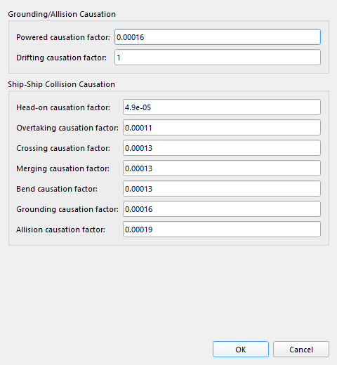

   Default values come from Fujii (1974), Pedersen (1995), and the
   IALA IWRAP manual.  See :ref:`theory` for the reference table.

Eight fields: powered, drifting, head-on, overtaking, crossing,
**merging**, bend, grounding and allision.  The merging factor was
added in v0.14.0 and defaults to the crossing value -- IWRAP
publishes no separate figure for it (see :ref:`merging-collisions`).

Ship Categories
---------------

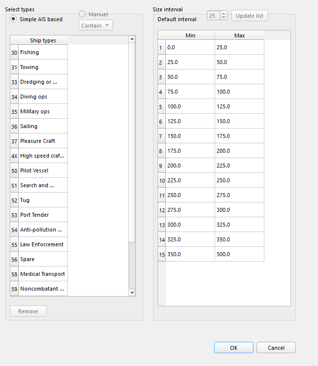

   Edit the type names (rows of the traffic matrix) and the LOA bins
   (columns).  Changing these rebuilds the Traffic Data matrix.

AIS connection
--------------

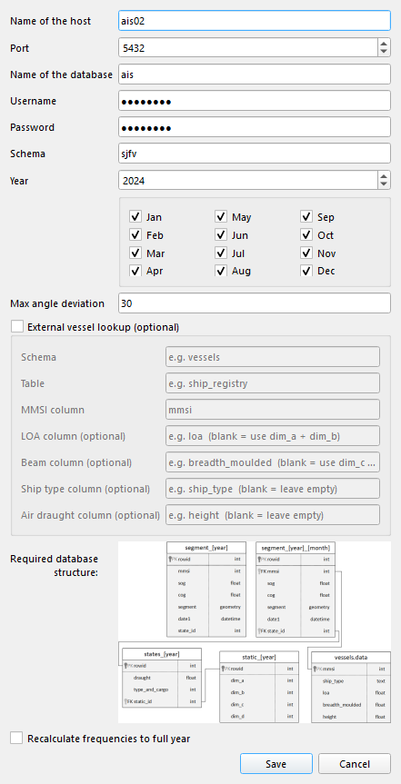

   Connection parameters for an AIS PostgreSQL/PostGIS database.
   Values are stored in the project file; the password is stored in
   plain text, so treat ``.omrat`` files as sensitive if you fill
   this in.

This dialog only stores credentials.  **Database setup wizard...** on
the same menu walks you through creating the database and ingesting
data.  To stand up the database itself, ingest raw AIS files, and
verify that segments are queryable, see
:ref:`database-setup`.

File menu
=========

* **Save** / **Load** -- writes / reads the project as a single JSON
  file with extension ``.omrat``.  Every tab's contents is included.
  See :ref:`reference-data-format` for the full schema.
* **Export to IWRAP XML** / **Import from IWRAP XML** -- exchange with
  the IALA IWRAP reference tool.  Useful for cross-validating OMRAT
  results against IWRAP on the same project.
* **Manage previous runs...** -- browse, re-load and delete entries
  in the run history.

Two further menus sit alongside it: **Consequence** (the four
oil-spill inputs described in :ref:`consequence`) and **Help**, which
opens this documentation in a browser.

Run history (Previous runs)
============================

OMRAT keeps a history of every **Run model** invocation in two places:

* one **per-run GeoPackage** in the output folder you select, named
  ``<model_name>_<YYYYMMDD_HHMMSS>.gpkg``, holding the actual
  spatial result layers for that run.
* one **lightweight metadata row** in the master history database
  (``omrat_history.sqlite`` under the user app-data folder) holding the
  run name, timestamp, elapsed duration, every total probability,
  and a pointer (``output_dir`` + ``output_filename``) to the per-run
  file.

This split keeps the master DB small even after many runs, and gives
you one easy-to-archive ``.gpkg`` per run.

The master database location:

* **Windows**: ``%APPDATA%\\OMRAT\\omrat_history.sqlite``.
* **Linux**: ``~/.local/share/OMRAT/omrat_history.sqlite``.
* **macOS**: ``~/Library/Application Support/OMRAT/omrat_history.sqlite``.

Output folder + Run model gating
--------------------------------

**Run model** is **disabled** until *both* **Name of the model** and
**File path** are filled in.  Use the **File path** ``...`` button on
the Run Analysis tab to pick a folder -- the chosen path is
remembered between sessions.  If you trigger the run some other way
with either field empty, a popup names the missing one and nothing
runs.

Naming a run
------------

The **Name of the model** field on the Run Analysis tab becomes the
run's name AND the filename prefix for all three artefacts written to
the output folder:

* ``<name>_<YYYYMMDD_HHMMSS>.gpkg`` -- the result layers.
* ``<name>_<YYYYMMDD_HHMMSS>.omrat`` -- a read-only snapshot of the
  inputs the calculation actually consumed.
* ``<name>_results_<YYYYMMDD_HHMMSS>.md`` -- a Markdown report
  covering every accident type.

Note: result layers are no longer auto-added to the QGIS canvas at
the end of a run.  Use **Add selected run results to map** (see
below) when you want to look at them.

The Previous runs table
------------------------

The **Previous runs** table on the Run Analysis tab shows four
columns: **Name**, **Main**, **Date**, **Duration** -- enough to pick a
run without scrolling.  The newest run is selected automatically after
a calculation finishes.  Selecting rows adds columns to the
**Accident probabilities** table below:

* **Single selection** -- one probability column for that run plus a
  ``Δ %`` column against the baseline.
* **Multi-selection** -- one probability + ``Δ %`` column pair per
  selected run, side by side.

The **Main** checkbox chooses the baseline: tick exactly one run and
every ``Δ %`` column is computed against it (header ``Δ vs main
(<run name>) %``).  The choice is remembered between sessions and is
cleared automatically if that run is deleted from the history.  With
no main run ticked the baseline is the currently displayed run if
there is one, otherwise the first selected run, and the header says
which (``Δ vs current %`` or ``Δ vs <run name> %``).

Below the table is an **Add selected run results to map** button.
Click it with a single row selected to load that run's per-run
GeoPackage as new layers in the QGIS Layers panel, styled
graduated red->green like the live-run output.  Multiple selection
disables this button -- pick one run at a time when loading on the
canvas.

The right-click context menu on the table provides:

* **Add results to map** -- same as the button (single selection
  only).
* **Delete from history** -- removes only the row from the master
  DB; the per-run ``.gpkg`` file stays on disk so you can keep
  archived results around if you want.
* **Delete from history + remove .gpkg file** -- removes both.
  Asks for confirmation.

You can also reach the table via **File -> Manage previous runs...**,
which switches to the Run Analysis tab and refreshes the table.

Result-layer attributes
-----------------------

Loading a run onto the canvas adds up to six layers (any layer whose
total is zero is skipped):

.. list-table::
   :header-rows: 1
   :widths: 35 15 50

   * - Layer
     - Geometry
     - Key attributes
   * - Allision Results (drifting)
     - Line
     - One feature per boundary edge of each structure.
       ``obstacle_id``, ``segment_idx``, ``total_edge_probability``
       (alias *Total edge probability*), ``object_probability``
       (alias *Object probability*), ``value`` (the structure's
       height), the drift diagnostics ``normal_deg``,
       ``edge_dist_m``, ``reach_width_m``, ``edge_p_nr``,
       ``edge_h_eff``, and a ``leg_<id>`` column per contributing
       leg.
   * - Grounding Results (drifting)
     - Line
     - Same shape as Allision Results, with ``value`` holding the
       contour's depth.
   * - Powered Allision Results
     - Line
     - Structure boundary edges again, but coloured by the powered
       Cat II total.  ``obstacle_id``, ``segment_idx``,
       ``total_edge_probability``, ``object_probability``, ``value``,
       plus a ``leg_<id>`` column per contributing leg.
   * - Powered Grounding Results
     - Line
     - Same shape, over depth-contour edges.
   * - Ship-Ship Collision (per leg)
     - Line
     - ``leg_id``, ``head_on``, ``overtaking``, ``combined``.
   * - Ship-Ship Collision (waypoints)
     - Point
     - ``waypoint``, ``crossing``, ``merging``, ``bend``,
       ``combined`` (the sum of the three).

All layers use the same five-class graduated ramp on
``total_edge_probability`` / ``combined``: **green = lowest
contributor, yellow = middle, red = the hotspots that dominate the
total**.  Line layers are rendered semi-transparent so the
underlying route stays visible.

Compare tab
===========

The **Compare** tab diffs two finished runs without re-calculating
either.  Pick **Run A (.omrat)** and **Run B (.omrat)** with the two
``...`` browse buttons -- these are the input snapshots each run
writes next to its GeoPackage -- then click **Compare**.

Three tables fill in:

* **Accident probabilities** -- A, B and the relative difference per
  accident type.
* **Settings differences** -- every scalar under the ``drift``, ``pc``
  (causation factors), ``traffic_scaling``, ``consequence`` and
  ``ship_categories`` blocks that differs between the two snapshots,
  plus per-leg **Width** changes.  A value present on only one side
  shows an em-dash on the other.
* **Route distance per leg** -- leg-by-leg lengths, so a geometry
  change shows up immediately.

**Add both models to QGIS (grouped: A = red, B = blue)**, right under
the file pickers, creates one layer group per model in the Layers
panel.  Each group holds the model's **Depth Areas**, **Structures**,
**Legs** and **Tangent Lines** built from the ``.omrat`` snapshot, and
-- when ``<name>.gpkg`` exists next to the snapshot -- that run's
result layers on top.  Legs, tangent lines and result layers are
tinted red for A and blue for B.  **Clear model** removes the groups
again.

Tips and best practices
==========================

* **Start with default causation factors.**  Only adjust if you have
  local accident data to support different values.
* **Check the distribution plot** on every segment before you trust
  a result.  A zero-weight distribution silently zeroes that
  segment's contribution for some accident types.
* **Use Drift Analysis** before Run model on a new project -- if
  corridors don't reach the obstacles you care about, your result
  will be near zero and you'll waste time investigating why.
* **Result layers colour-code by contribution.**  Red polygons are
  your "risk hotspots" and usually the right place to look if the
  total seems implausibly high.
* **Keep your repair-time distribution realistic.**  If it says
  90 % of blackouts are repaired in 10 minutes, grounding risk will
  be near zero regardless of traffic.
* **Save often.**  The full result (including the debug-trace
  breakdown per obstacle, if enabled) is serialised with **File ->
  Save**, so a finished run is reproducible.
